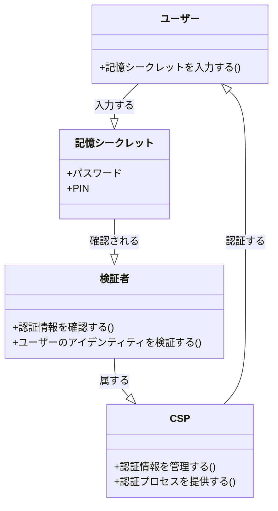
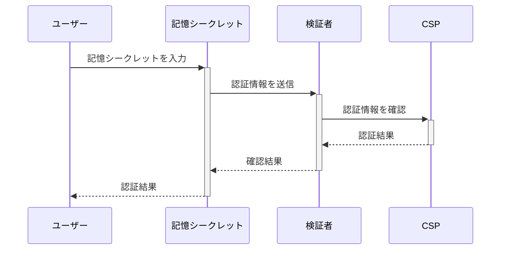

## コンポーネント図

``` mermaid
classDiagram
    class ユーザー {
        +記憶シークレットを入力する()
    }
    class 記憶シークレット {
        +パスワード
        +PIN
    }
    class CSP {
        +認証情報を管理する()
        +認証プロセスを提供する()
    }
    class 検証者 {
        +認証情報を確認する()
        +ユーザーのアイデンティティを検証する()
    }

    ユーザー --|> 記憶シークレット : 入力する
    記憶シークレット --|> 検証者 : 確認される
    検証者 --|> CSP : 属する
    CSP --|> ユーザー : 認証する
```

## シーケンス図

```mermaid
sequenceDiagram
    participant ユーザー
    participant 記憶シークレット
    participant 検証者
    participant CSP

    ユーザー->>+記憶シークレット: 記憶シークレットを入力
    記憶シークレット->>+検証者: 認証情報を送信
    検証者->>+CSP: 認証情報を確認
    CSP-->>-検証者: 認証結果
    検証者-->>-記憶シークレット: 確認結果
    記憶シークレット-->>-ユーザー: 認証結果
```