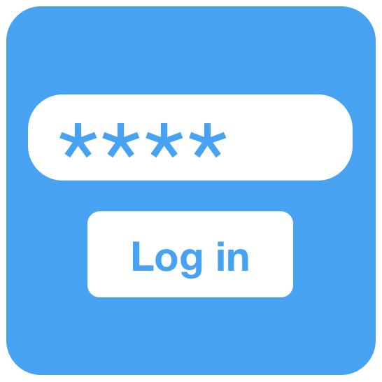
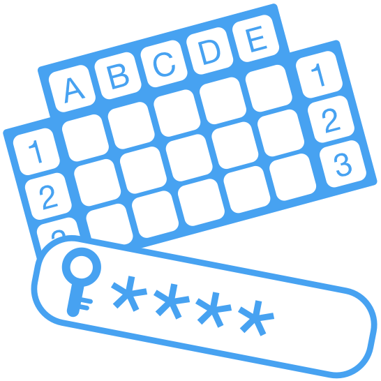
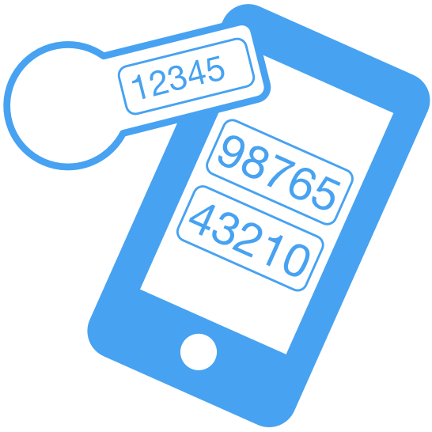
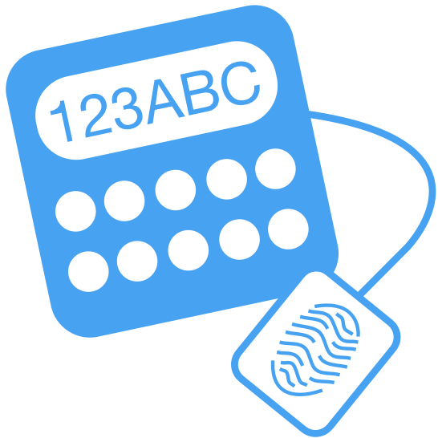
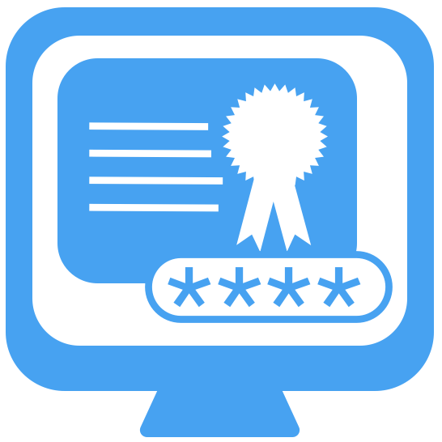
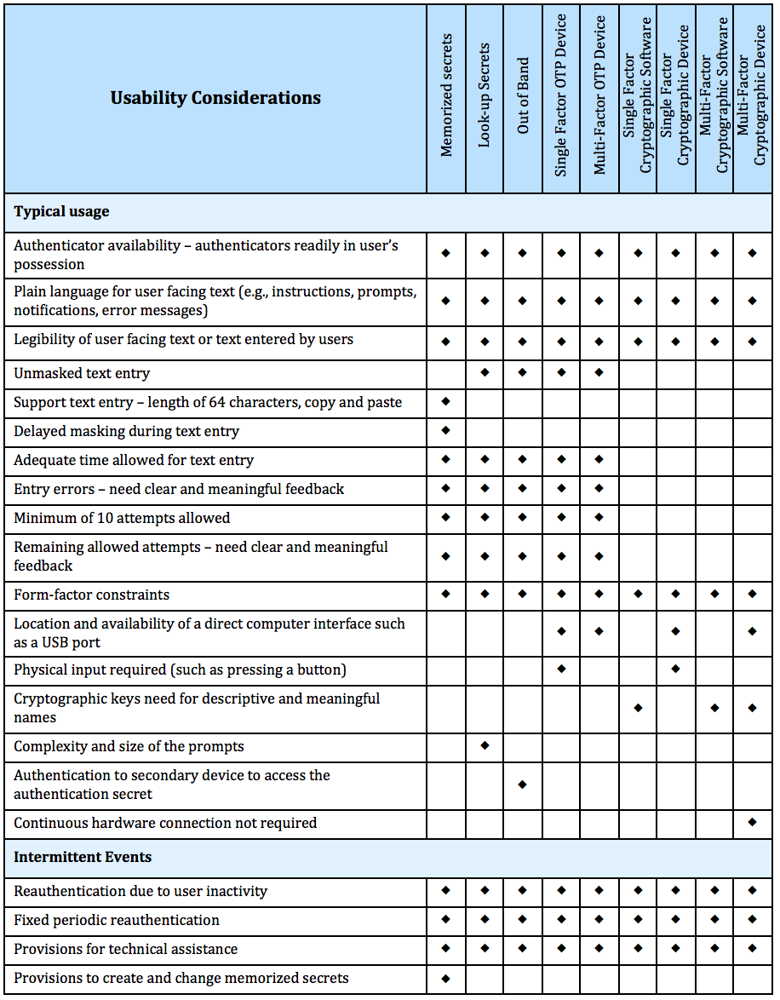

# NIST Special Publication 800-63B デジタルIDガイド (翻訳版)
https://nvlpubs.nist.gov/nistpubs/SpecialPublications/NIST.SP.800-63b.pdf  

1. [目的](#1-目的)
2. [はじめに](#2-はじめに)
3. [定義及び略語](#3-定義及び略語)
4. [認証器の保証レベル](#4-認証器の保証レベル)
5. [認証器及び検証者要件](#5-認証器及び検証者要件)
6. [認証器ライフサイクルの要件](#6-認証器ライフサイクルの要件)
7. [セッション管理](#7-セッション管理)
8. [脅威とセキュリティに関する考慮事項](#8-脅威とセキュリティに関する考慮事項)
9. [プライバシに関する考慮事項](#9-プライバシーの考慮事項)
10. [ユーザビリティに関する考慮事項](#10-ユーザビリティに関する考慮事項)
11. [参照](#11-参照)
12. [付録A &mdash; 記憶シークレットの強度](#付録-a記憶シークレットの強度)
13. [付録B &mdash; 定義](#付録-b定義と略語)

## 1 目的
_本セクションは参考情報である._

本書及び付随文書であるSpecial Publication (SP) 800-63，SP 800-63AおよびSP 800-63Cは，政府機関に対してデジタル認証の実装のための技術的なガイドラインを提供する．

1 Purpose

_This section is informative._

This document and its companion documents, Special Publication (SP) 800-63, SP 800-63A,
and SP 800-63C, provide technical guidelines to agencies for the implementation of digital
authentication.

## 2 はじめに
_本セクションは参考情報である._

デジタルIDはオンライン取引に関わるサブジェクトの一意な表現である．デジタルIDはデジタルサービスの文脈では常に一意だが，必ずしも実在するサブジェクトまで追跡できる必要はない．言い換えれば，デジタルサービスにアクセスするということが，根本的なサブジェクトの実在の表現が知られていることを意味していなくてもよい．身元証明はサブジェクトが実際には彼らが何者であるかを確認する．デジタル認証は，デジタルIDを主張するために利用いる一つ以上の認証器の妥当性を決定するプロセスである．認証はデジタルサービスに対してアクセスしようとしているサブジェクトが，認証するための技術を制御しているということを確認する行為である．再訪問するようなサービスでは，正常に認証することが今日サービスにアクセスしているサブジェクトが以前サービスにアクセスした人と同一であるということを示す合理的なリスクベースの保証をもたらす．デジタルIDは多くの場合オープンなネットワークを介した個人の証明を伴い，常にオープンなネットワークを介した個人の認証が必要となるため技術的な技術的な課題がある．この課題には，サブジェクトのデジタルIDを不正にかたることにつながるなりすましや他の攻撃の可能性が複数存在している．

サブスクライバーの継続的な認証は，サブスクライバーを彼らのオンラインでの活動と結びつけるプロセスの中心である．サブスクライバー 認証は，請求者が指定されたサブスクライバーと関連付けられている一つ以上の*認証器*(以前のバージョンのSP 800-63では*トークン*と呼ばれていたもの)を制御していることを検証することで実施される．認証が成功した結果は，Relying Party(RP)に対する仮名または仮名でない識別子のアサーションであり，オプションで他のアイデンティティ情報も対象となる．

本書は，様々な*認証器保証レベル*(AAL)で利用される認証器の選択を含む認証プロセスの分類における推奨を提供する．さらに本書は，紛失や盗難に際しての取り消しを含む，認証器のライフサイクルにおける推奨を提供する．

この技術的ガイドラインは，ネットワーク越しのシステムに対するサブジェクトのデジタル認証に適用される．ガイドラインは(ビルなどへの)物理アクセスのための人物の認証については考慮していないが，デジタルアクセスのために利用されるものと同じクレデンシャルが，物理アクセスの認証の目的でも利用されてよい．さらにこの技術的ガイドラインは，認証プロトコルに参加する連邦政府機関のシステム及びサービスの提供者が，サブスクライバーに対して認証されることを要求する．

認証トランザクションの強度はAALとして知られている分類によって特徴付けられる．より強力な認証(より高いAAL)では，悪意のある当事者が認証プロセスを成功裏に覆すために一層の機能及びリソースが必要となる．より高いAALでの認証は攻撃リスクを効果的に減少させることができる．個々のAALに求められる技術要件の概要を以下に記載する; 特別な標準要求については，本書の [Section 4](#4-認証器の保証レベル) 及び [5](#5-認証器及び検証者要件) を参照．

**認証器保証レベル1** - AAL1はサブスクライバーのアカウントに対して結び付けられている認証器を請求者が制御しているというある程度の保証をもたらす．AAL1では幅広く利用可能な認証技術を利用した，単一要素または多要素の認証を必要とする．認証が成功するには，その請求者が，セキュアな認証プロトコルを介して，自身がその認証器を所有・制御していることを証明する必要がある．

**認証器保証レベル2** - AAL2は，サブスクライバーのアカウントに対して結び付けられている認証器を請求者が制御しているという高い確実性をもたらす．セキュアな認証プロトコルを介して，異なる2つの認証要素を所有・制御していることを証明する必要がある．AAL 2及びそれ以上では，承認された暗号技術が必要とされる．

**認証器保証レベル3** - AAL3は，サブスクライバーのアカウントに対して結び付けられている認証器を請求者が制御しているという非常に高い確実性をもたらす．AAL3における認証は，暗号プロトコルを介した鍵を所有していることの証明に基づいている．AAL3の認証は，ハードウェアベースの認証器または検証器に対してなりすまし耐性を提供する認証器を要求す．この際，同じデバイスが両方の要件を満たしていても良い．AAL 3で認証するために，請求者はセキュアな認証プロトコルを介して2つの異なる認証要素を所有・制御していることを証明する必要がある．承認された暗号技術が必要とされる．

次の表は本文書の各セクションが標準であるか参考情報であるかを示している:

|セクション名|標準/参考情報
|----|:--:|
|1. 目的|参考情報|
|2. はじめに|参考情報|
|3. 定義及び略語|参考情報|
|4. 認証保証レベル|標準|
|5. Authenticator及び検証器の要件|標準|
|6. Authenticatorライフサイクルの要件|標準|
|7. セッション管理|標準|
|8. 脅威とセキュリティに関する考慮事項|参考情報|
|9. プライバシに関する考慮事項|参考情報|
|10. ユーザビリティに関する考慮事項|参考情報|
|11. 参照|参考情報|
|付録A &mdash; 記憶シークレットの強度|参考情報|

## 3 定義及び略語
定義及び略語の全体一式については[付録B.定義と略語](#付録-b定義と略語)を参照．

## 4 認証器の保証レベル
_本セクションは標準及び参考情報の題材両方を含む._

指定されたAALの要件を満たすために，請求者は少なくとも自身がサブスクライバーとして認識される強度のレベルで認証されるものとする(SHALL)．認証プロセスの結果は識別子であり，サブスクライバーがRPに対して認証するたびに使われるものとする(SHALL)．それは仮名でもよい(MAY)，サブスクライバーの識別子は異なる目的で再利用すべきではない(SHOULD NOT)が，CSPによって過去に登録済みのサブジェクトが再登録される場合には再利用すべきである(SHOULD)．サブスクライバーをを一意なサブジェクトであると識別する他の属性もまた提供されてもよい(MAY)．

各AALにおける認証器及び検証器に対する標準要件の詳細についてはセクション5に示されている．

最も適切なAALの選択方法の詳細については [SP 800-63](sp800-63-3.html) セクション6.2参照．

FIPS 140 要件は，[FIPS 140-2](#FIPS140-2)またはより新しい版により満たされる．

IAL1では，属性はデジタルIDサービスによって収集され，利用可能となる．任意のPIIまたは他の個人情報は - 自己申告されたまたは確認されたもののどちらでも - 多要素認証を必要とする．従って，連邦政府機関は自己申告性であるPIIや他の個人情報がオンラインで利用可能である場合，最低でもAAL2を選択するものとする(SHALL)．

### 4.1 認証保証レベル1
*本セクションは標準である．*

AAL 1はサブスクライバーのアカウントに対して結び付けられている認証器を請求者が制御しているという，ある程度の保証を提供する．AAL 1では幅広く利用可能な認証技術を利用した，単一要素または多要素の認証を必要とする．認証が成功するには，その請求者が，セキュアな認証プロトコルを介して，自身がその認証器を所有・制御していることを証明する必要がある．

#### 4.1.1 許可されている認証器タイプ
AAL1の認証では，[Section 5](#5-認証器及び検証者要件) で定義されている次の認証器タイプの何れかを利用するものとする(SHALL):

* 記憶シークレット ([Section 5.1.1](#511-記憶シークレット))
* ルックアップシークレット ([Section 5.1.2](#512-ルックアップシークレット))
* アウトオブバンドデバイス  ([Section 5.1.3](#513-アウトオブバンドデバイス))
* 単一要素ワンタイムパスワード (OTP) デバイス ([Section 5.1.4](#514-単一要素otp検証器))
* 多要素 OTP デバイス ([Section 5.1.5](#515-多要素-otpデバイス))
* 単一要素暗号ソフトウェア ([Section 5.1.6](#516-単一要素暗号ソフトウェア))
* 単一要素暗号デバイス ([Section 5.1.7](#517-単一要素暗号デバイス))
* 多要素暗号ソフトウェア ([Section 5.1.8](#518-多要素暗号ソフトウェア))
* 多要素暗号デバイス ([Section 5.1.9](#519-多要素暗号デバイス))

#### 4.1.2 認証器及び検証器の要件
AAL 1で用いられる暗号認証器は，承認された暗号技術を利用するものとする(SHALL)．オペレーティング・システム環境で動作するソフトウェアベースの認証器は，該当する場合(例，マルウェアによって)それ自身が動作している利用者のエンドポイントのセキュリティ侵害検出を試みてもよく(MAY)，そのようなセキュリティ侵害が検出された場合には操作を完了すべきでではない(SHOULD NOT)．

請求者と検証器との間の通信(アウトオブバンド認証器の場合はプライマリチャネル)は，認証器出力の秘匿性と中間者攻撃に対する耐性を提供する認証された保護チャネルを介して行われるものとする(SHALL)．

政府機関が運用する検証器は，AAL 1において，[FIPS 140](#FIPS140-2) Level 1 の要件に適合していることが確認されるものとする(SHALL)．

#### 4.1.3 再認証
[Section 7.2](#sessionreauthn)に記載があるように，サブスクライバーのセッションの定期的な再認証が行われるものとする(SHALL)．AAL 1では，ユーザの活動に関わらず，サブスクライバーの再認証は少なくとも30日に1回は繰り返し実施すべきである(SHOULD)．セッションはこの時間制限に到達したら終了される(すなわちログアウトされる)べき(SHOULD)である

#### 4.1.4 セキュリティ統制
CSPは，[SP 800-53](#SP800-53) または等価な連邦政府機関(例えば [FEDRAMP](#FEDRAMP)) あるいは業界標準で定義されているセキュリティ統制の*低度な*基準から適切に調整されているセキュリティ統制を採用することとする(SHALL)．CSPは*影響が低度な*システム，またはそれに相当するものに対する最低限の保証関連の統制を果たしていることを保証することとする(SHALL)．

#### 4.1.5 レコード保持ポリシ
CSPは，準拠法，規則，及び任意のNational Archives and Records Administration (NARA)のレコード保持スケジュールを含むポリシに合致するそれぞれのレコード保持ポリシに従う．もしCSPがいずれの必須要件なくレコードを保持することを選択する場合，CSPはレコードの保持期間を決定するためのプライバシ及びセキュリティリスクのアセスメントを含むリスク管理プロセスを実施するものとし(SHALL)，サブスクライバーに対して当該保持ポリシについて通知するものとする(SHALL)．

### 4.2 認証保証レベル2
*本セクションは標準である．*

AAL 2は，サブスクライバーのアカウントに対して結び付けられている認証器を請求者が制御しているという，高い確実性を提供する．セキュアな認証プロトコルを介して，2つの異なる認証要素の所有と制御の証明を必要とする．Approved Cryptographic技術がAAL2及びそれ以上では必要である．

#### 4.2.1 許可されている認証器タイプ
AAL2の認証では， 一つの多要素認証器または2つの単一要素認証器の組み合わせのどちらかを利用するものとする(SHALL)．一つの多要素認証器は，デバイスをアクティベートするために統合されたバイオメトリックセンサを備え，暗号的にセキュアであるようなデバイスのように，1回の認証イベントで二つの要素を必要とする．認証器の要件は[Section 5](#sec5)で指定されている．

多要素認証器を利用する際，以下の任意のものを利用してよい(MAY): 

* 多要素 OTP デバイス ([Section 5.1.5](#multifactorOTP))
* 多要素暗号ソフトウェア ([Section 5.1.8](#mfcs))
* 多要素暗号デバイス ([Section 5.1.9](#mfcd))

2つの単一要素認証器を組み合わせる際には，記憶シークレット認証器 ([Section 5.1.1](#memsecret)) と以下のリストから1つの所有ベース("something you have")の認証器を含むこととする(SHALL):

* ルックアップシークレット ([Section 5.1.2](#lookupsecrets))
* アウトオブバンドデバイス  ([Section 5.1.3](#out-of-band))
* 単一要素 OTP デバイス ([Section 5.1.4](#singlefactorOTP))
* 単一要素暗号ソフトウェア ([Section 5.1.6](#sfcs))
* 単一要素暗号デバイス ([Section 5.1.7](#sfcd))

> 注記: [Section 5.2.3](#biometric_use)でのバイオメトリック認証の要件を満たすために，デバイスはバイオメトリックに加えて，デバイスを認証される必要がある &mdash バイオメトリックは1つの要素としてみなせるが，それ自体を認証器としてみなしてはいない．従って，バイオメトリックを用いた認証を実施する時，2つの認証器を使う必要はない．なぜならば，関連付けられたデバイスは"something you have"として機能し，バイオメトリックは"something you are"として機能するからである．

#### 4.2.2 認証器及び検証器の要件
AAL 2で用いられる暗号認証器は，承認された暗号技術を使うものとする(SHALL)．政府機関によって調達された認証器は，[FIPS 140](#FIPS140-2) Level 1の要件に適合していることを確認されるものとする(SHALL)．オペレーティング・システム環境で動作するソフトウェアベースの認証器は，該当する場合(例，マルウェアによって)それ自身が動作しているプラットフォームのセキュリティ侵害検知を試みてもよく(MAY)，そのようなセキュリティ侵害が検出されると操作を拒否すべき(SHOULD)である．AAL2では少なくとも1つの認証器は[Section 5.2.8](#replay)に記載されているように，リプレイ耐性があるものとする(SHALL)．AAL2の認証器は[Section 5.2.9](#intent)に記載されているように，少なくとも1つの認証器から認証の意図を明示するべきである(SHOULD)．

請求者と検証器との間の通信(アウトオブバンド認証器の場合はプライマリチャネル)は，認証器出力の秘匿性と中間者攻撃に対する耐性を提供する認証された保護チャネルを介して行われるものとする(SHALL)．

政府機関が運用する検証器は，AAL 2において，[FIPS 140](#FIPS140-2) Level 1 の要件に適合していることが確認されるものとする(SHALL)．

認証プロセスでスマートフォンなどのデバイスが利用される際に，（典型的にはPINやバイオメトリックを利用して）デバイスをアンロックする行為は認証要素の一つとしてみなされないものとする(SHALL NOT)．一般的には，検証器がそのデバイスがロックされていたのか，あるいはアンロックプロセスが関連する認証器タイプの要件に合致していたのかを把握することができない．

バイオメトリック要素がAAL 2で利用される場合，[Section 5.2.3](#biometric_use)に規定されたパフォーマンス要件を満たすものとし(SHALL)，検証器はバイオメトリックセンサー及び後続処理がこれらの要件に合致していることを明確にしなければならない(SHOULD)．

#### 4.2.3 再認証
[Section 7.2](#sessionreauthn)に記載があるように，サブスクライバーのセッションの定期的な再認証が行われるものとする(SHALL)．AAL 2では，ユーザの活動に関わらず，サブスクライバーの再認証はセッションの利用が延長されている間は少なくとも12時間に1回は繰り返されるものとする(SHALL)．
30分以上継続している非活動期間の後は，サブスクライバーの再認証は繰り返されるものとする(SHALL)．
セッションはこの時間制限に到達したら終了される(すなわちログアウトされる)ものとする(SHALL)．

まだ時間制限に到達していないセッションの再認証は，記憶シークレットだけ，あるいはまだ有効なセッションシークレットと連動しているバイオメトリックを要求してもよい(MAY)．検証器は非活動によるタイムアウトの直前に，ユーザに対して活動を促してもよい(MAY)．

#### 4.2.4 セキュリティ統制
CSPは，[SP 800-53](#SP800-53) または等価な連邦政府機関(例えば [FEDRAMP](#FEDRAMP)) あるいは業界標準で定義されているセキュリティ統制の*中度な*基準から適切に調整されているセキュリティ統制を採用することとする(SHALL)．CSPは*影響が中度な*システム，またはそれに相当するものに対する最低限の保証関連の統制を果たしていることを保証することとする(SHALL)．

#### 4.2.5 レコード保持ポリシ
CSPは，準拠法，規則，及び任意のNational Archives and Records Administration (NARA)のレコード保持スケジュールを含むポリシに合致するそれぞれのレコード保持ポリシに従う．もしCSPがいずれの必須要件なくレコードを保持することを選択する場合，CSPはレコードの保持期間を決定するためのプライバシ及びセキュリティリスクのアセスメントを含むリスク管理プロセスを実施するものとし(SHALL)，サブスクライバーに対して当該保持ポリシについて通知するものとする(SHALL)．

### 4.3 認証保証レベル3
*本セクションは標準である．*

AAL 3は，サブスクライバーのアカウントに対して結び付けられている認証器を請求者が制御しているという，極めて高い確実性を提供する．AAL3における認証は，暗号プロトコルを介した，鍵の所有の証明に基づいている．．AAL3 認証は，1つのハードウェアベースの認証器と，1つの検証器なりすまし耐性を備える認証器を利用するものとする(SHALL)．同じデバイスが両方の要件を満たしても良い(MAY)．AAL3で認証するために，請求者はセキュアな認証プロトコルを介して，2つの異なる認証要素の所有と制御を証明するものとする(SHALL)．Approved Cryptographic技術が必要である．

#### 4.3.1 許可されている認証器タイプ
AAL3の認証では， セクション4.3の要件を満たす認証器の組み合わせの1つを利用するものとする(SHALL)．有効な組み合わせは次の通り:．

* 多要素暗号デバイス ([Section 5.1.9](#mfcd))
* 単一要素暗号デバイス ([Section 5.1.7](#sfcd))を記憶シークレット ([Section 5.1.1](#memsecret))と併用
* 多要素 OTP デバイス(ソフトウェアまたはハードウェア) ([Section 5.1.5](#multifactorOTP))を単一要素暗号デバイス ([Section 5.1.7](#sfcd))と併用
* 多要素 OTP デバイス(ハードウェアのみ) ([Section 5.1.5](#multifactorOTP))を単一要素暗号ソフトウェア ([Section 5.1.6](#sfcs))と併用
* 単一要素 OTP デバイス(ハードウェアのみ) ([Section 5.1.4](#singlefactorOTP)) を多要素暗号ソフトウェア ([Section 5.1.8](#mfcs))と併用
* 単一要素 OTP デバイス(ハードウェアのみ) ([Section 5.1.4](#singlefactorOTP)) を単一要素暗号ソフトウェア ([Section 5.1.6](#sfcs))及び記憶シークレット([Section 5.1.1](#memsecret))と併用

#### 4.3.2 認証器及び検証器の要件
請求者と検証器との間の通信は，認証器出力の秘匿性と中間者攻撃に対する耐性を提供する認証された保護チャネルを介して行われるものとする(SHALL)．AAL3 認証で利用される全ての暗号デバイス認証器は，[Section 5.2.5](#verifimpers)に記載されている検証器なりすまし耐性を備えているものとし(SHALL)，[Section 5.2.8](#replay)に記載されているように，リプレイ耐性があるものとする(SHALL)．AAL3の認証器は[Section 5.2.9](#intent)に記載されているように，少なくとも1つの認証器から認証及び再認証の意図を明示するべきである(SHOULD)．

AAL 3で利用される多要素認証器は，少なくとも[FIPS 140](#FIPS140-2) Level 3物理セキュリティを伴っており，総合的に[FIPS 140](#FIPS140-2) Level 2またはそれ以上で確認されたハードウェア暗号モジュールであるものとする(SHALL)．AAL3で利用される単一要素暗号デバイスは，少なくとも[FIPS 140](#FIPS140-2) Level 3物理セキュリティを伴っており，総合的に[FIPS 140](#FIPS140-2) Level 1またはそれ以上で確認されたハードウェア暗号モジュールであるものとする(SHALL)．

AAL3における検証器は，[FIPS 140](#FIPS140-2) Level 1またはそれ以上の基準で確認されるものとする(SHALL)．

AAL3における検証器は，[Section 5.2.7](#verifier-secrets)に記載のあるように，少なくとも１つの認証器要素において検証器危殆化耐性があるものとする(SHALL)．

AAL3におけるハードウェアベースの認証器と検証器は，関連するサイドチャネル(例，タイミング及び消費電力分析)攻撃への耐性があるべきである(SHOULD)．関連するサイドチャネル攻撃は，CSPによって実施されるリスクアセスメントにより，明確にされるものとする(SHALL)．

認証プロセスでスマートフォンなどのデバイスが利用される際に，デバイスが上記の要件に合致している可能性が推測される場合でも，デバイスをアンロックする行為は認証要素の一つとしてみなされないものとする(SHALL NOT)．これは，一般的には，検証器がそのデバイスがロックされていたのか，あるいはアンロックプロセスが関連する認証器タイプの要件に合致していたのかを把握することができないからである．

バイオメトリック要素がAAL3で利用される場合，検証器はバイオメトリックセンサー及び後続処理が，[Section 5.2.3](#biometric_use)に規定されたパフォーマンス要件に合致していることを明確にしなければならない(SHALL)．

#### 4.3.3 再認証
[Section 7.2](#sessionreauthn)に記載があるように，サブスクライバーのセッションの定期的な再認証が行われるものとする(SHALL)．AAL3では，[Section 7.2](#sessionreauthn)に記載があるように，ユーザの活動に関わらず，サブスクライバーの再認証はセッションの利用が延長されている間は少なくとも12時間に1回は繰り返されるものとする(SHALL)．15分以上継続している非活動期間の後は，サブスクライバーの再認証は繰り返されるものとする(SHALL)．再認証には両方の認証器要素を用いるものとする(SHALL)．セッションはこれらの時間制限に到達したら終了される(すなわちログアウトされる)ものとする(SHALL)．検証器は非活動によるタイムアウトの直前に，ユーザに対して活動を促してもよい(MAY)．

#### 4.3.4 セキュリティ統制
CSPは，[SP 800-53](#SP800-53) または等価な連邦政府機関(例えば [FEDRAMP](#FEDRAMP)) あるいは業界標準で定義されているセキュリティ統制の*高度な*基準から適切に調整されているセキュリティ統制を採用することとする(SHALL)．CSPは*影響が高度な*システム，またはそれに相当するものに対する最低限の保証関連の統制を果たしていることを保証することとする(SHALL)．

#### 4.3.5 レコード保持ポリシ
CSPは，準拠法，規則，及び任意のNational Archives and Records Administration (NARA)のレコード保持スケジュールを含むポリシに合致するそれぞれのレコード保持ポリシに従う．もしCSPがいずれの必須要件なくレコードを保持することを選択する場合，CSPはレコードの保持期間を決定するためのプライバシ及びセキュリティリスクのアセスメントを含むリスク管理プロセスを実施するものとし(SHALL)，サブスクライバーに対して当該保持ポリシについて通知するものとする(SHALL)．

### 4.4 プライバシ要件
CSPは[SP 800-53](#SP800-53)で定義された適切に調整されたプライバシコントロール，または他の等価な業界標準を採用するものとする(SHALL)．

CSPは，追加の用途のために明確な通知を行い加入者から承諾を得なければ，認証実施，詐欺緩和，または法令遵守や法的手続き以外のいかなる目的でもサブスクライバーの情報を利用・開示しないものとする(SHALL NOT)．CSPは，同意をサービスの条件としてはならない(SHALL NOT)．情報を収集した際の元々の目的に利用が限定されていることを保証するための対策が講じられるものとする(SHALL)．このような情報の利用が，認証や法令遵守，法的手続きに関連する用途に該当しないのであれば，CSPは通知を行い，サブスクライバーから同意を得るものとする(SHALL)．この通知は，[SP 800-63A](sp800-63a.html) Section 8.2の*Notice and Consent*に記載されているのと同じ原則に従うべき(SHOULD)であり，法律に固執し過ぎたプライバシポリシや一般的な利用規約に丸め込むべきではない(SHOULD NOT)．明示的な目的外の用途がある場合は，むしろサブスクライバーが追加の利用目的を理解するための意味のある方法，及び承諾または辞退する機会が提供されるべきである(SHOULD)．

CSPが政府機関または民間のプロバイダであるかどうかにかかわらず，次の要件が認証サービスを提供・利用する政府機関に対して適用される:

* 政府機関は，認証器の発行・維持を目的としたPIIの収集が*Privacy Act of 1974* [[Privacy Act]](#PrivacyAct) ([Section 9.4](#agency-privacy)参照)の要件をもたらすかどうか明確にするため，各機関のSenior Agency Official for Privacy (SAOP)と協議するものとする(SHALL)．
* 政府機関は，必要に応じてそのような収集活動を対象とするSystem of Records Notice (SORN)を公開するものとする(SHALL)．
* 政府機関は，認証器の発行・維持を目的としたPIIの収集が*E-Government Act of 2002* [[E-Gov]](#E-Gov)の要件をもたらすかどうか明確にするため，各機関のSAOPと協議するものとする(SHALL)．
* 政府機関は，必要に応じてそのような収集活動を対象とするPrivacy Impact Assement(PIA)を公開するものとする(SHALL)．

### 4.5 要件サマリ
*本セクションは参考情報である*

Table 4-1にて各AAL毎の要件のサマリを述べる:

**Table 4-1 各AAL毎の要件サマリ**

要件 | AAL1 | AAL2 | AAL3
------------|-------|-------|-------
**許可されている認証器タイプ** | 記憶シークレット; ルックアップシークレット; アウトオブバンド; 単一要素OTPデバイス; 多要素OTPデバイス; 単一要素暗号ソフトウェア; 単一要素暗号デバイス; 多要素暗号ソフトウェア; 多要素暗号デバイス  | 多要素OTPデバイス; 多要素暗号ソフトウェア; 単一要素暗号デバイス; または 記憶シークレット及び: &nbsp;&bull;&nbsp;ルックアップシークレット &nbsp;&bull;&nbsp;アウトオブバンド &nbsp;&bull;&nbsp;単一要素OTPデバイス &nbsp;&bull;&nbsp;単一要素暗号ソフトウェア &nbsp;&bull;&nbsp;単一要素暗号デバイス  | 多要素暗号デバイス; 単一要素暗号デバイス及び &nbsp;&nbsp;記憶シークレット; 単一要素OTPデバイス及び多要素暗号デバイスまたはソフトウェア; 単一要素OTPデバイス及び単一要素暗号ソフトウェア及び記憶シークレット
**FIPS 140 確認** | Level 1 (政府機関の検証器) | Level 1 (政府機関の認証器及び検証器) | Level 2 総合 (多要素認証器) Level 1 総合 (検証器及び単一要素暗号デバイス) Level 3 物理セキュリティ (全ての認証器)
**再認証** | 30 日 | 12 時間 または 30 分 の非活動; 1つの認証要素でもよい(MAY) | 12 時間 または 15 分 の非活動; 両方の認証要素をつかうものとする(SHALL)
**セキュリティ統制**|[SP 800-53](#SP800-53) 低度のベースライン(または等価)|[SP 800-53](#SP800-53) 中度のベースライン(または等価)|[SP 800-53](#SP800-53) 高度のベースライン(または等価)
**中間者攻撃耐性** | 必須 | 必須 | 必須 |
**検証器なりすまし耐性** | 不要 | 不要 | 必須 |
**検証器危殆化耐性** | 不要 | 不要 | 必須 |
**リプレイ耐性** | 不要 | 必須 | 必須 |
**認証意図** | 不要 | 推奨 | 必須 |
**レコード保持ポリシ** | 必須 | 必須 | 必須 |
**プライバシ統制** | 必須 | 必須 | 必須 |

## 5 認証器及び検証者要件
_本セクションは標準である．_

本セクションでは，各認証器タイプごとの要件詳細について記載する．[4章 認証器の保証レベル](#4-認証器の保証レベル)で指定された再認証要件及び[5.2.5 検証器なりすまし耐性](#525-検証器なりすまし耐性)に記載があるAAL3における検証器なりすまし耐性の例外を除いて，各認証器タイプ毎の技術要件は認証器が利用されるAALに関わらず同様である．

### 5.1 認証器タイプ毎の要件

#### 5.1.1 記憶シークレット

<table style="width:100%">
  <tr>
    <td></td>
    <td>記憶シークレット認証器は、一般的には<i>パスワード</i>や，数字ならば<i>PIN</i>として表現されているものであり，ユーザによって選択され，記憶されるシークレットである．記憶シークレットは攻撃者が正しい値を推測したり秘密の値を特定できないように，十分に複雑かつ秘密にしておく必要がある． 記憶シークレットは <i>知識情報</i> である．</td>
  </tr>
  </table>
  

#### 5.1.1.1 記憶シークレット認証器
記憶シークレットは，サブスクライバーにより選択されば場合少なくとも8文字とするものとする(SHALL)．記憶シークレットがCSPまたは検証器によってランダムに選択されたものである場合は，少なくとも6文字であるものとし(SHALL)，全て数字でもよい(MAY)．
CSPや検証器が，危殆化した値のブラックリストに出現状況に基づいて指定された記憶シークレットを拒否した場合，サブスクライバーは別の記憶シークレット値を選ぶよう要求されるものとする(SHALL)．記憶シークレットの複雑さに関する他の要件を課すべきではない(SHOULD)．本件についての論拠は[付録A 記憶シークレットの強度](#付録-a記憶シークレットの強度)に記載されている．

#### 5.1.1.2 記憶シークレット検証者
検証器は，サブスクライバーが選択した記憶シークレットに対して最低8文字であることを要求するものとする(SHALL)．検証器は，サブスクライバーが選択した記憶シークレットに対して最低64文字を許可すべきである(SHOULD)．すべての印字可能なASCII RFC20文字(スペースも同様)は記憶シークレットとして許容されるべきである(SHOULD)．Unicode(ISO/ISC10646)文字も同様に許容されるべきである(SHOULD)．検証器は，8文字以上であることの検証を行う前に，タイピングミスの類を考慮して連続した複数のスペースまたは全てのスペースを除去してもよい(MAY)．シークレットの切り詰めについては実施しないものとする(SHALL NOT)．前述の記憶シークレットの長さ要件を満たすために，それぞれのUnicodeの符号位置は一文字としてカウントされるものとする(SHALL)．

もしUnicode文字が記憶シークレットとして許容されるならば，検証器は，Unicode Standard Annex 15のセクション12.1で定義されている"Stablized Strings"のためのNFKCまたはNFKD正規化のいずれかを用いた正規化処理を適用すべきである(SHOULD)．この処理は記憶シークレットのバイト文字表現のハッシュ化の前に適用される．Unicode文字を含む記憶シークレットを選択したサブスクライバーは，いくつかのエンドポイントでは異なる表現になるかもしれない文字があり，それが彼らが正しく認証を行う能力に影響する可能性があるということをことを通知されるべきである(SHOULD)．

記憶シークレットは，CSP(例えばEnrollment時など)や検証器(ユーザが新しいPINを要求した時など)によりランダムに選択されるもので，最低6文字であるものとし(SHALL)，承認済み乱数生成器SP 800-90Ar1を利用して生成されるものとする(SHALL)．

記憶シークレット検証器は，サブスクライバーに対して，未認証な請求者でも到達可能な「ヒント」を記録することを許可しないものとする(SHALL NOT)．

記憶シークレットを選択する際，検証器はサブスクライバーに対して特定のタイプの情報（例えば，「あなたが飼った最初のペットの名前はなんですか？」といったもの）の入力を求めないものとする(SHALL NOT)．

記憶シークレットの設定，変更の要求を処理する際，検証器は候補となっているシークレットの値を，一般的に利用されている値，予想されうる値，危殆化した値として知られている値を含むリストに対し，比較するものとする(SHALL)．例えば，以下のリストが含んでいるものでよい(MAY)が，限定するものではない:

* 過去に漏洩した語彙集から得られるパスワード
* 辞書に含まれる言葉
* 繰り返しまたはシーケンシャルな文字 (例： 'aaaaaa'，'1234abcd')
* サービス名や，ユーザ名，そこから派生するようなものなど，文脈で特定可能な単語

もし選択したシークレットがリスト中に存在したら，CSPまたは検証器はサブスクライバーに対して異なるシークレット値を選ぶ必要があるということを知らせるものとし(SHALL)，その理由を提供するものとし(SHALL)，そしてサブスクライバーに異なる値を選択するよう求められるものとする(SHALL)．

検証器はサブスクライバーに対して，ユーザが強力な記憶シークレットを選択するのを支援するために，パスワード強度メーターのようなガイダンスを行うべきである(SHOULD)．上記におリストに載っている記憶シークレットを拒否したのち，ブラックリスト化されている(そしておそらく非常に弱い)記憶シークレットからのささいな変更を思いとどまらせることは特に重要である．

検証器は，[5.2.2 レート制限スロットリング](#522-レート制限-スロットリング)に記載されているように，サブスクライバーのアカウントにおける認証失敗回数を効果的に制限するレート制限の仕組みを実装するものとする(SHALL)．

検証器は他の構成ルール(例えば，異なる文字種の組み合わせ，一定の文字の繰り返し)を記憶シークレットに課すべきではない(SHOULD NOT)．検証器は，記憶シークレットを任意で(例えば，定期的に)変更するよう要求すべきではない(SHOULD NOT)．しかしながら認証器が危殆化した証拠がある場合は，変更を強制するものとする(SHALL)．

検証器は請求者による記憶シークレットを入力時に"ペースト"機能を利用することを許可すべきである(SHOULD)．これはパスワードマネージャの利用を促進し，広く利用されるようになることで多くの場合ユーザがより強力な記憶シークレットを選択する可能性を増加させる．

請求者が記憶シークレットを正しく入力することを支援するために，検証器は，ドットやアスタリスク表示ではなく，入力され終わるまでシークレットを表示するオプションを提供すべき(SHOULD)である．こうすることで，請求者は彼らのスクリーンが盗み見られる可能性が低い場所にいる場合に，入力内容を検証することができる．検証器は更に，ユーザのデバイスに対して，入力が正しいことを確認する目的で個々の文字を入力後に短期間表示することを許可してもよい(MAY)．これは特にモバイルデバイスに当てはまる．

検証器はApprove済み暗号化を利用するものとし(SHALL)，記憶シークレットを要求する際には，盗聴や中間者攻撃を防止するために認証された保護チャネルを用いるものとする(SHALL)．

検証器は，オフライン攻撃に対して耐性をもった形式で記憶シークレットを保存するものとする(SHALL)．シークレットは， ソルトを追加したうえで適切な一方向の鍵導出関数を利用してハッシュされるものとする(SHALL)，鍵導出関数は，パスワード，ソルト，コストファクタを入力して，パスワードハッシュを生成する．例えば[[SP800-132]](#SP800-132)で記載されているPBKDF2のようなApprove済みハッシュを用いてハッシュ化されるものとする(SHALL)．ソルト値は32ビット以上のランダム値で，承認済み(approved)の乱数生成器を用いて生成され，ハッシュ結果とともに記録される．少なくとも繰り返し10000回のハッシュ関数を適用すべきである(SHOULD)．ハッシュ認証器から分離されて記録される鍵(例:ハードウェアセキュリティモジュール中)を用いる鍵付ハッシュ関数(例:HMAC)は，記録済みハッシュ化認証器に対する辞書攻撃に対する更なる対抗方法として利用されるべきである(SHOULD)．パスワードハッシュのファイルを入手した攻撃者によってパスワード推測の試行に費用がかかるようにする．そのためパスワード推測攻撃のコストは高い，もしくは非常に法外なものになる．適切な鍵導出関数の例としてPassword-based Key Derivation Function 2 (PBKDF2) [[SP 800-132]](#SP800-132)及びBalloon [[BALLOON]](#balloon)がある．攻撃コストを増加させることができるため，memory-hardな関数が利用されるべきである(SHOULD)．鍵導出関数はApprove済み一方向関数が用いられるべき(SHOULD)であり，例えば，Keyed Hash Message Authentication Code (HMAC) [[FIPS 198-1]](#FIPS198-1)，[SP 800-107](#SP800-107)のApprove済みハッシュ関数の何れか，Secure Hash Algorithm 3 (SHA-3) [[FIPS 202]](#FIPS202)，CMAC [[SP 800-38B]](#SP800-38B)，Keccak Message Authentication Code (KMAC)，Customizable SHAKE (cSHAKE)，ParallelHash [[SP 800-185]](#SP800-185)などがある．鍵導出関数からの出力を選択する際，根拠となる一方向関数の出力と長さが同じであるべきである(SHOULD)．

ソルトは少なくとも32ビットの長さで，保存されたハッシュ間でソルト値の衝突が最小化されるように任意に選択されたものとする(SHALL)．ソルト値及び結果のハッシュはいずれも記憶シークレット認証器を利用してサブスクライバー毎に保存されるものとする(SHALL)．

PBKDF2において，コストファクタは繰り返し回数である: PBKDF2関数が繰り返し適用される回数が増加すれば，パスワードハッシュの計算時間が必要となる．すなわち，繰り返し回数は検証サーバのパフォーマンスが許す限り大きくするべきであり(SHOULD)，概ね10,000以上とすべきである．

加えて，検証器は，自身だけが知っているシークレットをソルト値として用いた鍵導出関数の適用を追加で実施すべきである(SHOULD)．もし可能ならばソルト値はApprove済み乱数生成器 [[SP 800-90Ar1]](#SP800-90Ar1)を利用して生成されるべき(SHOULD)であり，[SP 800-131A](#SP800-131A)の最新版で指定されている最小のセキュリティ強度(本書の公開日時点では112ビット)を少なくとも備えるべき(SHOULD)である．このシークレットソルト値は，ハッシュ化された記憶シークレットとは別に(例えば，ハードウェアセキュリティモジュールなどの特別なデバイスの中に)保存されるものとする(SHALL)．この追加の適用により，シークレットソルト値が秘密である限り，記憶シークレットのハッシュに対するブルートフォース攻撃は非現実的である．

#### 5.1.2 ルックアップシークレット

<table style="width:100%">
  <tr>
    <td></td>
    <td>ルックアップシークレット認証器は物理的または電子的なレコードであり，請求者とCSPとの間で共有されているシークレット一式を記録するものである．請求者は，検証器からの入力要求に答えるために必要とされる適切なシークレットを検索するために認証器を利用する．例えば，検証器は請求者に対して，カード上に印字された表形式の数字または文字列のうち特定の一部を提示するよう求められるかもしれない．ルックアップシークレットの一般的な適用としては，サブスクライバーによって保存され，別の認証器が紛失したり機能しなくなった際に用いる"リカバリキー"の利用がある．ルックアップシークレットは<i>something you have</i>である．</td>
  </tr>
  </table>
  

#### 5.1.2.1 ルックアップシークレット認証器
CSPがルックアップシークレット認証器を生成する際，Approve済み乱数生成器 [[SP 800-90Ar1]](#SP800-90Ar1) を用いてシークレットのリストを生成するものとし(SHALL)，サブスクライバーに対して認証器を安全に届けるものとする(SHALL)．ルックアップシークレットは最低20ビットのエントロピーを持つものとする(SHALL)．

ルックアップシークレットは，CSPの人間の手での配布，サブスクライバーの住所宛への配送，またはオンラインでの配布が行われてもよい(MAY)，もし配布がオンラインで行われるならば，ルックアップシークレットはpost-enrollment binding要件[Section 6.1.2](#post-enroll-bind)を満たすセキュアチャネル上で配布されるものとする(SHALL)．

もし認証器がルックアップシークレットを連続してリストから利用する場合，サブスクライバーは一度認証に成功した場合に限ってシークレットを破棄してもよい(MAY)．

#### 5.1.2.2 ルックアップシークレット検証器

ルックアップシークレットの検証器は請求者に対して，彼らの認証器から得られる次のシークレット，または特定の(例:付番された)シークレットの入力を促すものとする(SHALL)．認証器から得られたシークレットは1度しか正常に利用できないものとする(SHALL)．もしルックアップシークレットが格子状のカードから得られる場合，格子の各セルは1度だけ利用するものとする(SHALL)．

検証器は，オフライン攻撃へ対策する形式でルックアップシークレットを保存するものとする(SHALL)．112ビット以上のエントロピーを持ったルックアップシークレットは，[Section 5.1.1.2](#memsecretver)に記載されているようにApprove済み一方向関数でハッシュ化されるものとする(SHALL)．112ビット未満のエントロピーを持ったルックアップシークレットは[Section 5.1.1.2](#memsecretver)に記載されているように，ソルトを追加したうえで適切な一方向の鍵導出関数を用いてハッシュされるものとする．ソルト値は32ビット以上の長さで，保存されたハッシュ間でソルト値の衝突が最小化されるように任意に選択されるものとする(SHALL)．ソルト値及び結果のハッシュはいずれもルックアップシークレット毎に保存されるものとする(SHALL)．

64ビット未満のエントロピーを持つルックアップシークレットに対して，検証器は，[Section 5.2.2](#throttle)に記載されているように，サブスクライバーのアカウントにおける認証失敗回数を効果的に制限するレート制限の仕組みを実装するものとする(SHALL)．

検証器はApprove済み暗号化を利用するものとし(SHALL)，ルックアップシークレットを要求する際には，盗聴や中間者攻撃を防止する目的で，認証された保護チャネルを利用するものとする(SHALL)．

#### 5.1.3 アウトオブバンドデバイス

<table style="width:100%">
  <tr>
    <td></td>
    <td>アウトオブバンド認証器は，一意にアドレス可能，かつセカンダリチャネルと呼ばれる異なる通信チャネルを介して検証器と安全に通信することができる物理デバイスである．デバイスは請求者によって所有及び制御されており，E-認証のためのプライマリチャネルと分離されたセカンダリチャネルを介したプライベートな通信をサポートしている．アウトオブバンド認証器は<i>something you have</i>である．  アウトオブバンド認証器は以下の方法の1つで動作する:   - 請求者はアウトオブバンドデバイスによってセカンダリチャネルを介して受け取ったシークレットを，プライマリチャネルを使って検証器に送信する．例えば，請求者は自身のモバイルデバイス上でシークレットを受信し，それ(一般的には数字6桁のコード)を自身の認証セッションに対して入力してもよい．  - 請求者はプライマリチャネルを介して受け取ったシークレットを，アウトオブバンドデバイスに対して送信し，セカンダリチャネルを介して検証器に対して送信する．例えば，請求者は自身の認証セッション上で確認したシークレットを，モバイルデバイス上のアプリケーション対して入力したり，バーコード・QRコードといった技術を利用して送信を行ってもよい．  - 請求者はプライマリチャネルとセカンダリチャネルから得たシークレットを比較し，セカンダリチャネルを介した認証を確認する．  シークレットの目的は安全に認証操作をプライマリとセカンダリのチャネルに結びつけることである．プライマリ通信チャネルを介してレスポンスをする場合，シークレットはアウトオブバンドデバイスを請求者が制御していることもまた証明していることになる．</td>
  </tr>
  </table>
  

#### 5.1.3.1 アウトオブバンド認証器
アウトオブバンド認証器はアウトオブバンドシークレットや認証リクエストを取得するために検証器との分離された通信チャネルを確立するものとする(SHALL)．このチャネルはプライマリ通信チャネルとの関係においてアウトオブバンドであるとし，(同じデバイス上で終端されている場合でさえも)，請求者の認可なしに一方から他方に対して情報が漏洩することがないようなデイバイスであることを前提とする．

アウトオブバンドデバイスは一意にアドレス可能であるべきであり(SHOULD)，セカンダリチャネルを介した通信は，公衆交換電話網(PSTN)を介して送信されない場合は暗号化されているものとする(SHALL)．PSTNに固有な追加の認証器要件に対しては，[Section 5.1.3.3](#pstnOOB)を参照すること．Voice-over-IP(VoIP)やEmailなど，特定デバイスの所有を証明を行わない方式は，アウトオブバンド認証を行う目的では利用しないものとする(SHALL)．

アウトオブバンド認証器は，検証器との通信において以下に記載する方法の1つを用いて，一意に自身の真正性を証明するものとする(SHALL):

- Approve済み暗号理論を利用して検証器に対する認証された保護チャネルを確立すること．鍵は認証器アプリケーションが利用可能なデバイス上で適切にセキュアであるストレージ(例:キーチェーンストレージ，TPM，TEE，セキュアエレメント)に記録されるものとする(SHALL)．

- SIMカードまたはデバイスを一意に識別する等価な方法を用いて公衆携帯電話網に対して認証する．この方法はPSTN(SMSまたは音声)を介してアウトオブバンドデバイスに対して検証器からシークレットが送信される場合に限り用いるものとする(SHALL)．

もし検証器からアウトオブバンドデバイスに対してシークレットが送信されるならば，デバイスは所有者によってデバイスがロックされている(例:表示するために，PINやパスコード入力，またはバイオメトリックの入力が必要とされる)間は認証シークレットを表示すべきではない(SHOULD NOT)．しかしながら認証器はロックされたデバイス上で認証シークレットを受信したことを表示すべきである(SHOULD)．

もしアウトオブバンド認証器がセカンダリ通信チャネルを介して承認メッセージを送信するならば(請求者がプライマリ通信チャネルに対して受け取ったシークレットを送信するよりもむしろ)，次のうち1つを実施するものとする(SHALL):

* 認証器はプライマリチャネルから得たシークレットを転送することを許容するものとし(SHALL)，認証トランザクションに対する承認と関連付けるために，セカンダリチャネルを介して検証器に対して送信するものとする(SHALL)．請求者は送信を手動で実施，またはバーコード・QRコードといった技術を利用して送信を行ってもよい(MAY)．

* 認証器はセカンダリチャネルを介して検証器から受け取ったシークレットを提示し，請求者に対してプライマリチャネルのシークレットとの一貫性を検証するよう促した上で，請求者から「はい/いいえ」の応答を受け入れるものとする(SHALL)．

#### 5.1.3.2 アウトオブバンド検証器
PSTNに特有の追加の検証要件は，[Section 5.1.3.3](#pstnOOB)を参照すること．

アウトオブバンド検証がセキュアなアプリケーション(例:スマートフォン上)を利用して行われる場合，検証器はデバイスに対してPush通知を行ってもよい(MAY)．検証器は認証された保護チャネルの確立を待ち，認証器の識別キーを検証する．認証器は識別キー自身を記録しないものとする(SHALL NOT)が，認証器を一意に識別するためにハッシュのような検証方法(例えばApprove済みのハッシュ関数や，識別キーの所持証明)を用いるものとする(SHALL)．認証されると，検証器は認証シークレットを認証器に対して送信する．

アウトオブバンド認証器の種別に応じて，以下のうち1つを行うものとする(SHALL):

* シークレットをプライマリチャネルに送出: 検証器はサブスクライバーの認証器を持つデバイスに対して認証の準備を示すシグナルを送信してもよい(MAY)．そのうえで，アウトオブバンド認証器に対してランダムなシークレットを送信するものとする(SHALL)．検証器はプライマリ通信チャネル上でシークレットが返却されるのを待つものとする(SHALL)．

* シークレットをセカンダリチャネルに送出: 検証器はランダムな認証シークレットをプライマリチャネル経由で請求者に対して表示するものとする(SHALL)．そのうえで，セカンダリチャネル上で請求者のアウトオブバンド認証器からシークレットが返却されるのを待つものとする(SHALL)．

* 請求者によるシークレットの検証器: 検証器はランダムな認証シークレットをプライマリチャネル経由で請求者に対して表示するものとし(SHALL)，セカンダリチャネルを介してアウトオブバンド認証器に対して同じシークレットを送信し請求者に提示するものとする(SHALL)．そのうえで，セカンダリチャネルを介した承認(非承認)メッセージを待つものとする(SHALL)．

全てのケースにおいて，10分以内に完了しない認証は不正とみなすものとする(SHALL)．[Section 5.2.8](#replay)に記載されているリプレイ耐性を備えるために，検証器は特定の認証シークレットを確認期間の間で一度だけ受け付けるものとする(SHALL)．

検証器は，Approve済み乱数生成器 [[SP 800-90Ar1]](#SP800-90Ar1) を用いて少なくとも20ビットのエントロピーでランダムな認証シークレットを生成するものとする(SHALL)．もし認証シークレットが64ビット未満のエントロピーを持つ場合は，ルックアップシークレットに対して，検証器は，[Section 5.2.2](#throttle)に記載されているように，サブスクライバーのアカウントにおける認証失敗回数を効果的に制限するレート制限の仕組みを実装するものとする(SHALL)．

#### 5.1.3.3 公衆交換電話網を利用する認証器
アウトオブバンドでの検証を目的としたPSTNの利用は，本セクション及び [Section 5.2.10](#restricted) に記載されているように制限されている(RESTRICTED)．もしアウトオブバンドでの検証がPSTNを用いて実施される場合は，検証器は利用されている事前登録済みの電話番号が，特定の物理デバイスに結びつけられていることを検証するものとする(SHALL)．事前登録済みの電話番号の変更は，新しい認証器のバインディングとみなされ，[Section 6.1.2](#post-enroll-bind) に記載されている場合のみ発生するものとする(SHALL)．

検証器は，デバイス入れ替え，SIM変更，番号ポーティング，あるいはその他にアウトオブバンド認証シークレットの配送にPSTNを利用する以前の異常な振る舞いのようなリスク指標を考慮すべきである(SHOULD)．

> 注記: [Section 5.2.10](#restricted)における認証器の制限に従い，NISTは脅威状況及びPSTNの技術的な運用の発展に基づき，PSTNの制限(RESTRICTED)状態を時間の経過とともに調整するかもしれない．

#### 5.1.4 単一要素OTP検証器

<table style="width:100%">
  <tr>
    <td></td>
    <td>単一要素OTPデバイスはOTPの生成をサポートするデバイスである．単一要素OTPデバイスは，携帯電話のようなデバイスにインストールされたソフトウェアのOTP生成器及びハードウェアデバイスが含まれる．これらのデバイスは，OTPの生成のシードとして利用される組み込みのシークレットを保持しており，二要素目によるアクティベーションを必要としない．OTPはデバイス上で表示，手動で検証器に対して入力され，そのことによりデバイスの所持と制御を証明する．OTPデバイスは例えば一度に6文字の表示を行うことがある．単一要素OTPデバイスは<i>something you have</i>である．  単一要素OTPデバイスはルックアップシークレット認証器と同様，暗号理論に基づいて認証器と検証器がシークレットを生成し，検証器によって比較されるという例外を除いて同様である．シークレットは，時間ベースのノンスまたは認証器と検証器のカウンタに基づいて計算される.</td>
  </tr>
  </table>
  

#### 5.1.4.1 Single-Factor OTP 認証器
単一要素OTP認証器は2つの永続的な値を保持する.1つ目はデバイスの存続期間にわたり保持し続ける対象鍵である.2つ目は認証機が使われる都度変化する，またはリアルタイムクロックに基づいているノンスである.

秘密鍵とそのアルゴリズムは少なくとも[SP 800-131A](#SP800-131A)の最新版で定義された最低のセキュリティ強度(本書の刊行現在では112ビット)であるものとする(SHALL)．ノンスは，デバイスの存続期間にわたりデバイスが操作される都度一意な値であることを確実にするために十分長いこととする(SHALL). OTP 認証器は - 特にソフトウェアベースのOTP生成器の場合 - 複数デバイスに対して秘密鍵を複製する行為を思いとどまらせるべきであり(SHOULD)，助長しないものとする(SHALL NOT)．

認証器出力は，鍵とノンスとを安全な方法で組み合わせ，Approveされたブロック暗号またはハッシュ関数を用いることで得られる．認証器出力は少なくとも(約20ビットのエントロピーの)6桁の数字になるよう切り詰めてもよい(MAY).

もし認証器出力を生成するために利用されるノンスがリアルタイムクロックをベースとしている場合，ノンスは少なくとも2分毎に変化するものとする(SHALL).与えられたノンスと関連するOTP値は一度だけ受け入れられるものとする(SHALL).

#### 5.1.4.2 単一要素OTP検証器
単一要素OTP 検証器は，認証器によるOTPの生成プロセスを実質的に再現する．検証器は，認証器が使う対称鍵を所持しており，セキュリティ侵害に対する強力な防御が行われているものとする(SHALL)．

単一要素OTP 認証器がサブスクライバーアカウントに紐付けられている時，検証器または関連するCSPは，認証器の出力を再現するために必要なシークレットを生成，交換または取得するためにApproveされた暗号理論を利用するものとする(SHALL)．

検証器は，OTPを収集する際の盗聴や中間者攻撃に対抗するために，Approveされた暗号化を利用し，認証された保護チャネルを利用するものとする(SHALL)．時間ベースのOTP[[RFC 6238]](#RFC6238)は，有効期間を定義するものとし(SHALL)，認証器の存続期間にわたり予想される（何れの方向に対する）時刻ずれにネットワーク遅延とユーザによるOTP入力の許容時間を加えて決定される．[Section 5.2.8](#replay)に記載されているリプレイ耐性を備えるために，検証器は指定された時間ベースのOTPを有効期間で一度だけ受け付けるものとする(SHALL)．

もし認証器出力が64ビット未満のエントロピーを持つ場合は，検証器は，[Section 5.2.2](#throttle)に記載されているように，サブスクライバーのアカウントにおける認証失敗回数を効果的に制限するレート制限の仕組みを実装するものとする(SHALL)．

#### 5.1.5 多要素 OTPデバイス

<table style="width:100%">
  <tr>
    <td></td>
    <td>多要素OTPデバイスは，追加の認証要素によりアクティベートされた後に認証で使われるワンタイムパスワードを生成する．多要素OTPデバイスは，ハードウェアデバイス及び携帯電話のようなデバイスにインストールされたソフトウェアのOTP生成器が含まれる．認証の2要素目は組み込みの入力パッド，組み込みのバイオメトリック(例：指紋)リーダ，USBポートなどのコンピュータに対するダイレクトなインタフェースを介して実現される．ワンタイムパスワードはデバイス上で表示，手動で検証器に対して入力され，そのことによりデバイスの所持と制御を証明する．ワンタイムパスワードデバイスは例えば一度に6文字の表示を行うことがある．多要素OTPデバイスは<i>something you have</i>である．また，<i>something you know</i>または<i>something you are</i>のどちらかによってアクティベートされるものとする(SHALL)．</td>
  </tr>
  </table>
  

#### 5.1.5.1 多要素OTP 認証器
多要素OTP 認証器は，認証器からパスワードを得るために記憶シークレットの入力またはバイオメトリクスの利用を要求する点を除いて，単一要素OTP 認証器([Section 5.1.4.1](#sfotpa)参照)と同じ方法で動作する．いずれの場合でも追加要素の入力が必要であるものとする(SHALL)．

アクティベーション情報に加えて，多要素OTP 認証器は2つの永続的な値を含んでいる．1つ目はデバイスの存続期間にわたり永続する対称鍵である．2つ目は，認証器利用の都度変化する，またはリアルタイムクロックに基づいているノンスである．

秘密鍵とそのアルゴリズムは少なくとも[[SP 800-131A]](#SP800-131A)の最新版で定義された最低のセキュリティ強度(本書の刊行現在では112ビット)であるものとする(SHALL)．ノンスは，デバイスの生存期間に渡りデバイスが操作される都度一意な値であることを確実にするために十分長いこととする(SHALL). OTP 認証器は - 特にソフトウェアベースのOTP生成器の場合 - 複数デバイスに対して秘密鍵を複製する行為を思いとどまらせるべきであり(SHOULD)，助長しないものとする(SHALL NOT)．

認証器出力は，鍵とノンスとを安全な方法で組み合わせ，Approveされたブロック暗号またはハッシュ関数を用いることで得られる．認証器出力は少なくとも(約20ビットのエントロピーの)6桁の数字になるよう切り詰めてもよい(MAY)．

もし認証器出力を生成するために利用されるノンスがリアルタイムクロックをベースとしている場合，ノンスは少なくとも2分毎に変化するものとする(SHALL)．与えられたノンスと関連するOTP値は一度だけ受け入れられるものとする(SHALL)．

認証器のアクティベーションのために利用される記憶シークレットは，ランダムに選ばれた最低6文字の数字または[Section 5.1.1.2](#memsecretver)に記載されているものと同等な複雑さを備えた他の記憶シークレットであるものとし(SHALL)，[Section 5.2.2](#throttle)に記載されているようにレート制限が行われるものとする(SHALL)．バイオメトリックのアクティベーション要素は，[Section 5.2.3](#biometric_use)の要件を満たすものとし(SHALL)，連続する認証失敗回数に制限がある．

暗号化されていない秘密鍵とアクティベーションシークレット，またはバイオメトリック標本（及び信号処理により生成されたプローブのようなバイオメトリック標本に由来する任意のバイオメトリックデータ）は，パスワード生成が終わると直ちにゼロ埋めされるものとする(SHALL)．

#### 5.1.5.2 多要素OTP検証器
多要素OTP検証器は，認証器によるOTPの生成プロセスを実質的に再現するが，2要素目の要求は行わない．例えば，認証器が用いる対象鍵は，セキュリティ侵害に対して強力な防御が行われているものとする(SHALL)．

多要素OTP 認証器がサブスクライバーアカウントに紐付けられている時，検証器または関連するCSPは，認証器の出力を再現するために必要なシークレットを生成，交換または取得するためにApproveされた暗号理論を利用するものとする(SHALL)．検証器またはCSPは，認証器の出所によって，認証器が多要素デバイスであることを証明するものとする(SHALL)．それが多要素認証器であるという信頼できる報告がない場合、検証器は[Section 5.1.4](#singlefactorOTP)に従い認証器を単一要素として扱うものとする(SHALL)．

検証器は，OTPを収集する際の盗聴や中間者攻撃に対抗するために，Approveされた暗号化を利用し，認証された保護チャネルを利用するものとする(SHALL)．時間ベースのOTP[[RFC 6238]](#RFC6238)は，有効期間を定義するものとし(SHALL)，認証器自体の寿命までに予想される（何れの方向に対する）時刻ずれにネットワーク遅延とユーザによるOTP入力の許容時間を加えて決定される．[Section 5.2.8](#replay)に記載されているリプレイ耐性を備えるために，検証器は指定された時間ベースのOTPを有効期間で一度だけ受け付けるものとする(SHALL)．あるOTPの使い回しにより請求者の認証が拒否されるような場合には，検証器は請求者に対して，攻撃者が先回りして認証を行うことができる可能性があることを警告してもよい(MAY)．検証器は，あるOTPの使い回しが試みられた既存セッションのサブスクライバーに対して同様に警告してもよい(MAY)．

もし認証器出力またはアクティベーションシークレットが64ビット未満のエントロピーを持つ場合は，検証器は，[Section 5.2.2](#throttle)に記載されているように，サブスクライバーのアカウントにおける認証失敗回数を効果的に制限するレート制限の仕組みを実装するものとする(SHALL)．バイオメトリックのアクティベーション要素は，[Section 5.2.3](#biometric_use)の要件を満たすものとし(SHALL)，連続する認証失敗回数に制限がある．

#### 5.1.6 単一要素暗号ソフトウェア

<table style="width:100%">
  <tr>
    <td></td>
    <td>単一要素ソフトウェア暗号認証器は、ディスクあるいは"ソフト"媒体に記録された暗号鍵である．認証は鍵の所有と制御を証明することで行われる．認証器出力は特定の暗号プロトコルに強く依存し、一般的にはある種の署名付メッセージになっている．単一要素ソフトウェア暗号認証器は<i>something you have</i>である．</td>
  </tr>
  </table>
  

#### 5.1.6.1 単一要素暗号ソフトウェア認証器
単一要素暗号ソフトウェア認証器は、認証器で一意な秘密鍵を保持している．鍵は認証器アプリケーションが利用可能なデバイス上で適切にセキュアであるストレージ(例:キーチェーンストレージ，TPMまたは可能であればTEE)に記録されるものとする(SHALL)．デバイス上のソフトウェアコンポーネントがアクセス要求を行ったときのみ鍵にアクセスできるよう制限するアクセス制御を用いて、鍵は許可のない暴露から強力に保護されているものとする(SHALL)．単一要素暗号ソフトウェア認証器は，複数デバイスに対して秘密鍵を複製する行為を思いとどまらせるべきであり(SHOULD)，助長しないものとする(SHALL NOT)．

#### 5.1.6.2 単一要素暗号ソフトウェア検証器
単一要素暗号ソフトウェア検証器に対する要件は，[Section 5.1.7.2](#sfcdv) に記載されている単一要素暗号デバイス検証器に対する要件と同一である．

#### 5.1.7 単一要素暗号デバイス

<table style="width:100%">
  <tr>
    <td></td>
    <td>単一要素暗号デバイスは，保護された暗号鍵を用いた暗号操作，及びユーザエンドポイントに対する直接コネクションを介して認証器出力を提供するハードウェアデバイスである．デバイスは組み込みの対象暗号鍵，非対称暗号鍵を利用し，認証の2要素目を用いたアクティベーションを要求しない．認証は認証プロトコルを介してデバイスの所持証明を行うことにより達成される．認証器出力はユーザエンドポイントに対する直接接続により提供され，特定の暗号デバイスとプロトコルに強く依存し，典型的にはある種の署名付メッセージになっている．単一要素暗号デバイスは<i>something you have</i>である．</td>
  </tr>
  </table>
  

#### 5.1.7.1 単一要素暗号デバイス認証器
単一要素暗号デバイス認証器は秘密鍵を格納しており，その鍵はデバイスで一意かつエクスポートされない(つまりデバイスから除去することができない)ものとする(SHALL NOT)．認証器は，通常はUSBポートなどのコンピュータに対するダイレクトなインタフェースを介して提供されるチャレンジノンスに署名することで動作する．暗号デバイスはソフトウェアを含んでいるが，全ての組み込みソフトウェアがCSP(または発行者)の制御下にあるという点，及び認証器全体で認証時のAALにおけるFIPS 140要件に適合する必要がある点において，暗号ソフトウェア認証器とは異なる．

秘密鍵とそのアルゴリズムは少なくとも[SP 800-131A](#SP800-131A)の最新版で定義された最低のセキュリティ強度(本書の刊行現在では112ビット)であるものとする(SHALL)．チャレンジノンスは少なくとも64ビット長であるものとする(SHALL)．Approveされた暗号理論が利用されるものとする(SHALL)．

単一要素暗号デバイス認証器は動作するために(ボタンを押すなどの)物理的な入力を必要とすべきである(SHOULD)．これにより，デバイスが接続している先がセキュリティ侵害をうけているような場合に起こりうる，デバイスの意図しない動作を防止することができる．

#### 5.1.7.2 単一要素暗号デバイス検証器
単一要素暗号デバイス検証器はチャレンジノンスを生成して，対応する認証器に送信する．また，認証器出力をデバイスの所有を検証するために用いる．認証器出力は特定の暗号デバイスとプロトコルに強く依存し，典型的にはある種の署名付メッセージになっている．
検証器は，各認証器に対応する対象鍵または非対称暗号鍵を保持している．どちらのタイプの鍵も改変に対して保護されているものとし(SHALL)，対象鍵については追加で許可のない暴露に対して保護されているものとする(SHALL)．

チャレンジノンスは少なくとも64ビット長であるとし(SHALL)，認証器の有効期間を通じて一意，または統計上一意(したがって，Approveされた乱数生成器[[SP 800-90Ar1]](#SP800-90Ar1)を用いて生成されたもの)であるとする(SHALL)．

#### 5.1.8 多要素暗号ソフトウェア

<table style="width:100%">
  <tr>
    <td></td>
    <td>多要素ソフトウェア暗号認証器は，ディスクあるいは"ソフト"媒体に記録された暗号鍵であり，認証の2要素目を用いたアクティベーションを必要とする．認証は鍵の所有と制御を証明することで行われる．認証器出力は特定の暗号プロトコルに強く依存し，一般的にはある種の署名付メッセージになっている．多要素ソフトウェア暗号認証器は<i>something you have</i>であり，<i>something you know</i>または<i>something you are</i>のどちらかによってアクティベートされるものとする(SHALL)．</td>
  </tr>
  </table>
  

#### 5.1.8.1 多要素暗号ソフトウェア認証器
多要素暗号ソフトウェア認証器は秘密鍵を格納しており，その鍵はデバイスで一意であり記憶シークレットやバイオメトリックなどの追加の要素の入力を経たときだけアクセスできる．鍵は認証器アプリケーションが利用可能なデバイス上で適切にセキュアであるストレージ(例:キーチェーンストレージ，TPM，TEE)に記録されるべきである(SHOULD)．デバイス上のソフトウェアコンポーネントがアクセス要求を行ったときのみ鍵にアクセスできるよう制限するアクセス制御を用いて、鍵は許可のない暴露から強力に保護されているものとする(SHALL)．多要素暗号ソフトウェア認証器は，複数デバイスに対して秘密鍵を複製する行為を思いとどまらせるべきであり(SHOULD)，助長しないものとする(SHALL NOT)．

認証器を用いた各認証操作には両方の要素の入力を必要とするものとする(SHALL)．

認証器のアクティベーションのために利用される記憶シークレットは，最低6文字の数字または同等な複雑さを備えたものとし(SHALL)，[Section 5.2.2](#throttle)に記載されているようにレート制限が行われるものとする(SHALL)．バイオメトリックのアクティベーション要素は，[Section 5.2.3](#biometric_use)の要件を満たすものとし(SHALL)，連続する認証失敗回数に対する制限を含むものとする．

暗号化されていない秘密鍵とアクティベーションシークレット，またはバイオメトリック標本（及び信号処理により生成されたプローブのようなバイオメトリック標本に由来する任意のバイオメトリックデータ）は，認証トランザクションが行われたら直ちにゼロ埋めされるものとする(SHALL)．

#### 5.1.8.2 多要素暗号ソフトウェア検証器
多要素暗号ソフトウェア検証器に対する要件は，[Section 5.1.7.2](#sfcdv) に記載されている単一要素暗号デバイス検証器に対する要件と同一である．
多要素暗号ソフトウェア認証器出力を検証することで，アクティベーション要素の使用の証明となる．

#### 5.1.9 多要素暗号デバイス

<table style="width:100%">
  <tr>
    <td></td>
    <td>多要素暗号デバイスは，1つ以上の保護された暗号鍵を用いた暗号操作を行うハードウェアデバイスであり，2要素目を用いたアクティベーションを要求する．認証はデバイスの所持と鍵の制御を証明することで実現される．認証器出力はユーザエンドポイントに対する直接接続を介して提供され，特定の暗号デバイスとプロトコルに強く依存し，典型的にはある種の署名付メッセージになっている．多要素暗号デバイスは<i>something you have</i>であり，<i>something you know</i>または<i>something you are</i>のどちらかによってアクティベートされるものとする(SHALL)．</td>
  </tr>
  </table>
  

#### 5.1.9.1 多要素暗号デバイス認証器
多要素暗号デバイス認証器は耐タンパ性を有するハードウェアを用いて秘密鍵を格納しており，その鍵はデバイスで一意であり記憶シークレットやバイオメトリックなどの追加の要素の入力を経たときだけアクセスできる．鍵は認証器アプリケーションが利用可能なデバイス上で適切にセキュアであるストレージ(例:キーチェーンストレージ，TPM，TEE)に記録されるべきである(SHOULD)．デバイス上のソフトウェアコンポーネントがアクセス要求を行ったときのみ鍵にアクセスできるよう制限するアクセス制御を用いて、鍵は許可のない暴露から強力に保護されているものとする(SHALL)．多要素暗号ソフトウェア認証器は，複数デバイスに対して秘密鍵を複製する行為を思いとどまらせるべきであり(SHOULD)，助長しないものとする(SHALL NOT)．

秘密鍵とそのアルゴリズムは少なくとも[SP 800-131A](#SP800-131A)の最新版で定義された最低のセキュリティ強度(本書の刊行現在では112ビット)であるものとする(SHALL)．チャレンジノンスは少なくとも64ビット長であるものとする(SHALL)．Approveされた暗号理論が利用されるものとする(SHALL)．

認証器を用いた各認証操作には追加の要素の入力を必要とすべきである(SOULD)．追加要素の入力は，デバイスへの直接入力かハードウェア接続(例：USB，スマートカード)を介して実施されてもよい(MAY)．

認証器のアクティベーションのために利用される記憶シークレットは，最低6文字の数字または同等な複雑さを備えたものとし(SHALL)，[Section 5.2.2](#throttle)に記載されているようにレート制限が行われるものとする(SHALL)．バイオメトリックのアクティベーション要素は，[Section 5.2.3](#biometric_use)の要件を満たすものとし(SHALL)，連続する認証失敗回数に対する制限を含むものとする．

暗号化されていない秘密鍵とアクティベーションシークレット，またはバイオメトリック標本（及び信号処理により生成されたプローブのようなバイオメトリック標本に由来する任意のバイオメトリックデータ）は，認証トランザクションが行われたら直ちにメモリが上書きされるものとする(SHALL)．

#### 5.1.9.2多要素暗号デバイス検証器
多要素暗号デバイス検証器に対する要件は，[Section 5.1.7.2](#sfcdv) に記載されている単一要素暗号デバイス検証器に対する要件と同一である．
多要素暗号デバイス認証器出力を検証することで，アクティベーション要素の使用の証明となる．

#### 5.2. 一般認証器要件

#### 5.2.1 Physical 認証器
CSPはサブスクライバーに対して，認証器の盗難や紛失を正しく防止する方法について指示するものとする(SHALL)．CSPはサブスクライバーから認証機の盗難や紛失の疑いがある旨の通知に対し，直ちに認証器を無効化，停止するメカニズムを備えるものとする(SHALL)．

#### 5.2.2 レート制限 (スロットリング)
[Section 5.1](#reqauthtype)の認証器タイプの説明で要求される場合，検証器はオンライン推測攻撃に対抗するための制御を実装するものとする(SHALL)．指定された認証器の説明に記載がなければ，検証器はオンライン攻撃者に対し，同一アカウントで100回以上の連続した認証失敗試行を制限をするものとする(SHALL)．

レート制限の結果として攻撃者が正しい請求者をロックアウトさせる頻度を減少させるために用いられる追加のテクニックを用いてもよい(MAY)．追加テクニックは以下を含む:

- 請求者に対して，認証試行前にCAPTCHAの入力を要求する．

- 請求者に対して認証失敗後に一定期間待つように要求し，連続する認証失敗の最大回数に近づくにつれてその時間を(例えば30秒から1時間まで)増加させる．

- サブスクライバーが以前認証に成功したことがあるIPアドレスのホワイトリストからのみ行われる認証要求だけを受理する．

- ユーザの振る舞いが通常の範疇にあるかないかを特定するリスクベースまたは適応型認証の手法を活用する．

サブスクライバーが認証に成功した場合，検証器は同一IPアドレスからの以前の失敗した認証の試行を無視すべきである(SHOULD)．

#### 5.2.3 バイオメトリクスの利用
認証におけるバイオメトリクス(*something you are*)の利用は，物理的な特性(例：指紋，虹彩，顔の特徴)及び振る舞い特性(例：タイピングのリズム)の両方を測定法を含んでいる．[Section 5.2.9](#intent)に記載されている認証意図を確認する範囲とは差があるかもしれないが，両方の分類ともに，異なるバイオメトリック計測手段とみなされる．

様々な理由で，本書は認証におけるバイオメトリクスの利用を限定的にサポートする．それらは以下のとおりである:

- バイオメトリックのFalse Match Rate(FMR)は，それ自身ではサブスクライバーの認証における確実性を与えるものではない．更に，FMRはスプーフィング攻撃を考慮したものではない．
- バイオメトリックの比較は確率的なものであるが，他の認証要素は決定的なものである．
- バイオメトリックのテンプレート保護スキームは，他の認証要素(例: PKI証明書やパスワード)に相当するバイオメトリッククレデンシャルを無効化するための手段を提供する．しかしながら，そのようなソリューションの可用性は制限されており，これらの手段を試験するための標準も策定中の段階である．
- バイオメトリック特性はシークレットにはならない．それらはオンラインで取得したり，知識のあるなしに関わらず誰かが携帯電話のカメラで(例えば顔の)写真を取ることができ，誰かが触った物から(例えば潜在的に指紋を)採取することができ，高精細な画像から(例えば虹彩パターンを)キャプチャすることができる．生体検知のようなPresentation attack detaction(PAD)技術は，これらの種別の攻撃リスクを緩和することができるが，センサーやバイオメトリック処理はCSPとサブスクライバーのニーズに合うようにPADを適切に実施していることを保証する必要がある．

したがって，認証における制限されたバイオメトリクスの利用は，以下の要件とガイドラインの下でサポートされる:

バイオメトリクスは物理的な認証器を用いた多要素認証(*something you have*)の一部としてのみ利用されるものとする(SHALL)．

センサ(またはセンサ置き換え耐性のあるセンサーを持ったエンドポイント)と検証器間の認証された保護チャネルが確立され(SHALL)，センサーまたはエンドポイントが設置され(SHALL)，請求者からバイオメトリック標本を取得するのに先立ってセンサーまたはエンドポイントが認証されているものとする(SHALL)．

バイオメトリックシステムは，FMR [[ISO/IEC 2382-37]](#ISOIEC2382-37)は1000分の1より優れたレートで運用されるものとする．このFMRは[[ISO/IEC 30107-1]](#ISOIEC30107-1)で定義されているConformant attack(すなわちZero-effort imporster attempt)の条件下で達成されるものとする(SHALL)．

バイオメトリックシステムは，PADを実装すべきである(SHOULD)．バイオメトリックシステムを配備を目的として実施するテストでは，各関連攻撃タイプ(すなわち種類)に対して少なくとも90%の耐性があることを示すべきである(SHOULD)．ここでの耐性はプレゼンテーション攻撃の失敗回数をプレゼンテーション攻撃の試行回数で割ったものとして定義される．プレゼンテーション攻撃耐性のテストは，[[ISO/IEC 30107-3]](#ISOIEC30107-3)の12条に従い行われるものとする(SHALL)．PADは請求者のデバイス上でローカルに実施されても，または中央の検証器によって実施されてもよい(MAY)．

>注釈: PADはガイドラインの将来の版では必須要件としてみなされる．

バイオメトリックシステム5回の連続した認証試行の失敗を許容するものとする(SHALL)．もしPADが上記の要件を満たして実装されている場合は，10回の連続した認証試行の失敗を許容するものとする(SHALL)．一度上限に達すると，バイオメトリック認証器は以下の何れかであるものとする(SHALL): 

- 次回の試行までに少なくとも30秒の遅延を課し，試行回数が増える毎に指数関数的に遅延を増加させる(例えば，後続の失敗する試行の前に1分，その次の試行では2分)か，

- もし既に利用可能な代替手段があるのであれば，バイオメトリックユーザ認証を無効化し，もう一つの要素(例えば，異なるバイオメトリック計測手段や，まだ要求されていない要素であればPIN/パスコード)の利用を試みる．

検証器はセンサー及びポイントのパフォーマンス，一貫性，真正性について決定するものとする(SHALL)．この決定を行うために容認できる方法として以下があるが，限定はされていない:

* センサー及びエンドポイントの認証．
* 承認済みの適格性認定機関による認定．
* [Section 5.2.4](#attestation)に記載されている署名済みメタデータの実効時照会(例: アテステーション)

バイオメトリックの比較は請求者のデバイス上でローカルに実施されるか，中央の検証器で実施される．中央の検証器での大規模な攻撃の可能性が増加しつつあるため，ローカルでの比較が好ましい．

もし比較が中央で実施される場合:

* 認証としてのバイオメトリック利用はApproveされた暗号理論を用いて特定される一つ以上の特定デバイスに限定されるものとする(SHALL)．バイオメトリックがまだメインの認証鍵をアンロックしていないのであれば，分離している鍵がデバイスの特定のために利用されるものとする(SHALL)．
* バイオメトリックの破棄は，[ISO/IEC 24745](#ISO24745)中のバイオメトリックテンプレート保護と呼ばれており，実装するものとする(SHALL)．
* 全てのバイオメトリクスの送信は認証された保護チャネルを介して行われる．

認証プロセス中で収集されたバイオメトリック標本は，ユーザの同意の下で，研究目的で比較アルゴリズムの学習に利用してもよい(MAY)．バイオメトリック標本及び信号処理により生成されたプローブのようなバイオメトリック標本に由来する任意のバイオメトリックデータは，学習や派生した研究データが得られた後は直ちにゼロ埋めされるものとする(SHALL)．

バイオメトリクスは，[SP 800-63A](sp800-63a.html)で記載されている全てのEnrollmentプロセスフェーズにおいて，Enrollmentの否認を防ぐため，また関与する同一個人であることを検証するために利用される．

#### 5.2.4 アテステーション
アテステーションは，直接接続されている認証器や認証操作に参加するエンドポイントに関して検証器に対して伝達される情報のことである．アテステーションにより伝達される情報は次を含んでもよい(MAY)が，限定はされていない:

* 認証器やエンドポイントの出所(例えば，製造元やサプライヤ認定など)，健康および一貫性．
* 認証器のセキュリティ機能
* バイオメトリックセンサーのセキュリティや性能特性
* センサー計測手段

このアテステーションが署名される場合，少なくとも[SP 800-131A](#SP800-131A)の最新版で定義された最低のセキュリティ強度(本書の刊行現在では112ビット)を備えるデジタル署名を用いて署名されるものとする(SHALL)．

アテステーション情報は，検証器のリスクベース認証の判断の一部に利用してもよい(MAY)．

#### 5.2.5 検証器なりすまし耐性
検証器なりすまし攻撃は，しばしばフィッシング攻撃と呼ばれ，検証器やRPになりすまして不用心な請求者を騙して詐欺サイトに対して認証させる試みである．SP 800-63の以前の版では，検証器なりすまし攻撃に対するプロトコル耐性は，中間者攻撃への強い耐性と呼ばれていた．

検証器なりすまし耐性のある認証プロトコルは，認証された保護チャネルを検証器との間に確立するものとする(SHALL)．認証された保護チャネルを確立する際にネゴシエートされたチャネル識別子は強く，変更できない形で(例えば，検証器が知っている公開鍵に対する，請求者が制御している秘密鍵を用いて2つの値を署名することにより)認証器出力に結び付けられるものとする(SHALL)．検証器は署名または検証器なりすまし耐性を確認するための情報を確認するものとする(SHALL)．このようにすることで，不正な検証器が，実際の検証器を表す証明書を得た場合でさえも，異なる認証された保護チャネルで認証を再生することを防止できる．

検証器なりすまし耐性が要求された場合に，それを確立するためにApproveされた暗号アルゴリズムが利用されるものとする(SHALL)．この目的で利用される鍵は，少なくとも[SP 800-131A](#SP800-131A)の最新版で定義された最低のセキュリティ強度(本書の刊行現在では112ビット)を備えるものとする(SHALL)．

検証器なりすまし耐性のある認証プロトコルの例としては，Client-authenticated TLSがある．クライアントは，ネゴシエーション済みの特定TLSコネクション対して一意なプロトコルから予めメッセージを受取り，そのメッセージと共に認証器出力に対して署名を行う．

アウトオブバンド認証器やOTP 認証器のような，認証器出力を手動入力するような認証器では，手動入力では認証器出力を特定の認証されたセッションに結びつけていないため，検証器なりすまし耐性があるとは考えないものとする(SHALL NOT)．中間者攻撃の場合には，不正な検証器はOTP 認証器出力を検証器に対して再生し，認証が成功してしまう．

#### 5.2.6 検証器-CSP通信
検証器とCSPが個別のエンティティである場合([SP 800-63-3 Figure 4-1](sp800-63-3.html#63Sec4-Figure1)の点線で示されているように)，検証器とCSPの間の通信は，(Client-認証d TLS接続のような)Approveされた暗号理論を利用する相互に認証されたセキュアチャネルを介して行われるものとする(SHALL)．

#### 5.2.7 検証器危殆化耐性
いくつかの認証器タイプを利用に際しては，検証器が認証器シークレットのコピーを記録する必要がある．例えば，OTP 認証器([Section 5.1.4](#singlefactorOTP)で記載)では，検証器が請求者から送信された値と比較するために，個別に認証器出力を生成する必要がある．検証器が危殆化され，記録されているシークレットが窃取される可能性があるため，検証器が永続的に認証に利用するシークレットを記録する必要のない認証プロトコルは，より強力であるとみなされ，ここでは*検証器危殆化耐性*があるものとして記載されている．そのような検証器が，全ての攻撃に耐性があるのではないことに注意すること．検証器は，特定の認証器出力を常に受け付けるように操作されるなど，異なる方法で危殆化される可能性がある．

検証器危殆化耐性は異なる方法で実現することができる．例えば:

- 暗号認証器を利用して，認証器が保持する秘密鍵に対応する公開鍵を検証器に記録する．
- 期待する認証器出力をハッシュ形式で記録する．この方式は，例えばルックアップシークレット([Section 5.1.2](#lookupsecrets)に記載)で用いることができる．

検証器危殆化耐性を考慮し，検証器によって記録される公開鍵は，Approveされた暗号アルゴリズムの利用と関連付けられているものとし(SHALL)，少なくとも[SP 800-131A](#SP800-131A)の最新版で定義された最低のセキュリティ強度(本書の刊行現在では112ビット)を備えるものとする(SHALL)．

他の検証器危殆化耐性のあるシークレットは，Approveされた暗号アルゴリズムを利用するものとし(SHALL)，基礎となるシークレットは少なくとも[SP 800-131A](#SP800-131A)の最新版で定義された最低のセキュリティ強度(本書の刊行現在では112ビット)を備えるものとする(SHALL)．より複雑性の低いシークレット(例えば記憶シークレット)は，辞書の探索や全探索などを通してハッシュ処理を攻略できる可能性があるため，ハッシュされていても検証器危殆化耐性を持つものと満たさないものとする(SHALL NOT)．

#### 5.2.8 リプレイ耐性
認証プロセスは，以前の認証メッセージを記録し再生することで認証を成功させることが困難であるならば，リプレイアタックに耐性を持つ．リプレイ耐性は，認証器出力が保護チャネルに入力されるまえに窃取される可能性があるため，認証された保護チャネルのリプレイ耐性に加えて施されるものである．ノンスやチャレンジをトランザクションの"新鮮さ"を示すために用いるプロトコルは，再生されるメッセージが適切なノンスや時系列データを含んでおらず，検証器が容易に過去のプロトコルメッセージが再生されたことを検知しうるため，リプレイ耐性があるといえる．

リプレイ耐性のある認証器の例として，OTPデバイス，暗号認証器およびルックアップシークレットがある．

反対に記憶シークレットは認証器出力がシークレットそのものであり，各認証で入力されるため，リプレイ耐性があるものとはみなさない．

#### 5.2.9 認証意図
認証プロセスは，サブジェクトが明示的に各認証や再認証の要求に応じる必要がある場合，意図を明らかにする．認証意図の目的は，直接接続された物理的な認証器(例えば，多要素暗号デイバス)が，エンドポイント上でマルウェアなどによりサブジェクトが知らないうちに利用されることをより困難にすることである．認証意図はその認証器そのものにより立証するものとする(SHALL)が，多要素暗号デバイスがその認証器が利用されるエンドポイント上で，他の認証要素を再入力することにより立証してもよい(MAY)．

認証意図は，いくつかの方法で立証してもよい(MAY)．サブジェクトの介入(例えばOTPデバイスから得た認証器出力を請求者が入力すること)を必要とする認証プロセスは意図を立証している．各認証や再認証操作に対して(例えばボタン押下や再挿入のような)ユーザアクションを必要とする暗号デバイスもまた意図を立証している．

バイオメトリクスのプレゼンテーションは，計測手段に応じて認証意図を立証したりしなかったりする．指紋のプレゼンテーションは通常は意図を立証するが，一方カメラを用いた請求者の顔の観測は，一般的にはそうならない．行動バイオメトリクスは，請求者側で特定のアクションを常に要求されるわけではないので，同様に認証意図を立証する可能性は低い．

#### 5.2.10 制限された(RESTRICTED) 認証器
脅威の進化につれて，認証器が攻撃に対抗する能力は一般的には減少する．一方で，いくつかの認証器の性能は改善するかもしれない &mdash; 例えば，根拠となる標準が改定されることで特定の攻撃に対抗する能力が増加する．

認証器の性能におけるこれらの変更を考慮するために，NISTは追加の制限を，認証器タイプや特定のクラスまたは認証器タイプのインスタンスに対して設けた．

制限された(RESTRICTED) 認証器を利用するには，実装した組織が，制限された(RESTRICTED) 認証器に関連するリスクを評価，理解，許容し，時間の経過とともにリスクが増加しうるということを認識する必要がある．組織の責任は，彼らのシステムおよび関連データにおけるリスクを許容できるレベルを決定し，過度なリスクを緩和する方法を定義することである．何れかの当事者に対するリスクが許容できないと組織が判断した時点で，認証器は利用されないものとする(SHALL NOT)．

更に，認証エラーのリスクは一般的には，実装した組織，認証結果に依存する組織，サブスクライバーを含む複数の当事者が負うものである．組織が制限された(RESTRICTED) 認証器を採用すると，サブスクライバーがそのリスクを十分に理解していない，またリスクを統制する能力が制限されている可能性があり，サブスクライバーは追加のリスクにさらされることになる．その為，CSPは次のことを実施することとする(SHALL)．

1. サブスクライバーに対して少なくとも1つの制限されていない代替認証器を提示し，要求されるAALで認証できるようにする．

2. サブスクライバーが理解しやすいように，制限されている認証器のセキュリティリスクと，制限されていない代替認証器が利用可能であることを通知する．

3. リスクアセスメントにおけるサブスクライバーに対する追加のリスクに対処する．

4. 将来的にある地点で制限された(RESTRICTED) 認証器が許容可能でなくなる可能性を踏まえて移行プランを立て，[digital identity acceptance statement](sp800-63-3.html#daps)の内容ににこの移行プランを含めておく．

## 6 認証器ライフサイクルの要件
*本セクションは標準である．*

サブスクライバーの認証器のライフサイクルにわたって認証器の利用に影響する様々なイベントが発生する．これらのイベントは，バインディング，紛失，盗難，不正な複製，有効期限切れ，破棄を含む．本性ではそれぞれのイベントで取るべきアクションについて述べる．

### 6.1 認証器バインディング
*認証器バインディング* は特定のサブスクライバーアカウントと認証器間の関連を確立するものであり，認証器を - 他の認証器と組み合わせる場合もあるが - そのアカウントを認証するために利用できる状態にする．

認証器はサブスクライバーアカウントに以下のいずれかによって結び付けられるものとする(SHALL): 

- Enrollmentの一部としてCSPにより発行される，または
- サブスクライバーが提示したCSPで利用するのに適切な認証器を関連付ける

これらのガイドラインでは， 双方の選択肢に対応するために，認証器の発行よりもむしろ *バインディング* について述べる．

デジタルアイデンティティのライフサイクルを通じて，CSPは各アイデンティティと関連付けられる，または既に関連付けられている全ての認証器のレコードを保持する(SHALL)．CSPや検証器は，[Section 5.2.2](#throttle)に記載されているように，認証試行のスロットリングに必要な情報を保持する(SHALL)．また，CSPはユーザが提示した認証器のタイプ(例えば，単一要素暗号デバイスであるのか，多要素暗号デバイスであるのか)を検証し(SHALL)，検証器は各AALの要件に合致しているかどうかを明らかにすることができる．

CSPによって生成されるレコードは，認証器がアカウントに結び付けられた日時を含むものとする(SHALL)．レコードは，Enrollmentに関連づけられている全てのデバイスのバインディングの発生源(例えばIPアドレス，デバイス識別子)に関する情報を含むべきである(SHOULD)．可能であれば，レコードは，認証器での認証試行が失敗した際の発生源についての情報についてもまた含むべきである(SHALL)．

何らかの新しい認証器がサブスクライバーアカウントに結び付けられる際，CSPは，バインディングプロトコルおよび関連する鍵のプロビジョニングを目的としたプロトコルが，その認証器が使われるAALに見合ったセキュリティのレベルで，実施されたということを保証する(SHALL)．例えば，鍵のプロビジョニングを目的としたプロトコルが認証された保護チャネルを利用して行われるものとする(SHALL)，または中間者攻撃を防御するため人間によって実施されるものとする(SHALL)．多要素認証器のバインディングには，多要素認証または等価(例えば，身元証明が実施された直後のセッションとの関連付け)なものが認証器をバインドするために必要である．認証器が鍵ペアを生成して公開鍵をCSPに送信する際には，同じ条件が適用される．

#### 6.1.1 Enrollment時のバインディング
認証器が[SP 800-63A](sp800-63a.html)に記載されている身元証明のトランザクションが成功した結果として，アイデンティティにバインドされる時，次の要件が適用される．Executive Order 13681 [[EO 13681]](#EO13681)によりあらゆる個人データの開示には，多要素認証を利用する必要があるため，認証器はサブスクライバーアカウントにEnrollment時にバインドされ，身元証明に確立されているものを含む個人データへのアクセスが許可されることが重要である．

CSPは，記憶シークレットまたは1つ以上のバイオメトリクスに加えて，サブスクライバーのオンラインアイデンティティに対する物理的な (*something you have*) 認証器を少なくとも1つはバインドし(SHALL)，2つ以上バインドすべきである(SHOULD)．

全ての識別情報はIAL1で自己申告されているが，オンライン素材の保存やオンラインでの評判は，認証器の紛失が原因でアカウントの制御を消失することを望ましくないようにする．二つ目の認証器はある認証器の紛失から安全に復活させることを可能にする．この理由により，CSPは少なくともIAL1でも同様にサブスクライバークレデンシャルに少なくとも2つの物理認証器をバインドすべき(SHOULD)である．

IAL2以上では，識別情報は，デジタルアイデンティティに関連付けられ，サブスクライバーは[SP 800-63A](sp800-63a.html)に記載されている身元証明プロセスを受ける．結果として，要求するIALと同じAALの認証器がアカウントにバインドされるものとする(SHALL)．例えば，もしサブスクライバーがIAL2で証明に成功したならば，AAL2またはAAL3の認証器がIAL2のアイデンティティにバインドするために適切である．CSPはAAL1の認証器をIAL2のアイデンティティにバインドしてもよい(MAY)が，もしサブスクライバーがAAL1で認証された場合には，CSPは，それが仮に自己申告性であっても，個人情報をサブスクライバーに対して開示しない(SHALL NOT)．以前の文章で述べているように，追加の認証器が利用可能であれば，ある認証器が破損，紛失，盗難してしまった場合に備える手段を提供することになる．

もし，一度の物理的接触や，電子的トランザクション(すなわち，単一保護セッション)でEnrollmentおよびバインディングを完了することができない場合には，プロセスを通じてApplicantとして振る舞う当事者であることを保証するために以下の方法が利用されるものとする(SHALL):

リモートトランザクションの場合:

1. Applicantは，新しいバインディングのトランザクションにおいて，以前のトランザクションの間に確立した，またはApplicantの電話番号，Emailアドレス，住所に送付された一時的なシークレットを提示することで，自分自身であることを識別する(SHALL)．

2. 長期間の認証器シークレットは，保護セッション中でApplicantに対して発行されたものに限るものとする(SHALL)．

対面トランザクションの場合:

1. Applicantは上記リモートトランザクション(1)で記載したシークレットを利用するか，以前の接触時に記録したバイオメトリックの利用を通じて，対面で自分自身であることを識別する(SHALL)．

2. 一時シークレットは再利用されないものとする(SHALL NOT)．

3. もしCSPが物理的なトランザクションの間に長期間の認証器シークレットを発行するならば，それは対面でApplicantに対して発行された物理デバイスに対して局所的にロードされる，またはアドレスレコードを確認する方法で配送されるものとする(SHALL)．

#### 6.1.2 Post-Enrollment Binding

#### 6.1.2.1 既存AALにおける追加認証器のバインディング
記憶シークレットを除いて，CSPと検証器は，使用する各要素の少なくとも2つ有効な認証器の保持をサブスクライバーに促すべきである(SHOULD)．例えば，普段は物理認証器としてOTPデバイスを利用しているサブスクライバーは，物理認証器の紛失，盗難，破損に備えて，ルックアップ認証器の番号を発行したり，アウトオブバンド認証器としてデバイスを登録してもよい(MAY)．記憶シークレット認証器の置き換えに関するより多くの情報は [Section 6.1.2.3](#replacement) を参照すること．

したがって，CSPはサブスクライバーアカウントに対して追加の認証器をバインドすることを許可すべきである(SHOULD)．新しい認証器を追加する前に，まずCSPはサブスクライバーに対して，新しい認証器が使用されるAAL(またはそれ以上のAAL)で認証するよう要求する(SHALL)．認証器の追加後は，CSPはサブスクライバーに対して，新しい認証器をバインドしたトランザクションと独立した方法(例えば，サブスクライバーに以前関連付けられているアドレスへのEmail)で，通知を行うべきである(SHOULD)．CSPは，この方法でバインドできる認証器の数を制限してもよい(MAY)．

#### 6.1.2.2 単一要素アカウントに対する追加要素の追加
サブスクライバーアカウントに1つの認証要素がバインドされていて(すなわちIAL1/AAL1)，異なる認証要素の追加認証器を追加する場合，サブスクライバーはアカウントを AAL2 にアップグレードするよう要求してもよい(MAY)．IALはIAL1のままである．

新しい認証器のバンディング前に，CSPはサブスクライバーに対してAAL1で認証するよう要求する(SHALL)．新しい認証器をバインドしたトランザクションと独立した方法(例えば，サブスクライバーに以前関連付けられているアドレスへのEmail)で，通知を行うべきである(SHOULD)．

#### 6.1.2.3 紛失した認証要素の置き換え
サブスクライバーが多要素認証に必要な全ての要素の認証器を失い，かつアイデンティティ証明がIAL2またはIAL3で実施されていた場合，サブスクライバーは[SP 800-63A](sp800-63a.html)で記載されている身元証明プロセスを再び実施する(SHALL)．もしCSPがオリジナルの証明プロセスから証拠を得ることができるならば，[SP 800-63A](sp800-63a.html) Section 4.2に記載されているプライバシリスクアセスメントに従って，以前提供された証拠と請求者とがバインドされていることを確認する簡易証明プロセスを利用してもよい(MAY)．CSPは．既存のアイデンティティへのバインディングを確認するために，請求者に対して可能であれば残りの要素の認証器を用いて認証するよう要求する(SHALL)．IAL3における認証要素の再確立は，対面または[SP 800-63A](sp800-63a.html) Section 5.3.3.2に記載された監督済みリモートプロセスを通じて実施し(SHALL)，オリジナルの証明プロセスで収取したバイオメトリックを検証する(SHALL)．

CSPはサブスクライバーに対して，そのイベントを通知すべきである(SHOULD)．証明プロセスの一部として要求されているものと同じ通知でもよい(MAY)．

記憶シークレットの紛失(すなわち忘れてしまうこと)の置き換えは，非常に一般的であるがゆえに解決が難しい問題である．追加の "バックアップ" 記憶シークレットは，結局忘れる可能性があるために緩和策にはならない．もしバイオメトリックがアカウントにバインドされていれば，バイオメトリックと関連する物理認証器が新しい記憶シークレットを設定するために利用されるべきである(SHOULD)．

アカウントにバイオメトリックがバインドされていない場合には，上記の再証明プロセスの代わりとして，CSPは，サブスクライバーの住所の一つに送信された確認コードとともに2つの物理認証器を用いた認証を行い新しい記憶シークレットをバインドしてもよい(MAY)．確認コードは，少なくともランダムな6文字の半角英数字で構成され，乱数生成器 [[SP 800-90Ar1]](#SP800-90Ar1) を利用して生成されるものとする(SHALL)．それらは，住所に送付され，最大7日間有効であるものとする(SHALL)．しかし，U.S. Postal Serviceが直接配送できない範囲の住所に適用する場合，例外プロセスとして最大21日まで有効としてもよい(MAY)．物理的なメール以外の方法で送信された確認コードの有効期限は最大10分とする(SHALL)．

#### 6.1.3 サブスクライバーが提示する認証器とのバインディング
サブスクライバーは特定のAALの認証にふさわしい認証器を既に所持しているかもしれない．例えば，彼らはAAL2及びIAL1とみなせるソーシャル・ネットワーク・プロバイダから2要素認証器を受領しており，そのクレデンシャルをIAL2を必要とするRPで利用したいとする．

現実的には大量の認証器を管理するサブスクライバーの負荷を軽減するために，CSPはサブスクライバーが提供する認証器の利用に対応するべきである(SHOULD)．これらの認証器のバインディングは，[Section 6.1.2.1](#post-enroll-bind)に記載されているように実施する(SHALL)．認証器強度が自明でない(例えば，与えられた認証器タイプが単一要素か多要素か)場合は，CSPは実際により強い認証器が使用されていることが(例えば，認証器の発行者や製造者の検証などにより)分かるようにならない限り，より弱い認証の利用を前提とすべきである(SHOULD)．

#### 6.1.4 更新
CSPは，既存の認証器の有効期限に到達する前に適切な時間を確保して，更新後の認証器をバインドすべきである(SHOULD)．このプロセスは，初期の認証器バインディングプロセス(例えば，アドレスレコードを確認するなど)に正確に従うべきである(SHOULD)．新しい認証器が正しく使用できるようになると，CSPはそれが置き換えている認証器を無効化してもよい(MAY)．

### 6.2 紛失，盗難，破損，不正な複製
危殆化した認証器には，盗難，紛失，不正な複製の対象となったものが含まれる．一般的に，紛失した認証器は盗難されたり認証器の正当なサブスクライバーではない誰かによって危殆化されたものであると仮定しなければならない．破損または故障した認証器もまた，認証器シークレットが抽出されたいかなる可能性に対しても防御するために，侵害されたとみなされる．攻撃者に入手されるといった危殆化した形跡がなく，忘れてしまった記憶シークレットは顕著な例外である．

危殆化した認証器の中断，無効化，破棄は，その検出後に速やかに行われるべきである(SHOULD)．政府機関はこのプロセスに時間制限を設けるべきである(SHOULD)．

認証器の紛失，盗難，破損の安全に報告することを促すために，CSPは，サブスクライバーに対してバックアップまたは代替認証器を利用してCSPに対して認証する方法を提供すべきである(SHOULD)．このバックアップ認証器は記憶シークレットか物理認証器のいずれかとする(SHALL)．どちらが利用されてもよい(MAY)が，この報告を行うためには1つだけの認証要素だけが必要である．あるいは，サブスクライバーは，認証済み保護チャネルを確立し，照明プロセスにおいて収集された情報を検証してもよい(MAY)．CSPはアドレスレコード(すなわちEmail，電話，住所)を検証し，危殆化したと報告のあった認証器を中断してもよい(MAY)．中断は，サブスクライバーが正当な(すなわち，中断されていない) 認証器を用いて正しくCSPに対して認証することができ，認証器を再アクティベーションを要求する場合，再開できるものとする(SHALL)．CSPは中断されている認証器がもはや再アクティベートができなくなるまでの時間制限を設けてもよい(MAY)．

### 6.3 有効期限切れ
CSPは有効期限がある認証器を発行してもよい(MAY)．認証器の有効期限が切れた際には，認証に利用することはできない(SHALL NOT)．有効期限切れの認証器を用いて認証が試行された時には，CSPはサブスクライバーに対してこの認証失敗は他の理由ではく有効期限によるものであることを指摘すべきである(SHOULD)．

CSPは認証器の有効期限切れまたは更新された認証器を受領した後，できるだけ早くCSPによって署名された属性証明書を含む物理認証器の引き渡しまたは破棄したことの証明をサブスクライバーに対して求める(SHALL)．

### 6.4 失効と解約
認証器の失効は，特にPIV 認証器の文脈では解約と呼ばれることがあるが，認証器とCSPが保持するクレデンシャルとのバインディングを除去することを指す．

CSPは，オンラインアイデンティティが存在しなくなった(例えば，サブスクライバーが死亡，詐称サブスクライバーであることが判明した)とき，サブスクライバーに要求されたとき，またはCSPがサブスクライバーがもはや加入要件を満たさなくなったと判断したとき，速やかに認証器のバインディングを削除する(SHALL)．

CSPは，失効または解約の実施後できるだけ早くCSPによって署名された属性証明書を含む物理認証器の引き渡しまたは破棄したことの証明をサブスクライバーに対して求める(SHALL)．

PIV 認証器の解約に関するさらなる要件は [FIPS 201](#FIPS201) にある．

## 7 セッション管理
*This section is normative.*

一度 認証 イベントが行われると，サブスクライバー が複数のインタラクションをまたぐアプリケーションを 認証 イベントを繰り返す必要なく継続して使用し続けられることはしばしば望まれる． この要件は， 認証 イベントがネットワーク経由で調整したいくつかのコンポーネントやパーティを巻き込む Federation シナリオ ( [SP 800-63C](sp800-63c.html) で説明される) に特に当てはまる．

この振る舞いを容易にするため，* セッション * は，ある 認証 イベントへの応答によって開始されてもよい (MAY) ．そしてその セッション はそれが終了されるときまで維持される． セッション は，活動がないときのタイムアウト，明示的なログアウトイベント，その他の理由など，様々な理由により終了されることがある (MAY) ． セッション は， 再認証 イベント ( [Section 7.2](#sessionreauthn) で説明される ) を通して維持されてもよい (MAY) ．ユーザーは，初回の 認証 イベントの一部または全部を繰り返すことによってセッションを再確立する．

セッション 管理は 頻繁な クリデンシャル の提示よりも望ましい． クリデンシャル を頻繁に提示することのユーザビリティの低さは，しばしばロック解除用 クリデンシャル のキャッシュなどの回避策に対するインセンティブを生み出し， 認証 イベントの新鮮さを無効にする．

### 7.1 セッション Bindings
セッション は， サブスクライバー が動作しているソフトウェア &mdash; ブラウザー，アプリケーション，オペレーティング システム (つまり セッションサブジェクト) &mdash; と， サブスクライバー がアクセスする RP や CSP (つまり セッション ホスト) の間に発生する． セッション シークレットは， サブスクライバー のソフトウェアとアクセスされているサービスの間で共有されることとする (SHALL) ． このシークレットは，セッション の 2 つのエンドをバインドし， サブスクライバー が経時的にサービスを使用し続けることを許可する． シークレットは，サブスクライバー のソフトウェアによって直接提示されることとする (SHALL) ．または，シークレットの所有は暗号化メカニズムによって証明されることとする (SHALL) ．

セッション のバインドに使用されるシークレットは， セッション ホストによって 認証 イベントへの直接の応答の中で生成されることとする (SHALL) ． セッション はその生成がトリガーされた 認証 イベントの AAL プロパティ 継承するべきである (SHOULD) ． セッション は 認証 イベントよりも低い AAL で考えられてもよい (MAY) が， 認証 イベントよりも高い AAL では考えないこととする (SHALL NOT) ．

セッション Binding に使用されるシークレットは :

1. インタラクションの間に，通常は 認証 の直後に セッション ホストによって生成されることとする (SHALL) ．
2. 承認されたランダムビットジェネレーター [[SP 800-90Ar1]](#SP800-90Ar1) によって生成され，少なくとも64ビットの Entropy を含むこととする (SHALL) ．
3. サブスクライバー のログアウト時に， セッションサブジェクト によって消去または無効にされることとする (SHALL) ．
4. ユーザーがログアウトするとき，またはシークレットの期限が切れたとみなされるとき，サブスクライバー エンドポイントから消去されるべきである (SHOULD) ．
5. Cross-site Scripting (XSS) 攻撃によるローカルストレージ暴露の可能性があるため，HTML5 ローカル ストレージなどの安全でない場所に配置されるべきでない (SHOULD NOT) ．
6. 認証済み Protected Channel を使用してデバイスから送信，または受信されることとする (SHALL) ．
7. [Section 4.1.4](#aal1reauth)，[4.2.4](#aal2reauth)，[4.3.4](#aal3reauth) の AAL にふさわしい時間の後は，タイムアウトすることとし，受け付けられてはならないこととする (SHALL) ．
8. ホストと サブスクライバー のエンドポイント間の安全でないコミュニケーションでは有効にしないこととする (SHALL NOT) ． 認証済み Session は，認証 の後，HTTPSからHTTPへというような安全でないトランスポートにフォールバックしないこととする (SHALL NOT) ．

URL か POST 内容は セッション identifier を含むこととする (SHALL) ．セッション identifier は， セッション の外側で行われたアクションが Protected セッション に影響しないことを保証することを RP によって検証されることとする (SHALL) ．

経時的に セッション を管理するためにはいくつかのメカニズムがある． 次のセクションでは，各例のテクノロジー特有の追加要件と考慮事項に沿って，それぞれの例を示す． 追加の有用なガイダンスとして， OWASP *Session Management Cheat Sheet* [[OWASP-session]](#OWASP-session) がある．

#### 7.1.1. ブラウザークッキー
ブラウザークッキーは，サービスにアクセスする サブスクライバー のための セッション の作成と追跡において，有力なメカニズムである．

クッキーは :

1. セキュアな (HTTPS) セッション のみでアクセス可能なようにタグ付けされることとする (SHALL) ．
2. ホスト名とパスの最小で実際的なセットにアクセス可能であることとする (SHALL) ．
3. JavaScript (HttpOnly) からアクセス不可となるようにタグ付けされるべきである (SHOULD) ．
4. セッションの有効な期間，またそのすぐ後に有効期限切れとなるようタグ付けされるべきである (SHOULD) ． この要件はクッキーの蓄積を制限することを目的としているが，強制的な セッション タイムアウトへの依存はしないこととする (SHALL NOT) ．

#### 7.1.2 アクセストークン
OAuthに見られるようなアクセストークンはアプリケーションが認証イベントの後，サブスクライバー のために一連のサービスに接続することを許可するために使用される． OAuthアクセストークンの存在は，他のシグナルがない場合，RP によって サブスクライバー の存在として解釈されないこととする (SHALL NOT) ． OAuth Access Token ，および関連付けられた Refresh Token は，認証 セッション が終了され，サブスクライバー そのアプリケーションから去ったあとでも，有効であってもよい (MAY) ．

#### 7.1.3 デバイスの識別
サブスクライバー とサービス間の セッション の制定には，安全なデバイス識別の他の方法 &mdash; 相互 TLS や Token Binding ，その他のメカニズムを含み，これに限らない &mdash; が使用されてもよい (MAY) ．

### 7.2 再認証
認証された セッション の継続性は，認証 の際に 検証器 によって発行され，セッション中に任意に更新される セッション シークレット の所有に基づくすることとする (SHALL) ． セッション の性質は以下を含むアプリケーションに依存する :

1. Web ブラウザー セッション と "セッション" クッキー
2. セッション シークレットを保持するモバイルアプリケーションのインスタンス

セッション シークレットは非永続的であることとする (SHALL) ．つまり，関連するアプリケーションのリスタートやホストデバイスのリブートを超えて残置されないこととする (SHALL NOT) ．

セッション の 定期的な 再認証 は，認証された セッション において，サブスクライバー が継続して存在していること (すなわち サブスクライバー がログアウトせずに立ち去っていないこと) を確認するために実行されることとする (SHALL) ．

セッション は，セッション シークレット単独の提示に基づいて，セクション [4.1.3](#aal1reauth), [4.2.3](#aal2reauth) そして [4.3.3](#aal3reauth) (AALに応じる) のガイドラインを超えて拡張されないこととする (SHALL NOT) ． 再認証 のタイムリミットは，セッション が 満了する前に，表 7-1で指定された 認証要素 を サブスクライバー に促すことで延長されることとする (SHALL) ．

タイムアウトやその他のアクションによって セッション が終了されたとき，ユーザーは再度の 認証 によって新しい セッション の確立を要求されることとする (SHALL) ．

**表 7-1 AAL 再認証 要件**

| AAL | 要件                                  |
| --- | ----------------------------------- |
| 1   | 任意の 1 つのファクターの提示                    |
| 2   | Memorized Secret または Biometrics の提示 |
| 3   | 全てのファクターの提示                         |

> ノート: AAL2では，セッション シークレットは *something you have* であり，また追加の 認証要素 が セッション を継続するために要求されるため， 物理的な 認証器 でない，Memorized Secret または Biometrics が必須とされる．

#### 7.2.1 Federation または アサーション からの 再認証
CSP と RP を接続するために [SP 800-63C](sp800-63c.html) のセクション5で説明されている Federation プロトコルを使用するとき，セッション 管理と 再認証 は特別な考慮事項が適用される． Federation プロトコルは CSP と RP の間の 認証 イベントを執り行うが，それらの間に セッション を確立しない． CSP と RP は，しばしば別々の セッション 管理技術を採用しているので，これらのセッション間にはどんな相関も仮定しないこととする (SHALL NOT) ． したがって，RP の セッション が満了し RP が再認証を必要とするとき，CSP の セッション が満了しておらず，ユーザーの 再認証 なしに CSP でこの セッション から新しい アサーション が生成される可能性は十分にある．

Federation プロトコルによる 再認証 を必要とする RP は，— 可能な場合はプロトコル内で — CSPへの許容可能な最大の 認証 経過時間を指定することとし (SHALL)，その期間内に 認証 が行われていない場合，CSP は サブスクライバー を 再認証 することとする (SHALL) ． CSP は，RP が，アサーション が 再認証 に十分かを決定でき且つ次の 再認証 イベントの時間を決定するために， 認証 イベントの時間を RP へ伝えることとする (SHALL) ．

## 8 脅威とセキュリティに関する考慮事項
_本セクションは参考情報である._

### 8.1 認証器 の脅威
認証器 を制御できる Attacker は 認証器 の所有者のように偽装することができる． 認証器 への脅威は，認証器 を構成する 認証 要素の種類ごとの Attack に基づいて分類されることができる :

* *Something you know* は攻撃者に開示されることがある． Attacker は Memorized Secret を推測するかもしれない． 認証器 が Shared Secret である場合，Attacker は CSP または 検証器 への Access を得てシークレットの値を入手する，または，その値のハッシュに対して辞書 Attack を行うことができるだろう． Attacker は，PIN やパスコードの入力を観察したり，PIN やパスコードが書かれた記録やジャーナルエントリを見つけたり，またはシークレットをキャプチャーするために不正なソフトウェア (例：キーボードロガー) をインストールしたりするかもしれない． さらに，Attacker は 検証器 によってメンテナンスされている Password データベースに対する Offline Attack によってシークレットを特定するかもしれない．

* *Something you have* は紛失，破損，所有者から盗難される，または Attacker によって複製されることがある． たとえば，所有者のコンピューターへの Access を得た Attacker は，ソフトウェアの 認証器 をコピーするかもしれない． ハードウェアの 認証器 は，盗難されたり，いじられたり，複製されるかもしれない． Out-of-band のシークレットは，Attacker によって傍受され，彼らの セッション を 認証 するために利用されるかもしれない．

* *Something you are* は複製されることがある．たとえば，Attacker は サブスクライバー の指紋のコピーを得たり，レプリカを製作するかもしれない．

このドキュメントは サブスクライバー が 検証器 に対して虚偽の 認証 を試みようとしている Attacker と共謀してないことを前提としている． この前提に立って，デジタル認証 に使用される 認証器 への脅威はいくつかの例とともに [ 表 8-1](#63bSec8-Table1) にリストされる．

**表 8-1 - 認証器 の脅威**

| **認証器 の脅威/攻撃**  | **説明**  | **例**  |
| ------------------------- | --------------------------------------------------------------------------------------------------------------- | -------------------------------------------------------------------------------------------------------- |
| **アサーション の製造または変更**  | Attacker が偽の アサーション を生成する  | 危殆化した CSP が 正しく認証 されていない 請求者 の アイデンティティ を主張する  |
| | Attacker が既存の アサーション を変更する  | 認証 アサーション の AAL を変更する危殆化したプロキシ  |
| **盗難**  | 物理的な 認証器 が Attacker によって盗難される  | ハードウェア暗号化デバイスが盗難される  |
| | | OTP デバイスが盗難される  |
| | | ルックアップシークレット 認証器 が盗難される  |
| | | 携帯電話が盗難される  |
| **複製**  | サブスクライバー の 認証器 が，本人の知識ごと，または知識なしに複製される  | Password が書かれた紙が開示される  |
|  |  | 電子ファイルに格納されている Password がコピーされる  |
|  |  | ソフトウェア PKI 認証器 (Private Key) がコピーされる  |
|  |  | ルックアップシークレット 認証器 がコピーされる  |
|  |  | 偽造された Biometric 認証器 が製造される  |
| **盗聴**  | サブスクライバー が認証を行っているときに， 認証器 Secret または 認証器 Output が攻撃者に暴露される  | キーボードエントリーを監視して Memorized secret を取得する  |
|  |  | キーストロークをロギングするソフトウェアによって，Memorized secret または 認証器 の出力を横取りする  |
|  |  | PIN パッドデバイスから PIN がキャプチャされる  |
|  |  | ハッシュされた Password が取得され，Attacker に別の 認証 で使用される (*pass-the-hash Attack*)  |
|  | Out of band シークレットが，通信チャネルの危殆化によって Attacker に傍受される  | Out of band シークレットが暗号化されていないWi-Fiで送信され，Attacker に受信される  |
| **オフライン クラッキング**  | 認証器 が，認証 メカニズムの外側で解析メソッドによって明らかにされる  | Software PKI 認証器 が，Private Key の復号に使用する正しい Password を識別するための辞書 Attack を受ける  |
| **サイドチャネル Attack**  | 認証器 Secret が， 認証器 の物理的特性を利用して明らかにされる．  | 鍵がハードウェア Cryptographic 認証器 の差分電力解析によって明らかにされる  |
|  |  | 認証器 への無数の試行の応答時間の解析によって， Cryptographic 認証器 シークレットが抽出される  |
| **Phishing または Pharming** | Attacker が 検証器 や RP であると考えるように サブスクライバー をだますことで，認証器 Output がキャプチャされる  | サブスクライバー が 検証器 に偽装した Web サイトに入力することで，Password が明らかにされる  |
|  |  | 銀行 サブスクライバー が，銀行担当者に見せかけたフィッシャーからのメールに返信することで，Memorized Secret が明らかにされる  |
|  |  | サブスクライバー が DNS スプーフィングを介して偽の 検証器 Webサイトにアクセスしてしまうことで，Memorized Secret が明らかにされる  |
| **Social Engineering**  | Attacker が，サブスクライバー 自身が認証器 Secret または 認証器 Output を明らかにするように説き伏せるために サブスクライバー と信頼関係を構築する | サブスクライバー の上司の代理として Password を聞いてきた同僚に対して サブスクライバー が Memorized Secret を明らかにする  |
|  |  | システム管理者を装った Attacker からの電話問い合わせによって，サブスクライバー が Memorized Secret を明らかにする  |
|  |  | Attacker が，犠牲者の携帯電話を Attacker にリダイレクトするようにモバイルオペレーターをやりこめることで，SMS経由の Out-of-band シークレットが Attacker に受信される |
| **オンラインでの推測**  | Attacker が 検証器 にオンラインで接続し，その 検証器 のコンテキストで有効な 認証器 Output を推測しようと試行する  | Memorized Secret を推測するためにオンライン辞書 Attack が利用される  |
|  |  | 正当な 請求者 に登録された OTP デバイスの 認証器 Output を推測するために，オンラインでの推測が使用される  |
| **エンドポイントの危殆化**  | エンドポイント上の不正なコードが，接続された 認証器 への Remote Access を サブスクライバー 同意なしにプロキシする．  | エンドポイントに接続された Cryptographic 認証器 が，Remote から Attacker の 認証 に使用される  |
|  | エンドポイント上の不正なコードが，検証器 が意図していない 認証 を引き起こす  | 認証 が，サブスクライバー ではなく Attacker のために行われる  |
|  |  | エンドポイント上の不正なアプリが SMS 経由で送信された Out-of-band シークレットを読みだし，Attacker がシークレットを 認証 に使用する  |
|  | エンドポイント上の不正なコードが， Multi-Factor ソフトウェア Cryptographic 認証器 を危殆化させる  | 不正なコードが 認証 をプロキシする，またはエンドポイントから 認証器 の鍵をエクスポートする  |
| **認証されていない Binding**  | Attacker が彼らの管理下の 認証器 を サブスクライバー のアカウントにバインドさせる  | Attacker が サブスクライバー への経路の途中で 認証器 やプロビジョニングキーを傍受する  |

### 8.2 脅威を軽減するストラテジー

[表 8-2](#63bSec8-Table2) は，上記で説明された脅威の軽減を支援するメカニズムをまとめたものである．

**表 8-2 - 認証器 の脅威を軽減する**

| **認証器 の脅威/攻撃**  | **脅威を軽減するメカニズム**  | **規約の参照**  |
| ------------------------- | ----------------------------------------------------------------------------------- | ---------------------------------------------------------------------------------------------- |
| **盗難**  | Memorized Secret または Biometrics によってアクティブにされる必要がある Multi-Factor 認証器 を使用する | [4.2.1](#aal2types), [4.3.1](#aal3types)  |
|  | Memorized Secret または Biometrics を含む 認証器 を組み合わせて使用する  | [4.2.1](#aal2types), [4.3.1](#aal3types)  |
| **複製**  | 認証 シークレットの抽出や複製が長期的に困難な 認証器 を使用する  | [4.2.2](#aal2req), [4.3.2](#aal3req), [5.1.7.1](#sfcda)  |
| **盗聴**  | 特にキー ロガーなどのマルウェアに感染していないか，エンドポイントがセキュリティを確保できているか，使用する前に確かめる  | [4.2.2](#aal2req)  |
|  | 信頼されていないワイヤレスネットワークを，暗号化されていないセカンダリの out-of-band の 認証 チャネルとして使用することを避ける | [5.1.3.1](#ooba)  |
|  | 認証され，保護されたチャネル経由で 認証 を行う (例 : ブラウザーウィンドウのロックアイコンを確認する)  | [4.1.2](#aal1req), [4.2.2](#aal2req), [4.3.2](#aal3req)  |
|  | *pass-the-hash* のようなリプレイ Attack に耐性のある 認証 プロトコルを使用する  | [5.2.8](#replay)  |
|  | 信頼された入力と信頼された表示機能の 認証 エンドポイントを使用する  | [5.1.6.1](#sfcsa), [5.1.8.1](#mfcsa)  |
| **オフライン クラッキング**  | 高い Entropy の 認証器 Secret で 認証器 を使用する  | [5.1.2.1](#lusa), [5.1.4.1](#sfotpa), [5.1.5.1](#mfotpa), [5.1.7.1](#sfcda), [5.1.9.1](#mfcda) |
|  | 鍵付きハッシュを含む，ソルト付き，ハッシュ化された状態で Memorized Secret を保存する  | [5.1.1.2](#memsecretver), [5.2.7](#verifier-secrets)  |
| **サイドチャネル Attack**  | シークレットの値に関係なく消費電力とタイミングが一定に保たれるように設計された 認証器 アルゴリズムを使用する  | [4.3.2](#aal3req)  |
| **Phishing または Pharming** | Verifier Impersonation への防御が提供される 認証器 を使用する．  | [5.2.5](#verifimpers)  |
| **Social Engineering**  | カスタマーサービスエージェントなどの第三者による Social Engineering のリスクを引き起こす 認証器 の使用を避ける  | [6.1.2.1](#bindexisting), [6.1.2.3](#replacement)  |
| **オンラインでの推測**  | 高い Entropy の出力を生成する 認証器 を使用する  | [5.1.2.1](#lusa), [5.1.7.1](#sfcda), [5.1.9.1](#mfcda)  |
|  | アクティベーションの試行に繰り返し失敗した後にはロックアップする 認証器 を使用する  | [5.2.2](#throttle)  |
| **エンドポイントの危殆化**  | サブスクライバー の物理的なアクションを必要とするハードウェア 認証器 を使用する  | [5.2.9](#intent)  |
|  | ソフトウェアベースの鍵は Restricted-Access ストレージで保持する  | [5.1.3.1](#ooba), [5.1.6.1](#sfcsa), [5.1.8.1](#mfcsa)  |
| **認証されていない Binding**  | 認証器 と 関連する鍵のプロビジョニングには MitM に体制のあるプロトコルを使用する  | [6.1](#binding)  |

[表 8-1](#63bSec8-Table1) で説明された脅威を軽減するために，いくつかのストラテジーを適用できる :

* *複数の要素* があると，Attack がより成功しにくくなる． もし Attacker が Cryptographic 認証器 を盗むことと Memorized Secret の推定の両方を必要とするなら，その両方を達成することはとても困難になり得る．

* *物理的なセキュリティメカニズム* は盗難された 認証器 を複製から保護するために採用されることがある．物理的なセキュリティメカニズムは，耐タンパー性の確保，検出，および対応を可能にする．

* 共有されている辞書に現れない *長い Memorized Secret の使用を要求する* ことは，Attacker にすべての入力可能な値を試させる．

* *システムと Network のセキュリティコントロール* は，Attacker がシステムへの Access を得ることや，不正なソフトウェアをインストールすることを防ぐために使用される．

* *定期的なトレーニング* は，いつどのように危殆化 —または危殆化の疑い— を報告するか サブスクライバー の理解を促したり，また，Attacker の 認証 プロセスを破るための試行を示す振る舞いのパターンを認識したりするために実施される．

* *Out of band テクニック* は，登録されたデバイス (例: 携帯電話) を所有していることの検証に使用される．

### 8.3 認証器 の復旧
多くの 認証 メカニズムの弱点は，サブスクライバー が 1 つまたは複数の 認証器 のコントロールを失い，それらを交換する必要がある場合の手続きである． 多くの場合，サブスクライバー を 認証 できる残りの選択肢は限られている．経済的な心配 (例 : コールセンター運営のコスト) から，安価であまりセキュアでないバックアップの 認証 メソッドを使用したいと考えさせる． 認証器 の復旧は，人がアシストをするという点で，Social Engineering Attack のリスクもある．

認証 要素の完全性を維持するためには，1 つの要素を使用した 認証 を異なる要素の 認証器 を取得するために活用できないことが必要不可欠である． たとえば，Memorized Secret は新しいルックアップシークレットのリストを得るために使用できてはならない．

### 8.4 セッション Attack
上記のディスカッションでは 認証 イベント自体に対する脅威に焦点を当てているが，認証 イベントに続く セッション 上のハイジャック Attack は同様のセキュリティインパクトを持つ可能性がある． [セクション 7](#sec7) の セッション 管理ガイドラインは XSSのような Attack に対して セッション の完全性を維持するために必要不可欠である． さらに，実行可能な内容が含まれていないことを確実にするために，[[OWASP-XSS-prevention]](#OWASP-XSS-prevention)に示されるすべての情報をサニタイズすることが重要である． これらのガイドラインでは，セッション シークレットの漏洩に対してさらなる保護を提供するため，セッション シークレットが Mobile Code にアクセスできないようにすることも推奨している．

もう一つの 認証 後の脅威である Cross-site Request Forgery (CSRF) は，複数の セッション を同時に有効にするユーザ傾向の利点を利用する． 有効なURLやリクエストが意図せずまたは悪意を持ってアクティブ化される可能性を防ぐために Web リクエストの中に セッション 識別子を埋め込んで検証することが重要である．

## 9 プライバシーの考慮事項
_これらのプライバシーに関する考慮事項はセクション 4 のガイダンスを補足する._
_本セクションは参考情報である._

### 9.1 プライバシー Risk Assessment
[セクション 4.1.5](#aal1records), [4.2.5](#aal2records), [4.3.5](#aal3records) は CSP にレコード保有のためのプライバシー Risk Assessment を行わせることを必要とする．このようなプライバシー Risk Assessment が含まれる :

1. レコード保有が サブスクライバー に侵害や権限のない情報へのアクセスなどの問題を引き起こす可能性
2. そのような問題が発生した場合のインパクト

CSP はリスク受容，リスク軽減，リスク共有など，特定されたプライバシーリスクをとった場合に起こることを合理的に正当化できるべきである． サブスクライバー の同意を得ることはリスク共有の形と見なされ，サブスクライバー が共有されたリスクを適切に評価し，受け入れる能力があることが合理的に期待される場合にのみ適している．

### 9.2 プライバシー コントロール
[セクション 4.4](#aal_privacy) は CSP が適切に調整されたプライバシーコントロールを採用することを必要とする． [SP 800-53](#SP800-53) は，CSP が 認証 メカニズムをデプロイするときに検討するべき一連のプライバシーコントロールを提供する． これらのコントロールは，成功し，信頼できるデプロイメントのための通知や救済策，その他の重要な考慮事項をカバーする．

### 9.3 使用制限
[セクション 4.4](#aal_privacy) は，認証 以外のいかなる目的，詐欺の緩和，または法律や法的手続きにおいて，CSP が明確な通知を提供し サブスクライバー からの追加の用途についての同意を取得しない限り，認証 プロセス中に収集され保持される 認証器 についての情報の使用を禁止する． そのような情報の使用は，収集の本来の目的に限定されていることが保証されるよう注意が払われるべきである． 提案されたエージェンシーの使用がこのスコープに該当するが疑問がある場合は，あなたの SAOP に相談してほしい． [セクション 4.4](#aal_privacy) で述べられているように，サブスクライバー による追加の要件の受諾は，認証 サービスを提供する条件としないこととする．

### 9.4 Agency-Specific Privacy Compliance
[セクション 4.4](#aal_privacy) は，連邦政府の CSP に関する特定の遵守義務をカバーする． プライバシーリスクを評価，軽減し，認証器 を発行または維持する PII のコレクションが PIA を実施するための *Privacy Act of 1974* [Privacy Act](#PrivacyAct) や *E-Government Act of 2002* [E-Gov](#E-Gov) 要件をトリガーするかどうかなど，コンプライアンス要件について助言するように，デジタル認証 システム開発の最初期段階にあなたのエージェンシーの SAOP を参画させることが重要である． たとえば，Biometrics の集中保有に関して， Privacy Act requirements がトリガーされ，認証 に必要なその他の属性や PII の収集，維持のために，新規または既存の Privacy Act 記録のシステムによってカバーされる必要があるかもしれない． SAOP は PIA が必要かどうかを判断する際， 同様にエージェンシーを支援することができる．

これらの考慮事項は 認証 だけのために Privacy Act SORN や PIA を開発するための要件として読まれるべきでない． 多くの場合，全体を網羅する デジタル認証 プロセスの PIA と SORN を下書きすることや，エージェンシーがオンラインで確立しているサービスやベネフィットを議論する，より大きなプログラマティック PIA の一部として デジタル認証 を含めることが最も理にかなっている．

多くの デジタル認証 コンポーネントのために，SAOP がそれぞれ個別のコンポーネントの認識と理解を持つことが重要である． たとえば，他のプライバシー成果物は連携された CSP や RP のサービスを提供または使用するエージェンシーに適用可能であってもよい (例 : データ使用規約，コンピュータマッチング規約) ． SAOP は追加要件の適用を判断する際にエージェンシーを支援できる． また，デジタル認証 の個別のコンポーネントを完全に理解することは，コンプライアンスプロセスまたはほかの手段によって，SAOP が徹底的にプライバシーリスクを評価，軽減することを可能にする．

## 10. ユーザビリティに関する考慮事項
_本セクションは参考情報である._

[ISO/IEC 9241-11](#ISO9241) は，Usability を「特定のユーザが特定の使用状況において，有効性，効率，満足をもって特定のゴールを達成するためにある製品を使用できる程度」として定義している．この定義は有効性，効率，満足を達成する鍵となる要素として，ユーザ，そのゴール，使用状況に焦点を当てている． Usability を達成するためには，これらの鍵となる要素を占める全体論的なアプローチが必要である．

情報システムにアクセスするユーザのゴールは，意図したタスクを実行することである． 認証 はこのゴールを実現する機能である． しかしユーザの視点からは，認証 はそれらと意図したタスクの間にある． 認証 の効果的な設計と実装は，正しいことを行うことを簡単にし，謝ったことを行うことを難しくし，誤ったことが起きたとき，回復することを簡単にする．

組織はステークホルダーの デジタル認証 エコシステム全体における全体的な影響を認識する必要がある． ユーザは多くの場合，一つか複数の 認証器 をそれぞれ異なる RP に対して採用する． 続いて，彼らはパスワードを覚えたり，どの 認証器 がどの RP のものかを思い出したり，複数の物理的な 認証 デバイスを持ち歩いたりすることに奮闘する． プアーな Usability はしばしば対抗メカニズムや意図しない回避策を生じさせ，結果としてセキュリティ管理の有効性を低下させるため，認証 の Usability を評価することは極めて重要である．

Usability を開発プロセスに取り入れることで，ユーザの 認証 ニーズ と組織のビジネス上のゴールに取り組みながら，セキュアで使いやすい認証 ソリューションをリードすることができる．

デジタルシステムにおける Usability のインパクトは，適切な AAL を決定する際の Risk Assessment の一環として考慮される必要がある． より高い AAL の 認証器 はより良い Usability を提供することがあり，より低い AAL アプリケーションとしての使用を許すべきである．

認証 のための Federation を活用することで，多くの Usability の問題を楽にすることができるが，そのようなアプローチは [SP 800-63C](sp800-63c.html) で説明されているような独自のトレードオフを持つ．

このセクションは一般的な Usability の考慮事項と実装方法を提供するが，特定のソリューションを推奨しない． 言及された実装は特定の Usability ニーズに取り組む革新的な技術的アプローチを促進するための例示である． さらに，Usability の考慮事項とその実装は one-size-fits-all のソリューションを予防する多くの要素に対して敏感である． たとえば，デスクトップコンピューティング環境で使っているフォントサイズは，小さな OTP デバイスのスクリーンではテキストを画面の外に出してしまうかもしれない． 選択した 認証器 の Usability 評価を実施することは，実装の極めて重要な要素である． ユーザの代表者，実際的なゴールとタスク，適切な使用状況とともに評価を行うことが重要である．

**前提**
このセクションでは，「ユーザ」という単語は「請求者」または「サブスクライバー」を意味する．

ガイドラインと考慮事項はユーザ視点から記述される．

アクセシビリティは Usability とは異なり，このドキュメントの対象外である． [セクション 508](#Section508) は情報技術のバリアを排除し，連邦政府機関に対して障害を持つ人々がオンラインの公開コンテンツにアクセスできるようにすることを求めるために制定された． アクセシビリティのガイダンスについてはセクション 508 の法律と標準を参照すること．

### 10.1 認証器 に共通する Usability の考慮事項
認証 システムの選択や実装を行う際は，ユーザ，そのゴール，使用状況の組み合わせに注意しながら，選択した 認証器 のライフサイクル全体にわたる Usability (例 : 代表的な使用法や断続的なイベント) を検討する．

単一の 認証器 Type では通常，利用人口のすべてを満足させることはできない． したがって，可能な限り — AAL の要件に基づいて — CSPは代わりの 認証器 をサポートし，ユーザが必要に応じて選択できるようにするべきである． 多くの場合，タスクの即時性，知覚されるコストベネフィットのトレードオフ，特定の 認証器 に対する不慣れさが選択に影響を与える． ユーザはその時点での最小の負担またはコストとなる選択肢を選ぶ傾向がある． たとえば，タスクが情報システムへの即時の Access を必要とするとき，ユーザはより多くのステップを必要とする 認証器 を選択するのではなく，新しいアカウントと Password を作成することを好むかもしれない． あるいは，ユーザがすでに アイデンティティ プロバイダのアカウントを持っている場合，(適切なAALで承認された) アイデンティティ 連携という選択肢を選ぶかもしれない． ユーザはいくつかの 認証器 を他のものよりもよく理解し，また彼らの理解と経験に基づいた異なる信頼レベルを持っている．

ポジティブな 認証 の経験は，望ましいビジネス成果を達成する組織の成功に不可欠である． したがって，ユーザ視点から 認証器 を検討するべきである． 包括的な 認証 Usability のゴールは，ユーザの負担と 認証 の摩擦 (例 : ユーザが 認証 する回数，関連するステップ，ユーザが追跡しなければならない情報の量) を最小限に抑えることである． シングルサインオンはそのような最小化ストラテジーの一つを例示する．

ほとんどの 認証器 に適用可能な Usability の考慮事項を以下に説明する．後続のセクションでは，特定の 認証器 に固有の Usability の考慮事項について説明する．

すべての 認証器 の代表的な使用法に関する Usability の考慮事項 :

* 認証器 の使用と保守に関連する情報を提供する．たとえば 認証器 の紛失や盗難があった場合の対応方法や使用方法 (特に初回の使用や初期化の際に異なる要件がある場合) ．

* ユーザが自分の 認証器 をすぐに利用できるようにするため，認証器 の可用性も考慮されるべきである ． 紛失，破損，その他の元の 認証器 へのネガティブなインパクトに対応するため，代替の 認証 の選択肢が必要であると考える．

* 可能な限り，AAL の要件に基づいて，ユーザは代替の 認証 の選択肢を提供されるべきである． これによりユーザは，コンテキスト，ゴール，およびタスク (例 : タスクの頻度や即時性) に基づいて 認証器 を選択することができる． 代替の 認証 の選択肢は特定の 認証器 で発生する可用性の問題にも役立つ．

* ユーザ向けテキストの特徴 :
  * 意図されたオーディエンスに対して，平易な言語でユーザ向けテキストを書く (例 : 説明，指示，通知，エラーメッセージなど) ． 専門的な技術用語を避け，通常，第6学年から第8学年の識字レベルで書く．
  * ユーザ向けおよびユーザが入力したテキストについて，フォントのスタイル，サイズ，色，周囲の背景とのコントラストなどを含む可読性を考慮する． 読みづらいテキストはユーザ入力のミスを引き起こす． 可読性を高めるため，以下の使用を検討する :
    * ハイコントラスト．最も高いコントラストは黒上の白である．
    * 電子ディスプレイ用には Sans serif フォント． 印刷用には Serif フォント．
    * 混乱しやすい文字を明確に区別するフォント (例 : 大文字の「O」と数字「0」など ) ．
    * デバイスの画面に収まる限りは，最小フォントサイズを 12 ポイントとする．

* 認証器 入力中のユーザ体験 :
  * マスクされたテキスト入力はエラーを起こしやすいので，入力中にテキストを表示するオプションを提供する． ユーザに対して一度十分に表示された文字はまた非表示にされる． 従来のデスクトップコンピュータよりもモバイルデバイス (例 : タブレットやスマートフォン ) では Memorized Secret を入力するのに時間がかかるため，マスキング遅延時間を決定する際にはデバイスを考慮する． マスキング遅延時間がユーザのニーズと一致していることを確認する．
  * テキスト入力に不足しない時間が与えられていることを確認する (すなわち，入力画面が尚早にタイムアウトしない ) ．与えられたテキスト入力時間がユーザのニーズと一致していることを確認する．
  * ユーザの混乱や不満を軽減するため，入力エラーに対する明確，有意義かつアクション可能なフィードバックを提供する． ユーザが誤ってテキストを入力したことを知らない場合，重大な Usability への影響が生じる．
  * ユーザが 認証器 Output を入力する必要がある 認証器 に対して，少なくとも10回の入力を許す． 入力テキストがより長く複雑になるほど，ユーザ入力エラーの可能性は大きくなる．
  * 残された試行回数について，明確で有意義なフィードバックを提供する． 混乱と不満を軽減するため，レート制限 (すなわち，スロットリング) によって次の試行までどらくらい待たなければならないかを知らせる．

* モバイルデバイスでのタッチ領域や表示領域の制限など，フォーム要因の制約の影響を最小限に抑える :
  * 小さなデバイスでのタイピングはフルサイズキーボードでのタイピングよりもはるかにエラーが発生しやすく時間がかかるため，大きなタッチ領域は Usability を向上させる． 画面上のキーボードサイズが小さいほど，画面上のターゲットのサイズに対する入力メカニズム (例 : 指など) のサイズにより，タイプすることがより困難になる．
  * 小さなディスプレイのための優良なユーザインターフェースと情報デザインを追及する．

断続的なイベントには，再認証，アカウントロックアウト，有効期限切れ，失効，破損，紛失，盗難，機能しないソフトウェアなどのイベントが含まれる．

認証器 タイプ間の断続的なイベントに関する Usability の考慮事項 :

* ユーザの非アクティブ状態によって Reauthenticate が必要となることを予防するために，非アクティブタイムアウトが起こらないようその直前(例 : 2分など) に活動をトリガーするためのプロンプトを出す．

* ユーザの操作に関係のない定期的な 再認証 イベントが必要となる前には，ユーザが作業を保存することを十分な時間 ( 例 : 1時間など ) を以って促す．

* どのようにして，どこで技術的な支援を得られるか明確にする． たとえば，オンラインセルフサービス機能へのリンク，チャットセッション，ヘルプデスクサポートのための電話番号などの情報をユーザに提供する． 理想的には，十分な情報が提供された場合は，外部からの介入なしにユーザが断続的なイベントから自分たちで回復できるようになる．

### 10.2 認証器 Type による Usability の考慮事項
ほとんどの 認証器 ( [セクション 10.1](#usabilitycommon) ) に適用可能な前述の一般的な Usability の考慮事項に加えて，以下のセクションでは，特定の 認証器 Type に固有のその他の Usability の考慮事項について説明する．

#### 10.2.1 Memorized Secret
**_代表的な使用法_**

ユーザは，Memorized Secret (一般的に Password や PIN といわれる) を手動で入力する．

典型的な使用法のための Usability の考慮事項 :

* Memorized Secret の記憶しやすさ
  * ユーザが覚えておくべき項目が多いほど，思い出すことに失敗する可能性は大きくなる． Memorized Secret が少なくなるほど，特定の RP に必要な特定の Memorized Secret をより簡単に思い出すことができる．
  * 使用頻度の低い Password は記憶負担が大きくなる．

* Memorized Secret 入力中のユーザ体験  
  * Passphrase を含む Memorized Secret を入力するためのフィールドにコピーアンドペースト機能をサポートする．

**_断続的なイベント_**

断続的なイベントの Usability の考慮事項は以下を含む :

* ユーザが Memorized Secret を作成または変更するとき :
  * Memorized Secret の作成や変更の方法を情報を明確に伝える．
  * [セクション5.1.1](#reqauthtype) で指定されているように，Memorized Secret の要件を明確に伝える．
  * Passphrase の使用をサポートするには，少なくとも64文字の長さを許容する． ユーザが空白を含む任意の文字を使用して，望み通りの長さで Memorized Secret を作成し記憶を手助けすることを奨励する．
  * Memorized Secret に他の構成ルール ( 例 : 異なる文字タイプの混合) を課さない．
  * ユーザの要求や 認証器 の危殆化の証拠がない限り，Memorized Secret は恣意的な (例 : 定期的な) 変更を必要としない． ( 詳細については [セクション 5.1.1](#reqauthtype) を参照 )

* 選択された Password を拒否された場合，( 例 : 受け入れられない Password の"ブラックリスト"に含まれる，過去に使用されたなど ) 明確，有意義でアクション可能なフィードバックを提供する．

#### 10.2.2 ルックアップ シークレット
**_代表的な使用法_**

ユーザは印刷物または電子的な 認証器 を使用して，検証器 の問いかけに応答するために必要な適切なシークレットを探す． たとえば，ユーザはカードにテーブル形式で印刷された数字または文字列のうち，特定のサブセットを提供するように求められる．

代表的な使用法のための Usability の考慮事項 :

* ルックアップシークレット入力中のユーザ体験
  * プロンプトの複雑さとサイズを考慮する． ユーザが探すように促されるシークレットのサブセットが大きいほど，Usability への影響は大きくなる． 認証 のためのルックアップシークレットの量と複雑さを選択する際には，認知的作業負荷と入力の物理的な難しさの両方を考慮に入れるべきである．

#### 10.2.3 Out-of-Band
**_代表的な使用法_**

Out-of-band 認証 では，ユーザはプライマリとセカンダリの通信チャネルへの Access を持つ必要がある．

代表的な使用法のための Usability の考慮事項 :

* ロックされたデバイス上でシークレットの受信を通知する．ただし Out-of-Band デバイスがロックされている場合，シークレットに Access するにはデバイスへの 認証 が必要とされるべきである．

* 実装に応じて，ユーザがモバイルデバイスにテキストを入力しなければならない場合に特に問題となるフォーム要因の制約を考慮する． より大きなタッチ領域を提供することはモバイルデバイスでシークレットを入力する際の Usability を向上させる．

* より良い Usability の選択肢は，モバイルデバイス上にテキスト入力を必要としない機能を提供することだ ( 例 : ユーザが Out-of-Band シークレットをコピーアンドペースト出来るような画面上でのシングルタップ，コピー機能など ) ． このような機能をユーザに提供することは，プライマリチャネルとセカンダリチャネルが同じデバイス上にある場合に特に役立つ． たとえば，ユーザがスマートフォンで 認証 Secret を転送することは，Out-of-Band アプリケーションとプライマリチャネルを ( もしかすると複数回にわたり ) 前後に切り替える必要があるため，困難である．

#### 10.2.4 Single-Factor OTP デバイス
**_代表的な使用法_**

ユーザは Single-Factor OTP デバイスによって生成された OTP に Access する．認証器 Output は通常デバイスに表示され，ユーザは 検証器 のためにそれを入力する．

代表的な使用法のための Usability の考慮事項は以下を含む :

* 認証器 Output は少なくとも変更までに1分を許容する．しかし理想的には [セクション 5.1.4.1](#sfotpa) で指定されているように満2分間を許容する． ユーザは 認証器 Output を入力するのに十分な時間を必要とする ( Single-Factor OTP デバイスとその入力画面の間を前後に行き来することを含む ) ．

* 実装に応じた，実装者にとっての追加の Usability の考慮事項は以下のとおり :
  * もし Single-Factor OTP デバイスがそのアウトプットを電子インターフェース ( 例 : USBなど ) を介して提供する場合，ユーザが 認証器 Output を手動で入力する必要がないことが望ましい． しかし，物理的インプットの操作 ( 例 : ボタンを押すなど ) が必要とされる場合，USBポートの位置は Usability の問題となる可能性がある． たとえば，一部のコンピュータの USB ポートはコンピュータの背面にあり，ユーザの手が届きにくくなる．
  * USB ポートのような直接的コンピュータインターフェースの利用が限られる場合は Usability の問題を引き起こすことがある． たとえば，ラップトップコンピュータの USB ポートの数はしばしばとても限られる． これはユーザに対して Single-Factor OTP デバイスのために他の USB 周辺機器の接続解除を強制するかもしれない．

#### 10.2.5 Multi-Factor OTP デバイス
**_代表的な使用法_**

ユーザは第二の 認証要素 を通じて Multi-Factor OTP デバイスによって生成された OTP に Access する． 通常 OTP はデバイスに表示され，検証 のためにそれを手動で入力する． 第二の 認証要素 は Memorized Secret ，一体型 Biometrics ( 例 : 指紋など ) リーダー，または直接的なコンピュータインターフェース ( 例 : USB ポート ) などの統合的なエントリーパッドに入力することで達成されてもよい． 追加の要素に対する Usability の考慮事項も同様に適用される． — Multi-Factor 認証器 に使用される Memorized Secret については [セクション 10.2.1](#memorizedsecrets)，Biometrics については [Section 10.4](#biomusability) を参照．

代表的な使用法のための Usability の考慮事項は以下を含む :

* 認証器 Output の手動入力中のユーザ体験
  * タイムベース OTP の場合は，OTP が表示されている時間に加えて猶予期間を設ける． ユーザは Multi-Factor OTP デバイスとその入力画面の間を前後に行き来することを含む，認証器 Output を入力するのに十分な時間を必要とする．
  * ユーザが統合的なエントリーパッドを使用するか，モバイルデバイス上に 認証器 Output を入力して Multi-Factor OTP デバイスのロックを解除する必要がある場合は，フォーム要因の制約について考慮する． 小さなデバイスでのタイピングは従来のキーボードよりはるかにエラーが発生しやすく，時間がかかる． 統合的なエントリーパッドとオンスクリーンキーボードが小さくなるほど，タイプすることがより難しくなる． より大きなタッチ領域を提供することは Multi-Factor OTP デバイスのロックを解除する，またはモバイルデバイスで 認証器 Output を入力する際の Usability を向上させる．
  * USB ポートのような直接的コンピュータインターフェースの利用が限られる場合は Usability の問題を引き起こすことがある． たとえば，ラップトップコンピュータの USB ポートの数はしばしばとても限られるため，ユーザに対して Multi-Factor OTP デバイスのために他の USB 周辺機器の接続解除を強制するかもしれない．

#### 10.2.6 Single-Factor 暗号ソフトウェア
**_代表的な使用法_**

ユーザは暗号ソフトウェアキーの所持とコントロールを証明することによって 認証 する．

代表的な使用法のための Usability の考慮事項は以下を含む :

* ユーザがどの 認証 タスクに使用する Cryptographic Key であるかを認識して呼び出す必要があるため，Cryptographic Key にはユーザにとって意味のある適切で説明的な名前がつけられる． これはユーザが，似ている，またはあいまいな名前の複数の Cryptographic Key を扱うことを予防する． より小さなモバイルデバイス上の複数の Cryptographic Key から選択することは，画面サイズが小さくなるために Cryptographic Key の名前が短縮されると特に問題になる．

#### 10.2.7 Single-Factor 暗号デバイス
**_代表的な使用法_**

ユーザは Single-Factor 暗号デバイスの所持を証明することで 認証 する．

代表的な使用法のための Usability の考慮事項は以下を含む :

* Single-Factor 暗号デバイスの操作として物理的インプット ( 例 : ボタンを押すなど ) を必要とする場合， Usability の問題となる可能性がある． たとえば，いくつかの USB ポートはコンピュータの背面にあり，ユーザの手が届きにくい．

* USB ポートのような直接的コンピュータインターフェースの利用が限られる場合は Usability の問題を引き起こすことがある． たとえば，ラップトップコンピュータの USB ポートの数はしばしばとても限られるため，ユーザに対して Single-Factor 暗号デバイスのために他の USB 周辺機器の接続解除を強制するかもしれない．

#### 10.2.8 Multi-Factor 暗号デバイス
**_代表的な使用法_**

認証 するために，ユーザはディスク上に格納された Cryptographic Key，またはアクティベーションを必要とするなんらかの"ソフト"メディアの所有とコントロールを証明する． アクティベーションは，Memorized Secret または Biometrics いずれかの第二の 認証要素 のインプットによるものである． 追加の要素に対する Usability の考慮事項も同様に適用される． — Multi-Factor 認証器 に使用される Memorized Secret については [セクション 10.2.1](#memorizedsecrets)，Biometrics については [Section 10.4](#biomusability) を参照．

代表的な使用法のための Usability の考慮事項は以下を含む :

* ユーザがどの 認証 タスクに使用する Cryptographic Key であるかを認識して呼び出す必要があるため，Cryptographic Key にはユーザにとって意味のある適切で説明的な名前がつけられる． これはユーザが，似ている，またはあいまいな名前の複数の Cryptographic Key を扱うことを予防する． より小さなモバイルデバイス上の複数の Cryptographic Key から選択することは，画面サイズが小さくなるために Cryptographic Key の名前が短縮されると特に問題になる．

#### 10.2.9 Multi-Factor 暗号デバイス
**_代表的な使用法_**

ユーザは Multi-Factor 暗号デバイスの所持と保護された Cryptographic Key のコントロールを証明することで 認証 する． デバイスは，Memorized Secret または Biometrics いずれかの第二の 認証要素 によってアクティベートされる． 追加の要素に対する Usability の考慮事項も同様に適用される． — Multi-Factor 認証器 に使用される Memorized Secret については [セクション 10.2.1](#memorizedsecrets)，Biometrics については [Section 10.4](#biomusability) を参照．

代表的な使用法のための Usability の考慮事項は以下を含む :

* ユーザは，認証のあと，Multi-Factor 暗号デバイスを接続したままにすることを必要としない． ユーザはそれが終わったあと，Multi-Factor 暗号デバイスを取り外すことを忘れるかもしれない ( 例 : スマートカードリーダー内にスマートカードを忘れてコンピュータから遠ざかるなど ) ．
  * ユーザは Multi-Factor 暗号デバイスが接続されたままである必要があるのかどうか，知らされることが求められる．

* ユーザがどの 認証 タスクに使用する Cryptographic Key であるかを認識して呼び出す必要があるため，Cryptographic Key にはユーザにとって意味のある適切で説明的な名前がつけられる． これはユーザが，似ている，またはあいまいな名前の複数の Cryptographic Key に面することを予防する． スマートフォンのような，より小さなモバイルデバイス上の複数の Cryptographic Key から選択することは，画面サイズが小さくなるために Cryptographic Key の名前が短縮されると特に問題になる．

* USB ポートのような直接的コンピュータインターフェースの利用が限られる場合は Usability の問題を引き起こすことがある． たとえば，ラップトップコンピュータの USB ポートの数はしばしばとても限られるため，ユーザに対して Multi-Factor 暗号デバイスのために他の USB 周辺機器の接続解除を強制するかもしれない．

### 10.3 ユーザビリティに関する考慮事項のまとめ
[表10-1](#t10-1) に各 認証器 Type の 代表的な使用法と断続的なイベントについての Usability の考慮事項 をまとめる． 代表的な使用法についての Usability の考慮事項の多くは，行で示されているように，ほとんどの 認証器 Type に適用される． この表では，認証器 Type 全体にわたる Usability の共通で多様な特性をハイライトしている． 各列は，各 認証器 に対処する Usability の属性を簡単に識別できるようにする． ユーザのゴールや使用状況により，特定の属性が他の属性よりも重視されることがある． 可能な限り，代替の 認証器 Type を提供し，ユーザがそれらを選択できるようにする．

Multi-Factor 認証器 ( 例 : Multi-Factor OTP デバイス，Multi-Factor 暗号ソフトウェア，Multi-Factor 暗号デバイスなど ) はまたそれらの第二要素の Usability の考慮事項 を継承する． Biometrics は Multi-Factor 認証 ソリューションのアクティベーション要素としてのみ許されているため，Biometrics の Usability の考慮事項は 表 10-1 には含まれず，セクション 10.4 で説明される．

**表 10-1 認証器 Type による Usability の考慮事項のまとめ**

### 10.4 Biometrics の Usability の考慮事項
このセクションは Biometrics の 一般的な Usability の考慮事項についてのハイレベルオーバービューを提供する． Biometrics Usability のより詳細な説明は *Usability & Biometrics, Ensuring Successful Biometric Systems* [NIST Usability](#use-and-bio) に見つけることができる．

ほかの Biometrics 様式も存在するが，以下の3つの Biometrics 様式が 認証 のためによく利用される : 指紋，顔，虹彩

**_代表的な使用法_**
* すべての様式で，ユーザのなじみ深さと熟練がデバイスのパフォーマンスを向上させる．

* デバイスアフォーダンス ( すなわち，ユーザがアクションを実行することを可能にするデバイスの特性 )，フィードバック，および明確な指示は Biometrics デバイスによるユーザの成功にとって極めて重要である． たとえば，生存検出のために必要なアクションについての明確な指示を提供する．

* 理想的には，ユーザは第二の 認証要素 のために，最も快適な様式を選択することができる． ユーザ人口は，他よりもいくつかの Biometrics 様式をより快適かつなじみ深く感じ，また受け入れるだろう．

* Biometrics をアクティベーション要素とするユーザ体験
  * 残された試行回数について，明確で有意義なフィードバックを提供する． たとえば，混乱と不満を軽減するため，レート制限 (すなわち，スロットリング) によって次の試行までに待たなければならない時間を知らせる．

* 指紋の Usability の考慮事項:
  * ユーザは最初の Enrollment に使用した指を覚えておく必要がある．
  * 指の湿気の量はセンサーのキャプチャー成功能力に影響する．
  * 指紋採取の品質に影響を及ぼす追加の要素には，年齢，性別，職業がある ( 例 : 化学薬品を取り扱う，または手で広範囲に働くユーザは摩擦隆線が低下している可能性がある ) ．

* 顔の Usability の考慮事項 :
  * 顔認識の精度に影響するため，ユーザは Enrollment の際にアーティファクト ( 例 : 眼鏡など ) を装着したかどうかを覚えておく必要がある．
  * 環境の証明条件の違いは顔認識の精度に影響することがある．
  * 顔の表情は顔認識の精度に影響する ( 例 : 笑顔に対するナチュラルな状態 ) ．
  * 顔のポーズは顔認識の精度に影響する ( 例 : カメラを見下ろす，またはカメラから遠ざかる ) ．

* 虹彩の Usability の考慮事項 :
  * カラーコンタクトの装着は虹彩認識精度に影響することがある．
  * 目の手術を受けたユーザは手術後の再登録が必要になることがある．
  * 環境の証明条件の違いは虹彩認識精度，特に特定の虹彩の色に影響することがある．

**_断続的なイベント_**
Biometrics は Multi-Factor 認証 の第二の要素としてのみ許可されているため，第一の要素の断続的なイベントの Usability の考慮事項は引き続き適用される． 認識精度に影響することがある Biometrics 使用の断続的なイベントは以下のものを含んでいるが，これに限らない :

* ユーザが登録した指にけがをすると，指紋認識が機能しないことがある．指紋が薄くなったユーザにとっては指紋 認証 は困難である．
* 認証 のための顔認識の時点と最初の Enrollment の時点の間に経過した時間は，ユーザの顔の経年による自然の変化として認識精度に影響することがある． ユーザの体重の変化もまた要因となる．
* 眼科手術を受けた人は，再登録を行わない限り虹彩認識が機能しないことがある．

すべての Biometrics 様式において，断続的なイベントの Usability の考慮事項は以下を含む :

* 代替の 認証 方法が利用可能で機能している必要がある．Biometrics が機能しない場合，代替の第二要素としてユーザが Memorized Secret を使用できるようにする．
* 技術的な支援のための規定 :
  * どのようにして，どこで技術的な支援を得られるかの情報を明確に伝える． たとえば，オンラインセルフサービス機能へのリンク，ヘルプデスクサポートのための電話番号などの情報をユーザに提供する． 理想的には，外部からの介入なしにユーザが断続的なイベントから自分たちで回復できるだけの十分な情報を提供する．
  * Biometrics センサの感度に影響することがある要因をユーザに通知する ( 例 : センサーの清浄度 ) ．

## 11 参照
_本セクションは参考情報である._

### 11.1 General References

[BALLOON] Boneh, Dan, Corrigan-Gibbs, Henry,  and Stuart Schechter. "Balloon Hashing: A Memory-Hard Function Providing Provable Protection Against Sequential Attacks," *Asiacrypt 2016*, October, 2016. Available at: <https://eprint.iacr.org/2016/027>.

[Blacklists] Habib, Hana, Jessica Colnago, William Melicher, Blase Ur, Sean Segreti, Lujo Bauer, Nicolas Christin, and Lorrie Cranor. "Password Creation in the Presence of Blacklists," 2017. Available at: <https://www.internetsociety.org/sites/default/files/usec2017_01_3_Habib_paper.pdf>

[Composition] Komanduri, Saranga, Richard Shay, Patrick Gage Kelley, Michelle L Mazurek, Lujo Bauer, Nicolas Christin, Lorrie Faith Cranor, and Serge Egelman. “Of Passwords and People: Measuring the Effect of Password-Composition Policies.” In Proceedings of the SIGCHI Conference on Human Factors in Computing Systems, 2595–2604. ACM, 2011. Available at: <https://www.ece.cmu.edu/~lbauer/papers/2011/chi2011-passwords.pdf>.

[E-Gov] *E-Government Act* \[includes FISMA] (P.L. 107-347), December 2002, available at: <http://www.gpo.gov/fdsys/pkg/PLAW-107publ347/pdf/PLAW-107publ347.pdf>.

[EO 13681] Executive Order 13681, *Improving the Security of Consumer Financial Transactions*, October 17, 2014, available at: <https://www.federalregister.gov/d/2014-25439>.

[FEDRAMP] General Services Administration, *Federal Risk and Authorization Management Program*, available at: <https://www.fedramp.gov/>.

[ICAM] National Security Systems and Identity, Credential and Access Management Sub-Committee Focus Group, Federal CIO Council, *ICAM Lexicon*, Version 0.5, March 2011.

[M-03-22] OMB Memorandum M-03-22, *OMB Guidance for Implementing the Privacy Provisions of the E-Government Act of 2002*, September 26, 2003, available at: <https://georgewbush-whitehouse.archives.gov/omb/memoranda/m03-22.html>.

[M-04-04] OMB Memorandum M-04-04, *E-Authentication Guidance for Federal Agencies*, December 16, 2003, available at: <https://georgewbush-whitehouse.archives.gov/omb/memoranda/fy04/m04-04.pdf>.

[Meters] de Carné de Carnavalet, Xavier and Mohammad Mannan. "From Very Weak to Very Strong: Analyzing Password-Strength Meters." In Proceedings of the Network and Distributed System Security Symposium (NDSS), 2014. Available at: <http://www.internetsociety.org/sites/default/files/06_3_1.pdf>

[NIST Usability] National Institute and Standards and Technology, *Usability & Biometrics, Ensuring Successful Biometric Systems*, June 11, 2008, available at: <http://www.nist.gov/customcf/get_pdf.cfm?pub_id=152184>.

[OWASP-session] Open Web Application Security Project, *Session Management Cheat Sheet*, available at: <https://www.owasp.org/index.php/Session_Management_Cheat_Sheet>.

[OWASP-XSS-prevention] Open Web Application Security Project, *XSS (Cross Site Scripting) Prevention Cheat Sheet*, available at: <https://www.owasp.org/index.php/XSS_(Cross_Site_Scripting)_Prevention_Cheat_Sheet>.

[Persistence] herley, cormac, and Paul van Oorschot. "A Research Agenda Acknowledging the Persistence of Passwords," IEEE Security&Privacy Magazine, 2012. Available at: <http://research.microsoft.com/apps/pubs/default.aspx?id=154077>.

[Privacy Act] *Privacy Act of 1974* (P.L. 93-579), December 1974, available at: <https://www.justice.gov/opcl/privacy-act-1974>.

[Policies] Weir, Matt, Sudhir Aggarwal, Michael Collins, and Henry Stern. "Testing Metrics for Password Creation Policies by Attacking Large Sets of Revealed Passwords." In Proceedings of the 17th ACM Conference on Computer and Communications Security, 162–175. CCS ’10. New York, NY, USA: ACM, 2010. doi:10.1145/1866307.1866327.

[Section 508] Section 508 Law and Related Laws and Policies (January 30, 2017), available at: <https://www.section508.gov/content/learn/laws-and-policies>.

[Shannon] Shannon, Claude E. "A Mathematical Theory of Communication," *Bell System Technical Journal*, v. 27, pp. 379-423, 623-656, July, October, 1948.

[Strength] Kelley, Patrick Gage, Saranga Komanduri, Michelle L Mazurek, Richard Shay, Timothy Vidas, Lujo Bauer, Nicolas Christin, Lorrie Faith Cranor, and Julio Lopez. “Guess Again (and Again and Again): Measuring Password Strength by Simulating Password-Cracking Algorithms.” In Security and Privacy (SP), 2012 IEEE Symposium On, 523–537. IEEE, 2012. Available at: <http://ieeexplore.ieee.org/iel5/6233637/6234400/06234434.pdf>.

### 11.2 Standards

[BCP 195] Sheffer, Y., Holz, R., and P. Saint-Andre, *Recommendations for Secure Use of Transport Layer Security (TLS) and Datagram Transport Layer Security (DTLS)*, BCP 195, RFC 7525,DOI 10.17487/RFC7525, May 2015, <https://doi.org/10.17487/RFC7525>.

[ISO 9241-11] International Standards Organization, ISO/IEC 9241-11 *Ergonomic requirements for office work with visual display terminals (VDTs) — Part 11: Guidance on usability*, March 1998, available at: <https://www.iso.org/standard/16883.html>.

[ISO/IEC 2382-37] International Standards Organization, *Information technology — Vocabulary — Part 37: Biometrics*, 2017, available at: <http://standards.iso.org/ittf/PubliclyAvailableStandards/c066693_ISO_IEC_2382-37_2017.zip>.

[ISO/IEC 10646] International Standards Organization, *Universal Coded Character Set*, 2014, available at: <http://standards.iso.org/ittf/PubliclyAvailableStandards/c063182_ISO_IEC_10646_2014.zip>.

[ISO/IEC 24745] International Standards Organization, *Information technology — Security techniques — Biometric information protection*, 2011, available at: <http://www.iso.org/iso/iso_catalogue/catalogue_tc/catalogue_detail.htm?csnumber=52946>.

[ISO/IEC 30107-1] International Standards Organization, *Information technology — Biometric presentation attack detection — Part 1: Framework*, 2016, available at: <http://standards.iso.org/ittf/PubliclyAvailableStandards/c053227_ISO_IEC_30107-1_2016.zip>.

[ISO/IEC 30107-3] International Standards Organization, *Information technology — Biometric presentation attack detection — Part 3: Testing and reporting*, 2017.

[RFC 20] Cerf, V., *ASCII format for network interchange*, STD 80, RFC 20, DOI 10.17487/RFC0020, October 1969, <https://doi.org/10.17487/RFC0020>.

[RFC 5246] IETF, *The Transport Layer Security (TLS) Protocol Version 1.2*, RFC 5246, DOI 10.17487/RFC5246, August 2008, <https://doi.org/10.17487/RFC5246>.

[RFC 5280] IETF, *Internet X.509 Public Key Infrastructure Certificate and CRL Profile*, RFC 5280, DOI 10.17487/RFC5280, May 2008, <https://doi.org/10.17487/RFC5280>.

[RFC 6238] IETF, *TOTP: Time-Based One-Time Password Algorithm*,RFC 6238, DOI 10.17487/RFC6238, <https://doi.org/10.17487/RFC6238>.

[RFC 6960] IETF, *X.509 Internet Public Key Infrastructure Online Certificate Status Protocol - OCSP*, RFC 6960, DOI 10.17487/RFC6960, <https://doi.org/10.17487/RFC6960>.

[UAX 15] Unicode Consortium, *Unicode Normalization Forms*, Unicode Standard Annex 15, Version 9.0.0, February, 2016, available at: <http://www.unicode.org/reports/tr15/>.

### 11.3 NIST Special Publications

NIST 800 Series Special Publications are available at: <http://csrc.nist.gov/publications/nistpubs/index.html>. The following publications may be of particular interest to those implementing systems of applications requiring digital authentication.

[SP 800-38B] NIST Special Publication 800-38B, *Recommendation for Block Cipher Modes of Operation: the CMAC Mode for Authentication*, October, 2016, <http://dx.doi.org/10.6028/NIST.SP.800-38B>.

[SP 800-52] NIST Special Publication 800-52 Revision 1, *Guidelines for the Selection, Configuration, and Use of Transport Layer Security (TLS) Implementations*, April, 2014, <http://dx.doi.org/10.6028/NIST.SP.800-52r1>

[SP 800-53] NIST Special Publication 800-53 Revision 4, *Recommended Security and Privacy Controls for Federal Information Systems and Organizations*, April 2013 (updated January 22, 2015), <http://dx.doi.org/10.6028/NIST.SP.800-53r4>.

[SP 800-57 Part 1] NIST Special Publication 800-57 Part 1, Revision 4, *Recommendation for Key Management, Part 1: General*, January 2016, <http://dx.doi.org/10.6028/NIST.SP.800-57pt1r4>.

[SP 800-63-3] NIST Special Publication 800-63-3, *Digital Identity Guidelines*, June 2017, <https://doi.org/10.6028/NIST.SP.800-63-3>.

[SP 800-63A] NIST Special Publication 800-63A, *Digital Identity Guidelines: Enrollment and Identity Proofing Requirements*, June 2017, <https://doi.org/10.6028/NIST.SP.800-63a>.

[SP 800-63C] NIST Special Publication 800-63C, *Digital Identity Guidelines: Authentication and Lifecycle Management*, June 2017, <https://doi.org/10.6028/NIST.SP.800-63c>.

[SP 800-90Ar1] NIST Special Publication 800-90A Revision 1, *Recommendation for Random Number Generation Using Deterministic Random Bit Generators*, June 2015, <http://dx.doi.org/10.6028/NIST.SP.800-90Ar1>.

[SP 800-107] NIST Special Publication 800-107 Revision 1, *Recommendation for Applications Using Approved Hash Algorithms*, August 2012, <http://dx.doi.org/10.6028/NIST.SP.800-107r1>.

[SP 800-131A] NIST Special Publication 800-131A Revision 1, *Transitions: Recommendation for Transitioning the Use of Cryptographic Algorithms and Key Lengths*, November 2015, <http://dx.doi.org/10.6028/NIST.SP.800-131Ar1>

[SP 800-132] NIST Special Publication 800-132, *Recommendation for Password-Based Key Derivation*, December 2010, <http://dx.doi.org/10.6028/NIST.SP.800-132>.

[SP 800-185] NIST Special Publication 800-185, *SHA-3 Derived Functions: cSHAKE, KMAC, TupleHash, and ParallelHash*, December, 2016, <https://doi.org/10.6028/NIST.SP.800-185>.

### 11.4 Federal Information Processing Standards

[FIPS 140-2] Federal Information Processing Standard Publication 140-2, *Security Requirements for Cryptographic Modules*, May 25, 2001 (with Change Notices through December 3, 2002), <https://doi.org/10.6028/NIST.FIPS.140-2>.

[FIPS 198-1] Federal Information Processing Standard Publication 198-1, *The Keyed-Hash Message Authentication Code (HMAC)*, July 2008, <https://doi.org/10.6028/NIST.FIPS.198-1>.

[FIPS 201] Federal Information Processing Standard Publication 201-2, *Personal Identity Verification (PIV) of Federal Employees and Contractors*, August 2013, <http://dx.doi.org/10.6028/NIST.FIPS.201-2>.

[FIPS 202] Federal Information Processing Standard Publication 202, *SHA-3 Standard: Permutation-Based Hash and Extendable-Output Functions*, August 2015, <http://dx.doi.org/10.6028/NIST.FIPS.202>.

## 付録 A&mdash;記憶シークレットの強度
*本付録は参考情報である.*

本付録を通じて，ディスカッションを容易にするため"パスワード"という単語を用いる．使用箇所では，パスワード同様にパスフレーズおよびPINを含むものとして解釈すべきである．

### A.1 Introduction

ユーザビリティとセキュリティの立場の両面からパスワードの利用は大きな不満を伴うにも関わらず，認証の形式 [[Persistance]](#persistence) として極めて広く利用され続けている．人間は，しかしながら，複雑で任意のシークレットを記憶する能力が限られているため，しばしば容易に推測できるパスワードを選ぶことがある．その結果発生するセキュリティ上の問題に対処するため，オンラインサービスでは，これらの記憶シークレットの複雑さを増加させる努力として，ルールが導入されてきた．最も注目すべき形式としては，ユーザがパスワードを選択する際に，少なくとも1文字以上の数字，大文字，記号のような文字種を組み合わせて作成するよう求める構成ルールがある．しかし，漏洩したパスワードデータベースの分析により，そのようなルールでは，ユーザビリティと記憶難易度へ与える影響はあれど，当初 [[ポリシー]](#policies) で考えられていたほど得られる利益が大きくないことが明らかになった．

ユーザが選択したパスワードの複雑さは，エントロピー [[Shannon]](#shannon) という情報理論の概念を用いて特徴づけられることが多い．確定的分布関数に従うデータに対するエントロピーを計算することは容易だが，ユーザが選択したパスワードのエントロピーを推測することは難しく，それを行うための過去の努力は特に正確ではない．このため，主にパスワードの長さの観点で差があり少しシンプルになっているアプローチがここに示されている．

パスワードの利用に関連する多くの攻撃はパスワードの複雑さと長さに影響をうけない．キー入力ロギング，フィッシング，ソーシャルエンジニアリング攻撃は，複雑で長いパスワードに対しても，それがシンプルなものであるのと同様に作用する．これらの攻撃は本付録の対象外である．

### A.2 長さ
パスワードの長さは，パスワードの強度 [[Strength]](#strength) [[Composition]](#composition) を特徴付ける主要因であることがわかっている．短すぎるパスワードは単語や一般的に選択されたパスワードを利用する辞書攻撃と同様にブルートフォース攻撃をももたらす．

最低でもどの程度の長さのパスワードが必要となるかは，想定する脅威モデルによって大きく左右される．攻撃者がパスワードを推測してログインを試みるオンライン攻撃では，許容するログイン試行回数に対してレート制限をかけることで緩和することができる．攻撃者(またはしつこくタイプミスを繰り返す請求者)が大量の誤ったパスワード推測を行いサブスクライバーに対するDoS攻撃を容易に行えないようにするためには，そこまで誤った試行回数が多くはないのであればレート制限を発生させなくても済むほど十分複雑である必要がある．とはいえ，推測が成功する確率が大きくなる前にレート制限は発生する．

オフライン攻撃は，攻撃者がデータベース侵害を通じて1つ以上のハッシュされたパスワードを得た場合に発生する可能性がある．攻撃者が1人以上のユーザのパスワードを決定する能力は，パスワードの記録方法によって異なる．一般的には，パスワードはランダム値を用いてソルトを追加したうえでハッシュ化され，そのために計算コストが高いアルゴリズムを用いることが望ましい．そのような基準でさえも，レート制限なしで毎秒何十億もの計算を行うことができる現在の攻撃者の能力に対抗するためには，パスワードはオンライン攻撃だけに対抗することを想定するよりも複雑で大きなオーダーである必要がある．

ユーザは，こういった理由もあり，望みどおり長いパスワードが使えるよう促進されるべきである．ハッシュされたパスワードの長さはパスワードそのものの長さと無関係であるため，長いパスワード(またはパスフレーズ)の利用を許可しない理由はない．極端に長いパスワード(おそらくはメガバイト)はハッシュ処理に極端に時間を要すると考えられるため，何らかの制限を行うのは適切なことである．

### A.3 複雑さ
上記のように，構成ルールはユーザが選択したパスワードの推測難易度を上げる目的で一般的に利用される．しかしながら，研究者はユーザが構成ルール [[Policies]](#policies) で課せられた要件に対してかなり予測可能な方法で応答することを示した．例えば，パスワードとして"password"を選択したユーザは，大文字と数字を含む要件を与えると，比較的高い確率で"Password1"を選択し，記号を要件に追加すると"Password1!"を選択する．

複雑なパスワードを作成しようとしてオンラインサービスにそれを拒否されるとユーザも不満を抱く．多くのサービスではスペースや様々な特殊文字を含むパスワードを拒否する．場合により，特殊文字が受け入れられないことがあるが，それは特殊文字を用いるSQLインジェクションのような攻撃を回避するためである．しかし，適切にハッシュ化されたパスワードはいかなる場合でもそのままデータベースに送信されることはないので，そのような予防策は不要である．ユーザはフレーズの利用を許容するためにスペースを使ってもよい．しかし，スペースはそれ自体ではパスワードの複雑さを僅かに増加させるにすぎず，ユーザビリティの問題(例えば，1つの場合に比べて2つのスペースを利用したことが検出されないなど)を招く可能性があるため，検証時は事前に入力されたパスワードから連続するスペースを削除すると効果的である．

ユーザのパスワードの選択は非常に予想可能であり，攻撃者は過去に成功した正しいパスワードを推測する可能性がある．これらのパスワードには，辞書の単語や上記例の"Password1!"のような過去に漏洩したパスワード，このような状況から，ユーザが選択したパスワードは許容できないパスワードのブラックリストと比較することが望ましい．このブラックリストは，ユーザが選択する可能性が高い，過去に漏洩したパスワード，語彙集，辞書の単語および特定の用語(サービス自体の名前など)を含むべきである．ユーザのパスワードの選択は最低文字の要件が適用されるため，この辞書は要件に合致したものだけを含んでいる必要がある．

極端に複雑な記憶シークレットは新たな潜在的な脆弱性を生み出す: シークレットを記憶できる可能性が減り，書き留めたり安全でない方法で電子的に記録する可能性が高まる．これらの慣例は必ずしも脆弱であるわけではないが，統計的にそのようなシークレットの記録方法のなかには脆弱なものがある．これは，極端に長い、または極端に複雑な記憶シークレットを要求しないということの追加の動機付けになる．

### A.4 ランダムに選択されたシークレット
記憶シークレットの強度を決定するもう一つの要素が，それが生成されるプロセスである．(検証器やCSPでは殆どの場合)分布が一様でランダムなシークレットでは、同じ長さと複雑さ要件に対してユーザが選択するシークレットに比べてパスワード推測やブルートフォース攻撃の難易度が高くなるだろう．従って，SP 800-63-2のLOA2ではランダムに選択された6桁の数字のPINが許容されるのに対し，ユーザが選択したシークレットの場合は最低8文字という要件になっている．

上で論じたように，記憶シークレットの長さ要件に考慮された脅威モデルには，オンライン攻撃に対するレート制限が含まれているが，オフライン攻撃は含まれていない．この制約があるものの，6桁のランダムに生成されたPINは記憶シークレットに対しては引き続き適切であるとみなされる．

### A.5 サマリ
ここで推奨されている内容を超えた長さと複雑さの要件は，記憶シークレットの難易度を大幅に増加させ，ユーザの不満を増加させる．結果としてユーザはしばしばこれらの制限を回避してしまうため，逆効果である． 更に，ブラックリスト，安全なハッシュストレージ，レート制限などの他の緩和策は，のブルートフォース攻撃をためにより効果的です．したがって，複雑さについて追加の要件が課されることはない．

## 付録 B&mdash;定義と略語
*This section is normative.*

### B.1 定義
認証 分野で使われる用語は幅広く, 多くの用語は以前のバージョンの SP 800-63 と整合性を保っているものの, いくつかは本リビジョンから定義が変更になっている. 多くの用語に複数の定義がありうるため, 本ドキュメントにおける定義を明確にする必要がある.

#### 接続
オンラインのデジタルサービスの1つ以上の個別機能に接続すること.

#### Active Attack
Attacker が 請求者, クリデンシャルサービスプロバイダ(CSP), 検証器, Relying Party (RP) に対してデータを送信するような 認証 プロトコル における Attack のこと. Active Attack の例としては Man-in-the-Middle Attack (MitM), Impersonation, Session Hijacking などが挙げられる.

#### Address of Record
許可された手段によって特定個人とのコミュニケーションに利用可能な, 有効かつ検証済の (物理的またはデジタルの) 場所情報.

#### Applicant
Enrollment および 身元証明 のプロセスを受けている主体.

#### 承認された暗号技術
Federal Information Processing Standard (FIPS) の承認, もしくは NIST の推奨を受けているもの. FIPS ないしは NIST Recommendation に (1) 指定されているか, (2) 採用されているアルゴリズムおよびテクニック.

#### アサーション
検証器 から Relying Party (RP) に対して送られる, サブスクライバー の アイデンティティ 情報を含んだ Statement. アサーション は検証済属性情報を含むこともある.

#### アサーション Reference
アサーション と紐付けて生成されるデータオブジェクトであり, 検証器 を識別するとともに, 検証器 が所有する Full アサーション へのポインタとして機能する.

#### Asymmetric Keys
Public Key と Private Key からなる鍵ペア.
暗号化と復号, 署名生成と署名検証など, 対となるオペレーションに用いられる.

#### Attack
Authorize されていない主体が, 検証器 や RP をだまして当該個人を サブスクライバー だと信じ込ませようとする行為.

#### Attacker
不正な意図を持ち情報システムに不正アクセスする主体. 内部犯も含む.

#### Attribute
人や物に関する生来の性質や特徴.

#### Attribute Bundle
パッケージ化された Attribute の集合で, 通常は単一の アサーション に含まれる. Attribute Bundle により, RP は関連する必要な Attribute 一式を IdP から簡単に受け取ることができる. Attribute Bundle は OpenID Connect の scope [[OpenID Connect Core 1.0]](#OpenIDConnectCore) と同義である.

#### Attribute Reference
サブスクライバー のプロパティーを Assert する Statement である. 必ずしも アイデンティティ 情報を含む必要はなく, フォーマットは問わない. 例えば, "birthday" という Attribute に対しては, "older than 18" や "born in December" などが Attribute Reference たりうる.

#### Attribute Value
サブスクライバー のプロパティーを Assert する完全な Statement. フォーマットは問わない. 例えば "birthday" という Attribute に対しては, "12/1/1980" や "December 1, 1980" などが Attribute Value となりうる.

#### 認証
[認証](#authentication) 参照.

#### 認証済み Protected Channel
接続元 (Client) が 接続先 (Server) を 認証 しており, 承認された暗号技術 を用いて暗号化されたコミュニケーションチャネル. 認証済み プロトコル Channel は機密性および MitM 保護を提供するものであり, ユーザーの 認証 プロセスの中でよく使われるものである. Transport Layer Security (TLS) [[BCP 195]](#bcp195) がその例としてあげられ, TLS では接続先が提示した Certificate を接続元が検証することになる. 特に指定がない限り, 認証済み Protected Channel では Server が Client を 認証 する必要はない. Server の 認証 は, 各 Server 個別の対応ではなく, しばしば Trusted Root から始まる Certificate Chain を用いて行われる.

#### 認証
ユーザー, プロセス, デバイスなどの アイデンティティ を検証すること. しばしばあるシステムのリソースへの 接続 を許可する際の必須要件となる.

#### 認証要素
*something you know*, *something you have*, および *something you are* という3種類の 認証要素 がある. 全ての 認証器 はこれら1つ以上の 認証要素 を持つ.

#### 認証 Intent
ユーザーを 認証 フローに介在させるプロセスを経ることによって, 請求者 が 認証 ないしは Reauthenticate を行う意思を確認するプロセス. 認証器 によっては, 認証 Intent をオペレーションの一部に含むこともあれば (e.g., OTP デバイス), ボタンを押させるなどといった特別なステップを要求するものもある. 認証 Intent は, 当該 Endpoint を Proxy として, マルウェアが サブスクライバー に気づかれずに Attacker を 認証 してしまうケースに対する対抗策となる.

#### 認証 プロトコル
請求者 が正規の 認証器 の所有および管理権限を示すことで自身の アイデンティティ を確立するプロセスにおいて, 請求者 と 検証器 の間でやりとりされる一連のメッセージの定義. 請求者 が意図した 検証器 とコミュニケーションしていることを立証するためのプロセスを含むこともある.

#### 認証 プロトコル Run
請求者 と 検証器 との間で 認証 (または 認証 失敗) という結果に至るまでの, 一連のメッセージ交換.

#### 認証 Secret
あらゆる鍵を示す一般的な呼び名. 認証 プロトコル において Attacker が サブスクライバー になりすますために利用することもできる.

認証 Secret は *short-term 認証 secrets* と *long-term 認証 secrets* に分類することができ, 前者は限定的な期間のみ利用可能なもの, 後者は手動でリセットされるまで使い続けられるものを示す. 認証器 Secret は long-term 認証 secret の代表的な例であり, 認証器 の出力する鍵が 認証器 Secret と異なる場合, その出力された鍵は一般的に short-term 認証 secret である.

#### 認証器
請求者 が所有および管理するもので, 典型的な例としては暗号モジュールやパスワード等がある. 認証器 は 請求者 の アイデンティティ を 認証 するために用いられる. SP 800-63 の前エディションまでは *token* と呼ばれていたものと同等である.

#### 認証器保証レベル (AAL)
認証プロセスの強度を示すカテゴリー.

#### 認証器 Output
認証器 によって生成される出力値. 必要に応じて正当な 認証器 Output を生成することで, 請求者 が 認証器 を所有し管理していることを証明できる. 検証器 へ送信されるプロトコルメッセージは 認証器 Output によって異なり, プロトコルメッセージが明示的に 認証器 Output を含んでいることもあればそうでないこともある.

#### 認証器 Secret
認証器 に内包されるシークレット値.

#### 認証器 Type
共通の特徴を持つ 認証器 のカテゴリー. 認証器 Type によっては単一の 認証要素 のみを持つものもあれば, 2つの 認証要素 を持つものもある.

#### Authenticity
データが意図された情報源から得られたものであるというプロパティー.

#### Authoritative Source
Identity Evidence の Issuing Source がもつ正確な情報に 接続 できる, もしくは検証済みコピーを所有している主体. これにより 身元証明 実施時に CSP が Applicant の提出した Identity Evidence の正当性を確認できる. Issuing Source 自身が Authoritative Source であることもありうる. Authoritative Source は, 身元証明 の検証フェーズの前に, 機関や CSP のポリシーによって決定されることも多い.

#### Authorize
[接続](#接続) を許可するかどうかの判断. 通常は サブジェクト の Attribute を評価することで自動的に判断される.

#### Back-Channel Communication
2つのシステム間で直接コネクションを貼って行われるコミュニケーション (標準プロトコルレベルでのプロキシの利用を許容する). ブラウザ等を媒介としたリダイレクトは用いない. HTTP Request & Response により実現される.

#### ベアラアサーション
ある主体がアイデンティティを証明するために提示する アサーション であり, アサーション を保有していること自体が アサーション 持参人のアイデンティティ証明として十分であるようなもの.

#### Binding
サブスクライバー の Identity と 認証器 や サブスクライバー Session の間の関連性.

#### Biometrics
個人の行動や生体情報をもとに個人を自動認識すること.

#### Challenge-Response プロトコル
検証器 が 請求者 に対してチャレンジ (通常はランダム値やノンス) を送信し, 請求者 はシークレットと連結 (チャレンジと Shared Secret を一緒にハッシュしたり, チャレンジに対して秘密鍵による操作を実施) して応答を生成し, 検証器 に返却するような 認証 プロトコル. 検証器 は 請求者 が生成した応答を自身のみで検証 (チャレンジと Shared Secret のハッシュを再計算してレスポンスと比較したり, レスポンスに対して公開鍵による操作を実施) し, 請求者 がシークレットを所有し管理下に置いているを証明することができる.

#### Claimant (請求者)
1つ以上の 認証 プロトコル により Identity を検証される サブジェクト.

#### Claimed Address
サブジェクト により, 自分に到達可能だと Assert された物理的位置. 居住地の住所や郵便の届く住所などを含む.

例えば, 外国籍のパスポートを所持している状態で U.S. に在住する人物であれば, 身元証明 プロセスにおいて住所を要求されることになる. そう言った場合の住所は, "address of record" ではなく "claimed address" となろう.

#### Claimed Identity
ある Applicant による, 個人に関する未検証かつ未証明な Attribute の申告.

#### Completely Automated Public Turing test to tell Computers and Humans Apart (CAPTCHA)
利用者が人間か自動化されたエージェントかを区別するために Web フォームに追加する対話的な機能. 典型的には, 歪んだ画像や音声に対応するテキストの入力を求める方式である.

#### Credential (クリデンシャル)
ある Identity および (任意で) 追加の Attribute を, 識別子を通じて, サブスクライバー が所有ないしは管理する 認証器 に紐付ける, 信頼のおけるオブジェクトもしくはデータ構造.

一般的に 認証情報 は サブスクライバー に管理されることが想定されるが, 本ガイドライン群では サブスクライバー の 認証器 と Identity の紐付けを確立する CSP 管理下の電子レコードを指すこともある.

#### クリデンシャルサービスプロバイダー (CSP)
サブスクライバー の 認証器 を発行もしくは登録し, サブスクライバー に電子的な クリデンシャル を発行する信頼された主体. CSP は独立した第三者となることもあれば, 自身で発行した クリデンシャル を用いて自らサービスを提供することもある.

#### Cross-site Request Forgery (CSRF)
RP に対して 認証 されている サブスクライバー が, セキュアな セッション をつうじて Attacker のウェブサイトに接続する場合に発生する Attack であり, 加入者が無意識のうちに望まないアクションを RP 上で実行してしまうことになる.

例えば, もし銀行のサイトが CSRF に対して脆弱である場合, 単にユーザが Web メールの本文中の悪意のあるリンクを参照するだけで, 別のブラウザウィンドウで銀行への接続が開かれ, 加入者が意図せず大きな金額の資金移動を Authorize してしまう可能性がある.

#### Cross-site Scripting (XSS)
Attacker が, 不正なコードを他の無害なページに対して注入することを許してしまう脆弱性. これらのスクリプトはターゲットのウェブサイトで生成されるスクリプトの権限で動作し, ウェブサイトとクライアント間でのデータ転送の Confidentiality (機密性) や Integrity (完全性) を侵害する. ウェブサイトは, ユーザが入力するデータをリクエストやフォームから受け取り, サニタイズを施して実行不可能にすることなく表示してしまう場合に脆弱である.

#### Cryptographic 認証器
Cryptographic Key をシークレットとする 認証器.

#### Cryptographic Key
復号, 暗号化, 署名生成, 署名検証等の暗号論的オペレーションを管理するために用いられる値. 本ガイドライン群では, NIST SP 800-57 Part 1 の Table 2 で述べられた最低限の要件を満たすものとする.

Asymmetric Keys および Symmetric Key も参照のこと.

#### Cryptographic Module
一式のハードウェア, ソフトウェア, およびファームウェアで, (暗号アルゴリズムや鍵生成を含む) 承認されたセキュリティ機能を実装するもの.

#### Data Integrity
Authorize されていないエンティティによってデータが変更されることがないというプロパティー.

#### Derived Credential
事前に発行済の クリデンシャル に紐づいた 認証器 を所有・管理していることを証明することで発行される クリデンシャル. このような クリデンシャル を発行することで, 再び 身元証明 プロセスを繰り返す必要がなくなる.

#### Digital 認証(デジタル認証)
情報システムに対して, 電子的に表現されたユーザーの Identity の確からしさを確立するプロセス.
SP 800-63 の前エディションまでは *Electronic 認証* と呼ばれていたもの.

#### Digital Signature
Private Key を用いてデータにデジタル署名を行い, Public Key を用いて署名検証を行う, Asymmetric Key を用いたオペレーション. Digital Signature は Authenticity Protection (真正性保護), Integrity Protection (完全性保護), Non-repudiation (否認防止) を提供するが, Confidentiality Protection (機密性保護) は提供しない.

#### Diversionary
KBV において, 多項選択式問題の全選択肢がまちがいであり, Applicant に "none of the above" といった選択肢を選択するよう要求するもの.

#### Eavesdropping Attack
認証 プロトコル を受動的に傾聴し, 情報を傍受する Attack. 傍受した情報は, 後続の 請求者 に成りすました Active Attack で利用される.

#### Electronic 認証 (E-認証)
*Digital 認証* 参照.

#### Enrollment
Applicant が CSP の サブスクライバー となるべく申し込み, CSP が Applicant の Identity を検証するプロセス.

#### Entropy
Attacker がシークレット値を決定することに対峙する際の不確実性の量の尺度. Entropy は通常ビットで表現される. *n* ビットの Entropy を持つ値は,  *n* ビットの一様乱数と同等の不確実性を持つ.

#### Federal Information Processing Standard (FIPS)
Secretary of Commerce は, Information Technology Management Reform Act (Public Law 104-106) に基づいて, National Institute of Standards and Technology (NIST) により連邦政府機関のコンピュータシステムに適用するために開発された標準及びガイドラインを承認する. これらの標準及びガイドラインは NIST によって FIPS として発行されたものであり, 政府機関で横断的に使われるものである. NIST はセキュリティや相互運用性といった強制力のある連邦政府の要求事項がある場合や, 許容可能な業界標準やソリューションが存在しない場合に, FIPS を開発する. 詳細については背景を参照すること.

FIPS ドキュメントは FIPS ホームページ <http://www.nist.gov/itl/fips.cfm> からオンラインアクセス可能である.

#### Federation
一連のネットワークシステム間で Identity および 認証 情報の伝搬を行うためのプロセス.

#### Federation Assurance Level (FAL)
Federation において 認証 情報および (場合によっては) Attribute 情報を RP に送る際に用いられる アサーション プロトコル のカテゴリー.

#### Federation Proxy
IdP に対して論理的に RP として動作し, RP に対して論理的に IdP として動作する, 2つのシステムを Bridge するコンポーネント. "Broker" と呼ばれることもある.

#### Front-Channel Communication
ブラウザ等を媒介とし, 2つのシステム間でリダイレクトを用いて行われるコミュニケーション.
これは通常メッセージ受信者がホストする URL に HTTP Query Parameter を付与することで実現される.

#### Hash Function
任意長の短いの文字列を固定長の文字列に変換する関数. 承認されている Hash Function は以下のプロパティーを満たす.

1. 一方向性 - 指定された出力結果から対応する入力を特定することが計算上困難であり

2. 衝突困難性 - 同じ出力となる任意の2つの異なる入力を特定することが計算上困難である.

#### Identity
特定のコンテキストにおいて, ある サブジェクト を他と区別できるかたちで表現する, Attribute ないしは Attribute の集合.

#### Identity Assurance Level (IAL)
Applicant の Claimed Identity が本人の本物の Identity であることの確からしさの度合いをあらわすカテゴリー.

#### Identity Evidence
Applicant が Claimed Identity を裏付ける為に提出する情報ないしはドキュメント. Identity Evidence は物理的存在 (e.g. 免許証) なこともあればデジタルな存在 (e.g. CSP が Applicant を 認証 した上で発行した アサーション) なこともある.

#### 身元証明
CSP が クリデンシャル 発行のためにある人物に関する情報を収集, 確認, および検証するプロセス.

#### Identity Provider (IdP)
サブスクライバー のプライマリーな 認証クリデンシャル を管理し, アサーション を発行する主体.
本ドキュメント群においては, CSP とも呼ばれる.

#### Issuing Source
Identity Evidence として利用可能なデータや アサーション などのデジタルなエビデンス, 物理的ドキュメント等を責任を持って生成するオーソリティー.

#### Kerberos
MIT で開発された, 幅広く利用されている 認証 プロトコル. "classic" な Kerberos では, ユーザは秘密のパスワードを Key Distribution Center (KDC) に共有する. ユーザ Alice は他のユーザ Bob と通信するため KDC に対して 認証 し, KDC は "ticket" を発行する. 当該チケットは Alice が Bob に対して 認証 する為に利用する.

詳細は [SP 800-63C](sp800-63c.html) Section 11.2 を参照のこと.

#### Knowledge-Based Verification (KBV)
当該個人の Claimed Identity と関連づけられているプライベートな情報を知っていることを根拠とした Identity 検証方法. Knowledge-Based 認証 (KBA) や Knowledge-Based Proofing (KBP) とも呼ばれる.

#### Man-in-the-Middle Attack (MitM)
Attacker が通信を行う2つの主体の間に介在し, 両者の間を行き交うデータを傍受したり改ざんしたりする Attack. 認証 のコンテキストでは Attacker は 請求者 と 検証器 の間に介在し, Enrollment のコンテキストでは Registrant と CSP の間, 認証器 紐付けのコンテキストでは サブスクライバー と CSP の間に介在することとなる.

#### Memorized Secret
サブスクライバー に記憶されることを前提とした, 文字列からなる 認証器. サブスクライバー が 認証 プロセスにおいて *something they know* を立証するために利用できる.

#### メッセージ認証コード (MAC)
暗号理論に基づくデータのチェックサムであり, Synmmetric Key を用いてデータの予期していない変更及び意図的な変更との両方を検知するために用いられる. MAC は Authenticity (真正性) と Integrity (完全性) の保護を行うが, Non-repudiation (否認防止) は行わない.

#### Mobile Code
実行コードであり, 通常は提供元から別のコンピューターシステムに転送されたのち実行されるもの. 転送は Network を介す (e.g., Web ページに埋め込まれた JavaScript) が, 物理的なメディアを介して転送されることもある.

#### Multi-Factor
2つ以上の [認証要素](#認証要素) を要求する 認証 システムや 認証器 の特徴. MFA には, 2つ以上の要素を提供する単一の 認証器 を用いてもよいし, 互いに異なる要素を提供する複数の 認証器 を組み合わせて用いてもよい.

認証要素としては, 知識・所有・生体の3種類がある.

#### 多要素認証 (MFA)
2つ以上の[認証要素](#認証要素)を要求する認証システム.多要素認証は単一の多要素認証器を用いて実現してもよいし, 互いに異なる要素を提供する複数の認証器を組み合わせて用いてもよい.

認証要素としては, 知識・所有・生体の3種類がある.

#### 多要素認証器
2つ以上の 認証要素 を提供する 認証器. デバイスをアクティベートする為の Biometric センサーを持った暗号論的 認証 デバイスなど.

#### Network
オープンなコミュニケーションの伝達手段. Internet がその代表例である. Network は 請求者 とその他の主体の間でメッセージを伝達するために用いられる. 特に明示されない限り, Network のセキュリティは前提とされず, オープンであり, 任意の主体 (e.g., 請求者, 検証器, CSP および RP) 間の任意の点において Active Attack (e.g., なりすまし, Man-in-the-Middle, Session Hijacking) や Passive Attack (e.g., 盗聴) にさらされうるものと想定される.

#### Nonce
セキュリティプロトコル中で利用され, 同じキーによる繰り返しを許さない値. 例えば, Nonce は Challenge-Response 認証 プロトコル のチャレンジとして利用され, 認証 キーが変更されるまでの間繰り返されないものとする (SHALL NOT). さもなければ Replay Attack の可能性がある. Nonce をチャレンジとして利用することと, チャレンジをランダムにすることとは異なる要件である. Nonce は必ずしも予測不可能である必要性はない.

#### Offline Attack
Attacker が何らかの情報を得る (典型的には 認証 プロトコル 中のやりとりを盗聴したり, システムに侵入してセキュリティファイルを盗む) ことで, 対象となるシステムを解析する Attack.

#### Online Attack
認証 プロトコル において, 正当な 検証器 に対して 請求者 のふりをしたり, または能動的に 認証 チャネルを改ざんする Attack.

#### Online Guessing Attack
Attacker が 認証器 Output の取りうる値を推測してログオン試行を繰り返す Attack.

#### Pairwise Pseudonymous Identifier
CSP が特定の RP に対して生成する, opaque で推測不可能な サブスクライバー の識別子. この識別子は特定の CSP-RP ペア以外には知られることはなく, 当該ペア間でのみ用いられる.

#### Passive Attack
認証 プロトコル に対する Attack. 請求者 と 検証器 との間を Network を介してやり取りされるデータを傍受するが, データは改ざんしない (例. 盗聴).

#### Passphrase
Passphrase は 請求者 が自身の Identity を 認証 する際に利用する, 単語列や文字列からなる Memoized Secret. Passphrase は Password と似ているが, 一般的には Password より長くセキュリティー的にも強固である.

#### Password
*Memoized Secret* 参照.

#### Personal Data
*Personally Identifiable Information* 参照.

#### Personal Identification Number (PIN)
通常10進数の数値のみで構成された Memoized Secret.

#### Personal Information
*Personally Identifiable Information* 参照.

#### Personally Identifiable Information (PII)
[OMB Circular A-130](#A-130) で定義されているように, Personally Identifiable Information とは個人の Identity を識別したり追跡するために用いられる情報である. 単体の情報で個人を識別・追跡可能なものもあれば, 特定の個人に紐付け済もしくは紐付け可能なその他の情報と組み合わせることで識別・追跡可能となるものもある.

#### Pharming
DNS (Domain Name System) のようなインフラストラクチャサービスを汚染する手法により, サブスクライバー を偽の 検証器/RP へ誘導し, 機微情報を入力させる, 有害なソフトウェアをダウンロードさせる, 詐欺活動に加担させるような Attack.

#### Phishing
サブスクライバー を (主に Email を通じて) 偽の 検証器/RP に誘導し, 本物の 検証器/RP に対して サブスクライバー になりすますための情報を騙し取る Attack.

#### Possession and Control of an 認証器
認証器 プロトコル において, 認証器 をアクティベートし利用する能力.

#### Practice Statement
認証 プロセスの当事者 (e.g., CSP, 検証器) が従う実践的な内容を正式に記載した文書. 通常, 当事者のポリシーと実行内容が記述されており, 法的拘束力を持つ可能性がある.

#### プライベートクリデンシャル
認証器 へのセキュリティー侵害につながるため, CSP によって開示されることがない クリデンシャル.

#### Private Key
Asymmetric Key ペアの秘密鍵. データへのデジタル署名や復号に用いられる.

#### Presentation Attack
Biometric システムの運用妨害を目的とした Biometric データ読み取りサブシステムへの提示.

#### Presentation Attack Detection (PAD)
Presentation Attack の自動検知. Presentation Attack Detection 手法のサブセットである *liveness detection* では, 解剖学的特徴または非自発的または自発的反応の測定および分析を行い, Biometric サンプルが生体の サブジェクト から直接読み取られたものかどうかを判定する.

#### Protected Session
2者間でやりとりされるメッセージを, セッション Key と呼ばれる Shared Secret を用いて暗号化し, Integrity を保護する セッション.

当該 セッション 内で, ある主体が セッション Key に加えて1つ以上の 認証器 を所有していることを証明し, もう一方の主体が当該 認証器 に紐づく Identity を検証できる場合, 当該主体は *認証済み* であると言う. もし両主体が共に 認証済み となる場合, この Protected セッション は *Mutually 認証済み* であると言える.

#### Protected セッション
認証 され保護されたチャネルで確立された セッション.

#### Pseudonym
実名 (Legal Name) 以外の名前.

#### Pseudonymity
サブジェクト の識別に Pseudonym を用いること.

#### Pseudonymous Identifier
RP による サブスクライバー に関するいかなる推測をも許さず, かつ RP が複数のインタラクションに渡って サブスクライバー の Claimed Identity を紐づけられるような, 意味のないユニークな識別子.

#### パブリッククリデンシャル
セキュリティー侵害を伴わず 認証器 との紐付けを表せる クリデンシャル.

#### 公開鍵
Asymmetric Key ペアの公開鍵. データへの署名検証や暗号化に用いられる.

#### Public Key Certificate
Certificate Authority によって発行され, Certificate Authority の秘密鍵でデジタル署名された電子文書. Public Key Certificate により サブスクライバー の識別子が Public Key と紐づけられる. 当該 Certificate により識別される サブスクライバー のみが Private Key の管理および 接続 を持っていることが暗示される. [[RFC 5280]](sp800-63b.ja.html#RFC5280) も参照のこと.

#### Public Key Infrastructure (PKI)
Certificate と Public-Private Key Pair を管理する目的で利用される, 一連のポリシー, プロセス, サーバープラットフォーム, ソフトウェア, ワークステーションなど. Public Key Certificate の発行, 管理, 失効を行う能力を備える.

#### 再認証
ある セッション において, サブスクライバー が継続してその場に存在し 認証 する意思を持っていることを確認するプロセス.

#### Registration
[Enrollment](#enroll) 参照.

#### Relying Party (RP)
サブスクライバー の 認証器 および クリデンシャル, 検証器 の 請求者 Identity に関する アサーション を信頼して, Transaction を処理したり情報やシステムへの 接続 を許可したりする主体.

#### Remote
(*Remote 認証 や Remote Transaction といったコンテキストで*) 単一組織によるセキュリティ対策のみでは End-to-End での確実な保護が期待できないような状況下での, Network 接続されたデバイス間の情報交換.

#### Replay Attack
Attacker が事前に記録しておいた (正当な 請求者 と 検証器 との間の) メッセージを, 検証器 に対して 請求者 になりすまして, もしくはその逆方向に, 再送する Attack.

#### Replay Resistance
Replay Attack 耐性のある 認証 プロセスのプロパティ. 典型的には, 特定の 認証 にのみ有効な 認証器 Output により実現される.

#### Restricted
誤認発生時に追加のリスクが発生するため, 追加要件を要求されるような 認証器 Type, クラス, インスタンス.

#### Risk Assessment
システムの運用に起因する, 組織の運営 (ミッション, 機能, イメージ, レピュテーションを含む), 組織の資産, 個人および他組織に対するリスクを, 特定, 推定, 優先順位付けするプロセス. Risk Assessment は Risk Management の一部であり, 脅威・脆弱性解析を包含し, 計画済もしくは実施中のセキュリティー管理で施される対策について考察するプロセスである. Risk Analysis と同義.

#### Risk Management
組織の運営 (ミッション, 機能, イメージ, レピュテーションを含む), 組織の資産, 個人および他組織に対する情報セキュリティーリスクを管理するプログラムや補助的プロセス. (i) リスクに関係するアクティビティーを見極め, (ii) リスクを評価し, (iii) ひとたびリスクが特定されればそれに対応し, (iv) 継続的にリスクをモニタリングする, という一連の行動を含む.

#### Salt
暗号プロセスにおいて用いられる秘密でない (non-secret) 値で, 通常ある特定の計算結果が Attacker によって再利用されないことを保証するために用いられる.

#### Secure Sockets Layer (SSL)
*Transport Layer Security (TLS)* 参照.

#### セッション
サブスクライバー と RP ないしは CSP のエンドポイントの間の継続的インタラクション. セッション は 認証 イベントにより開始され, セッション 終了イベントで終了する. セッション は セッション シークレットにより紐づけられる. セッション シークレットは サブスクライバー のソフトウェア (Browser, アプリケーション, OS) が RP や CSP に サブスクライバー の 認証クリデンシャル の代わりとして提示することができる値である.

#### セッション Hijack Attack
請求者 と 検証器 の間の 認証 のやりとりが成功したのち, Attacker が 請求者 と 検証器 の間に入り込む攻撃. Attacker は 検証器 に対して サブスクライバー のふりをしたり, サブスクライバー に対して 検証器 のふりをしたりして, セッション 中のデータ交換をコントロールする. 請求者 と RP の間の セッション も同様に侵害されうる.

#### Shared Secret
サブスクライバー と 検証器 が知っている, 認証 で使われるシークレット.

#### Side-Channel Attack
物理的な暗号システムからの情報漏洩によって可能となる Attack. Side-Channel Attack においては, タイミング, 消費電力, 電磁波放出, 及び音響放射といった特性が利用される.

#### Single-Factor
単一の 認証要素 (知識、所有、生体) を要求する 認証 システムや 認証器 の特徴.

#### Social Engineering
人を欺いてセンシティブな情報を露呈させたり, 不正アクセスを得たり, 人と付き合いながら信頼を獲得した上で詐欺を行う活動.

#### Special Publication (SP)
NIST が発行する出版物の一形態. 特に SP 800 シリーズは, Information Technology Laboratory による研究活動, ガイドライン, コンピュターセキュリティ分野における公共福祉のための支援活動, 民間・政府・学術組織との協調的な活動などに関するレポートとなっている.

#### Subject (サブジェクト)
人間, 組織, デバイス, ハードウェア, ネットワーク, ソフトウェア, サービスなど.

#### Subscriber (サブスクライバー)
CSP から クリデンシャル や 認証器 を受け取る主体.

#### Symmetric Key
暗号化と復号, Message 認証 Code の生成と検証などの, 対となる暗号論的オペレーションの両方で用いられる暗号論的な鍵.

#### トークン
[認証器](#authenticator) 参照.

#### トークン認証器
[認証器 Output](#authenticatoroutput) 参照.

#### トークンシークレット
[認証器シークレット](#authenticatorsecret) 参照.

#### Transaction
ビジネスやプログラムの目標を支援する, ユーザーとシステムの間の個別のイベント. 政府のデジタルシステムにおいては, デジタル Identity の Risk Assessment において個別の分析が必要な, 複数のカテゴリーないしはタイプの Transaction がある.

#### Transport Layer Security (TLS)
ブラウザやウェブサーバに広く実装されている 認証 およびセキュリティプロトコル. TLSは [[RFC 5246]](#RFC5246) で定義されている. TLSはより古い SSL プロトコルと似ており, 実質的に TLS1.0 は SSL version 3.1 といえる. [[SP 800-52]](#SP800-52) (Guidelines for the Selection and Use of Transport Layer Security (TLS) Implementations) では, 政府のアプリケーションにおいてどのように TLS を用いるかを定めている.

#### Trust Anchor
ハードウェアやソフトウェエアに直接埋め込まれていたり, Out-of-band な手法によりセキュアに提供されたりすることで Trust される, Public Key もしくは Symmetric Key. 他の信頼できる主体の保証を受けて Trust を得るものは Trust Anchor とは呼ばない (Public Key Certificate 等). Trust Anchor はそのスコープを制限するような名称やポリシー制約を持つこともある.

#### Usability
[ISO/IEC 9241-11](#ISO9241) によると, 特定のユーザが特定の利用コンテキストにおいて, 効果的, 効率的かつ十分に特定の目的を果たすためにプロダクトを利用しうる度合い.

#### 検証器
認証プロトコルを利用して, 請求者 が1つまたは2つの 認証器 を 所有, 管理していることを検証し, 請求者 の Identity を検証する主体. 検証器 は上記の目的のため, 認証器 と Identity を紐付ける クリデンシャル を確認し, そのステータスをチェックする必要がある場合もある.

#### 検証器偽装
通常は正規の 検証器 に対して サブスクライバー になりすますために使える情報を詐取することを目的とし, 認証プロトコルにおいて攻撃者が 検証器 になりすますようなシナリオ. 以前の SP 800-63 では 検証器偽装耐性を持つ 認証 プロトコル は "strongly MitM resistant" であると記述されていた.

#### Virtual In-Person Proofing
Remote の 身元証明 プロセスのうち, 物理的・技術的・手続き上の手段により Remote セッション であっても物理的に対面 (In-person) の 身元証明 プロセスと同等であると考えられるもの.

#### Weakly Bound Credentials
クリデンシャル を無効化することなく変更可能な方法で, サブスクライバー と結びつけられた クリデンシャル.

#### Zeroize
データを破壊し復元できないようにするために, ゼロ値のビットだけで構成されるデータによってメモリを上書きすること. これはしばしばデータそのものを破壊するのではなく, ファイルシステム上のデータへの参照を破壊するだけの削除手法と対比される.

#### Zero-Knowledge Password プロトコル
請求者 が 検証器 に対して 認証 を行う際, 検証器 に対して Password を提示する必要がないような Password ベースの 認証 プロトコル. 例としては EKE, SPEKE, SRP などが挙げられる.

### A.2 略語
本ガイドライン群で選択されている略語を以下に定義する.

|略語|用語|日本語|
|:-----|:-----|:-----|
|ABAC|Attribute Based Access Control|属性ベースアクセス制御|
|AAL|Authenticator Assurance Level|認証器保証レベル|
|AS|Authentication Server||
|CAPTCHA|Completely Automated Public Turing test to tell Computer and Humans Apart||
|CSP|Credential Service Provider|クリデンシャルサービスプロバイダー|
|CSRF|Cross-site Request Forgery||
|XSS|Cross-site Scripting||
|DNS|Domain Name System||
|EO|Executive Order||
|FACT Act|Fair and Accurate Credit Transaction Act of 2003||
|FAL|Federation Assurance Level||
|FEDRAMP|Federal Risk and Authorization Management Program||
|FMR|False Match Rate||
|FNMR|False Non-Match Rate||
|FIPS|Federal Information Processing Standard||
|FISMA|Federal Information Security Modernization Act||
|IAL|Identity Assurance Level||
|IM|Identity Manager||
|IdP|Identity Provider||
|IoT|Internet of Things||
|ISO/IEC|International Organization for Standardization/International Electrotechnical Commission||
|JOSE|JSON Object Signing and Encryption||
|JSON|JavaScript Object Notation ||
|JWT|JSON Web Token||
|KBA|Knowledge-Based Authentication||
|KBV|Knowledge-Based Verification||
|KDC|Key Distribution Center||
|LOA|Level of Assurance||
|MAC|Message Authentication Code||
|MitM|Man-in-the-Middle||
|MitMA|Man-in-the-Middle Attack||
|MFA|Multi-Factor Authentication||
|N/A|Not Applicable||
|NARA|National Archives and Records Administration||
|OMB|Office of Management and Budget||
|OTP|One-Time Password||
|PAD|Presentation Attack Detection||
|PHI|Personal Health Information||
|PIA|Privacy Impact Assessment ||
|PII|Personally Identifiable Information||
|PIN|Personal Identification Number||
|PKI|Public Key Infrastructure ||
|PL|Public Law||
|PSTN|Public Switched Telephone Network||
|RA|Registration Authority||
|RMF|Risk Management Framework||
|RP|Relying Party||
|SA&A|Security Authorization & Accreditation||
|SAML|Security Assertion Markup Language||
|SAOP|Senior Agency Official for Privacy||
|SSL|Secure Sockets Layer||
|SMS|Short Message Service||
|SP|Special Publication||
|SORN|System of Records Notice||
|TEE|Trusted Execution Environment||
|TGS|Ticket Granting Server||
|TGT|Ticket Granting Ticket||
|TLS|Transport Layer Security||
|TPM|Trusted Platform Module||
|VOIP|Voice-over-IP||
